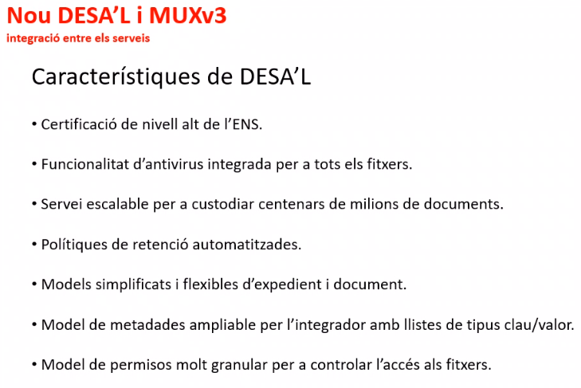
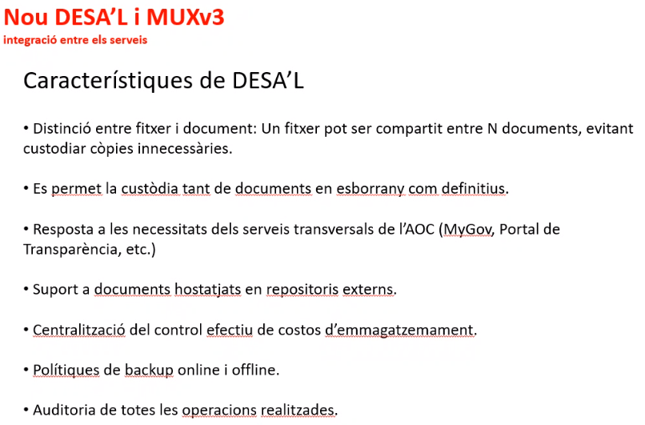
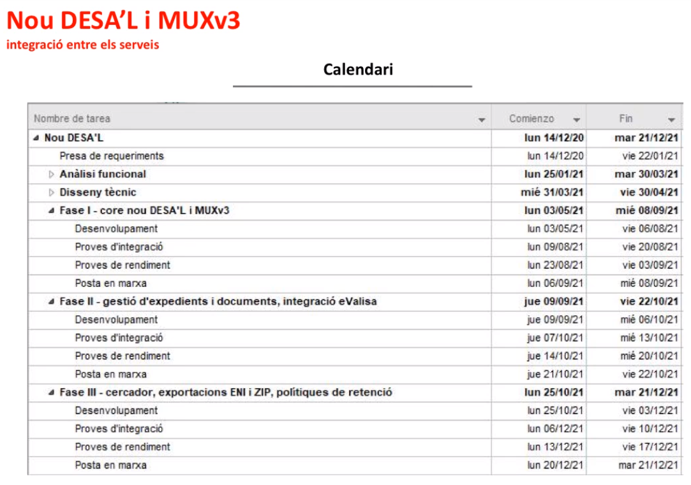
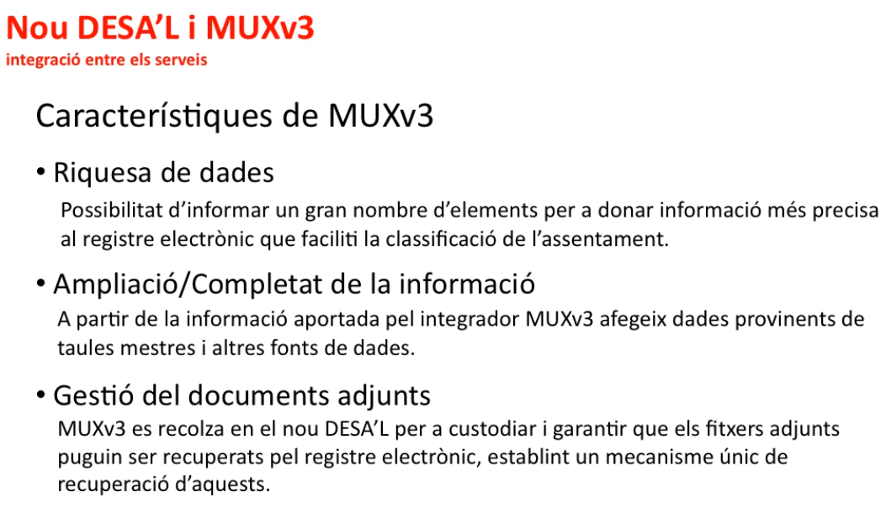
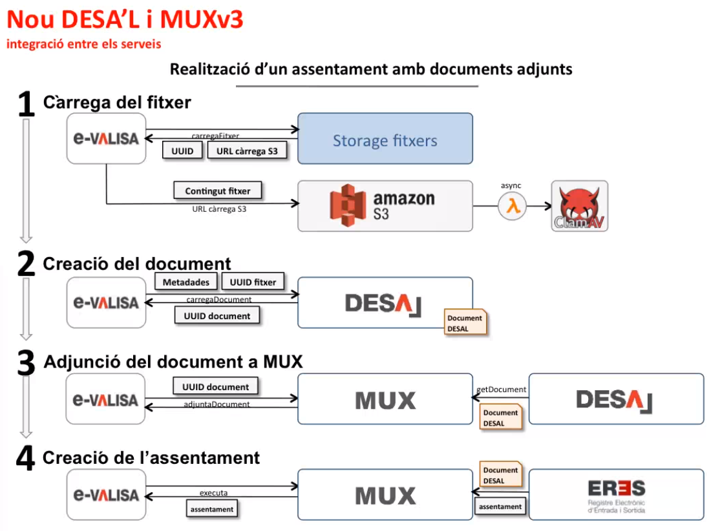

Gestió de l'Àrea de Tecnologia : Acta reunió tecnologia (TEC-144) 26/04/2021  

1.  [Gestió de l'Àrea de Tecnologia](index.md)
2.  [Página de inicio de Gestió de l'Àrea de Tecnologia](13893786.md)
3.  [Actes de reunió de seguiment](34505308.md)
4.  [Seguiment de Tecnologia 2021](Seguiment-de-Tecnologia-2021_64979514.md)

Gestió de l'Àrea de Tecnologia : Acta reunió tecnologia (TEC-144) 26/04/2021
============================================================================

Created by Èric Antonell on 26 abril 2021

Data

26-abr-2021

Assistents
----------

*   [Ivan Caballero Admin](https://confluence.aoc.cat/display/~icaballero.admin)
    
*   [Áurea Alcaide](https://confluence.aoc.cat/display/~aalcaide)
    
*   [Francesc Ferrer](https://confluence.aoc.cat/display/~FFerre)
*   [Roger Noguera](https://confluence.aoc.cat/display/~rnoguera)
*   [Oscar Trapote](https://confluence.aoc.cat/display/~otrapote)
*   [Sergio Figueras](https://confluence.aoc.cat/display/~sfigueras)
*   [Toni Vierge](https://confluence.aoc.cat/display/~tvierge)
*   [Kenneth Capseta](https://confluence.aoc.cat/display/~kcapseta)
*   [Antoni Llebaria](https://confluence.aoc.cat/display/~allebaria)
*   [Artur Barbeta](https://confluence.aoc.cat/display/~abarbeta)
*   [José Luis Pastor](https://confluence.aoc.cat/display/~jlpastor)
*   [David Tejada](https://confluence.aoc.cat/display/~dtejada)
*   [Maria Dolors Alvarez](https://confluence.aoc.cat/display/~mdalvarez)
*   [Ramon Grangé](https://confluence.aoc.cat/display/~RGrange)
*   [Èric Antonell](https://confluence.aoc.cat/display/~eantonell)
*   [Usuario desconocido (jlorenzo)](https://confluence.aoc.cat/display/~jlorenzo)
*   [Rafael Carrasco](https://confluence.aoc.cat/display/~rcarrasco)
*   [Albert Ciffone](https://confluence.aoc.cat/display/~aciffone)
*   [Andreu Martinez](https://confluence.aoc.cat/display/~amartinez)
*   [Rubén Cortés](https://confluence.aoc.cat/display/~rcortes)
*   [Sergio Gutierrez](https://confluence.aoc.cat/display/~sgutierrez)

Ordre del dia
-------------

*   [TEC-144](https://contacte.aoc.cat/browse/TEC-144?src=confmacro) - Los datos no se pueden recuperar debido a un error inesperado.

Acta
----

Punt

Ponent

Títol

Notes

1

[Sergio Gutierrez](https://confluence.aoc.cat/display/~sgutierrez)

Intervenció Hèstia, auditories de CESICAT i funcional del nou DESA'L i MUXv3

*   **Intervenció d'Hèstia**
*   Ens comenta les característiques principals de la nova versió d'Hèstia, implementada el dimecres 21 d'abril, una versió que es concentrava en solucionar vàries vulnerabilitats de seguretat. En aquest sentit, es van aglutinar varis canvis d'arquitectura importants. La nova versió crea el concepte de sessió, una vegada l'usuari s'autentica. Fins ara, la BBDD estava exposada al client de forma pública però ara s'han limitat els permisos de la BBDD. S'ha securitzat l'accés amb doble autenticació per part de l'usuari. Per tant, es controla prèviament l'accés amb doble factor abans de fer cap modificació a la BBDD.
*   S'afegeixen mesures i eines de seguretat. S'incorpora el WAF (Web Application Firewall_)_, que controla el tràfic entrant i sortint.  També s'actualitza i s'obliga als usuaris a utilitzar el .NET Framework 4.8.
*   Aquestes actualitzacions han repercutit l'agilitat de l'aplicació, tot i la estabilitat de l'aplicació. S'han augmentat els temps uns 2 segons en la operativa de cada procés i l'usuari ho ha percebut.
*   Es va afegir redis, un magatzem de dades en memòria per optimitzar la memòria cau (MemCached) i la sessió de l'usuari. Concretament es va configurar amb un màxim de 1000 connexions simultànies però va col·lapsar. Durant el dijous i el divendres alguns usuaris els hi va impactar aquest canvi amb el Remote Dictionary Server i ho han reportat, encara que sembla que la situació ha millorat.  Hi ha reportades 16 incidències al nostre canal de suport en aquesta direcció.
*   Totes les peces comentades van anar força bé tot i que es vol millorar el rendiment degut a la capa de seguretat que s'ha afegit. 
*   S'intentarà millorar el rendiment ja que desactivant el WAF es segueix notant una lentitud.
*   L'Andreu Martínez ofereix al Sergio Gutierrez que algú de Sistemes els hi doni suport si calgués.

  

*   **CESICAT**
*   Se li ha fet una proposta dels evolutius i se li ha traslladat un pla de treball amb les eines de seguretat avançades que utilitzarem, els hi ha semblat bé.
*   S'ha demanat que el CESICAT ens torni a auditar de forma regular. S'ha parlat amb l'Alejo, contacte de CESICAT i ens comenten que han implementat noves eines de seguretat, que volen provar amb nosaltres.
*   Ens demanen credencials (monitoritzaran els entorns de preproducció) per tal de cercar vulnerabilitats dels nostres sistemes.
*   Ens demanen el codi font ja que també l'analitzaran i ens demanen accés al portal d' Azure per revisar la configuració  i fer-nos arribar recomanacions.
*   Es contempla positivament l'auditoria però es valorarà el nivell de seguretat que haurem d'assumir i si el podrem implementar amb els nostres recursos actuals.

  

*   **DESA'L**
*   Es presenta el nou funcional de DESA'L:

*   De cara a un integrador, aquest DESA'L oferirà més seguretat. Tots els documents que estiguin custodiats al DESA'L compliran els requisits de l'Esquema nacional de dades.
*   Aquests documents custodiats per DESA'L seran escanejats per un antivirus, com a mesura important a destacar
*   Es volen fer proves d'estrès i de concurrència per assegurar als integradors un servei que pugui escalar a un nivell alt
*   Polítiques de retenció automatitzades. DESA'L tindrà la informació necessària per tal d'arxivar o esborrar els arxius segons el cicle del document, de forma independent
*   DESA'L no t'obligarà a treballar amb expedients i per tant, els models seran més simplificats i flexibles pel que fa a l'expedient tal com el coneixem
*   Model de metadades bàsic o complet. L'usuari tindrà la possibilitat d'escollir el model. L'integrador tindrà una eina per afegir les metadades que requereixi segons les seves necessitats
*   Control molt més exhaustiu dels permisos a través de dos elements: 1) Serveis 2) Organismes. Es podrà decidir qui accedirà a aquells documents (per servei o organismes)

*   Es distingeix entre fitxer i document evitant la duplicació de còpies innecessàries, estalviant espai d'emmagatzemament
*   Es permetrà la custodia tan d'esborranys com documents definitius
*   Es dóna resposta a les necessitats dels serveis més transversals de l'AOC com MyGov, Seu-e 2 i el portal de transparència
*   Es podran custodiar documents externs, com a novetat
*   Dintre de DESA'L podrem saber quin cost d'emmagatzemament tenim a nivell de servei i d'organisme
*   Les noves polítiques de l'esquema nacional de dades ens demanen alta disponibilitat, redundància i un sistema de còpia de seguretat robust com el que hem implementat
*   Qualsevol acció de DESA'L s'haurà d'auditar i es demana la integritat d'aquests logs, per tal que aquests no es puguin esborrar ni modificar. Tot això a través de ULDB

*   Es vol que el setembre d'enguany es posarà en marxa la integració per eVALISA. Seria el primer servei a integrar
*   A finals d'octubre tindríem un DESA'L més complet i amb un servei integrat i testejat (eVALISA)
*   A finals d'any, es volen organitzar varis equips de treball per començar a integrar (un conjunt important de serveis) cap al nou DESA'L
*   Solució de DESA'L i MUXv3 totalment disponible a final d'any

2

[Oscar Trapote](https://confluence.aoc.cat/display/~otrapote)

DESA'L i MUX

*   **Característiques de DESA'L i MUXv3**

  
Fins ara corria sobre un BEA .1 8 i es volia solucionar la obsolescència de programari, com a motiu principal de la renovació del servei. A part d'això, s'han millorat els següents aspectes:

*   S'ha solucionat la pobresa de dades que es rebia fins ara. amb la possibilitat d'informar un gran nombre d'elements que no teníem actualment, i així donar informació més precisa al registre electrònic, per tal que faciliti la classificació de l'assentament
*   S'ha afegit un mecanisme de completat d'informació. L'integrador, amb una aportació mínima de dades, podrà ampliar aquestes dades a través de taules mestres com les de DIR3, localitats, codis postal, etc.
*   El nou MUX garanteix per disseny la custodia dels documents adjunts en la transacció o en l'assentament. S'ha homogeneïtzat la gestió de dades entre MUX i DESA'L, els quals treballaran amb el mateix conjunt de dades. El nou DESA'L permet que els altres serveis enriqueixin el document custodiat. Per exemple, EACAT crearà un document, el qual el pujarà a DESA'L mentre un gestor d'expedient començarà un nou procediment. Per tant, aquest gestor estarà integrat al servei. Precisament el registre podrà completar un document adjunt i afegir-lo a l'assentament creat. MUX farà de punt d'enllaç.

Gràfiques per entendre la nova arquitectura:

*   Tot el conjunt de les metadades, el fitxer binari i la informació d'aquest fitxer ara només es mourà una vegada, tal com mostra el gràfic
*   Si el rendiment és satisfactori, la idea és que aquest s'utilitzi en un futur com a repositori documental per part de l'administració pública, així els organismes no haurien d'estar pendents de tenir còpies de seguretat de seu conjunt documental
*   Es valorarà el cost també d'aquesta gestió documental segons el consum i el volum, per tal de si es pot cobrar en un futur per aquest servei als organismes consumidors.

Tasques
-------

Attachments:
------------

 [image2021-4-26\_12-10-15.png](attachments/41522693/41522694.png) (image/png)  
 [image2021-4-26\_12-20-19.png](attachments/41522693/41522695.png) (image/png)  
 [image2021-4-26\_12-26-1.png](attachments/41522693/41522696.png) (image/png)  
 [image2021-4-26\_12-30-35.png](attachments/41522693/41522697.png) (image/png)  
 [image2021-4-26\_12-43-27.png](attachments/41522693/41522698.png) (image/png)  

Document generated by Confluence on 06 junio 2025 23:40

[Atlassian](http://www.atlassian.com/)