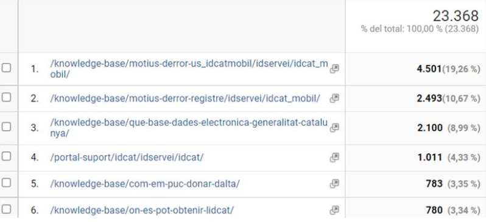

Gestió de l'Àrea de Tecnologia : Acta reunió tecnologia (TEC-150) 05/07/2021  

1.  [Gestió de l'Àrea de Tecnologia](index.md)
2.  [Página de inicio de Gestió de l'Àrea de Tecnologia](13893786.md)
3.  [Actes de reunió de seguiment](34505308.md)
4.  [Seguiment de Tecnologia 2021](Seguiment-de-Tecnologia-2021_64979514.md)

Gestió de l'Àrea de Tecnologia : Acta reunió tecnologia (TEC-150) 05/07/2021
============================================================================

Created by José Luis Pastor on 05 julio 2021

Data

14-jun-2020

Assistents
----------

*   [Rubén Cortés](https://confluence.aoc.cat/display/~rcortes) [Rafael Carrasco](https://confluence.aoc.cat/display/~rcarrasco) [Andreu Martinez](https://confluence.aoc.cat/display/~amartinez) [Sergio Gutierrez](https://confluence.aoc.cat/display/~sgutierrez)  [Toni Vierge](https://confluence.aoc.cat/display/~tvierge) [Ivan Caballero](https://confluence.aoc.cat/display/~icaballero) [Maria Dolors Alvarez](https://confluence.aoc.cat/display/~mdalvarez)  [Áurea Alcaide](https://confluence.aoc.cat/display/~aalcaide) [Èric Antonell](https://confluence.aoc.cat/display/~eantonell) [Oscar Trapote](https://confluence.aoc.cat/display/~otrapote)    [José Luis Pastor](https://confluence.aoc.cat/display/~jlpastor) [David Tejada](https://confluence.aoc.cat/display/~dtejada) [Albert Ciffone](https://confluence.aoc.cat/display/~aciffone) [Carlos Mena](https://confluence.aoc.cat/display/~cmena) [Èric Antonell](https://confluence.aoc.cat/display/~eantonell) [Sergio Figueras](https://confluence.aoc.cat/display/~sfigueras) [Ramon Grangé](https://confluence.aoc.cat/display/~RGrange) [Manel Rella](https://confluence.aoc.cat/display/~mrella)
    

Ordre del dia
-------------

*   [TEC-150](https://contacte.aoc.cat/browse/TEC-150?src=confmacro) - Los datos no se pueden recuperar debido a un error inesperado.

Acta
----

Punt

Ponent

Títol

Notes

1

[Toni Vierge](https://confluence.aoc.cat/display/~tvierge)

Migració Relays de correu AOC

*   Més informació del projecte al tiquet [SIS-4066](https://contacte.aoc.cat/browse/SIS-4066 "Revisió configuració SPF de aoc.cat").
*   Bàsicament el servidor de correu "Echange01" s'ha de decomissar i fer que les aplicacions vagin cap a nous relays relacionats amb el relay d'Office 365.
*   El projecte es dividirà en dos fases:
    *   Fase 1: Aquest dimecres sobre les 16:00 es farà un canvi de DNS i no tindrà cap impacte a les aplicacions que estiguin utilitzant enviament de correus.
    *   Fase 2: Encara per definir la data. En aquesta fase es crearan els nous relays per ser utilitzats per les aplicacions i poder eliminar l'Echange01.
*   S'ha fet un Excel per recolllir la informació de totes les aplicacions que utilitzen enviament de correus que cal omplir per cada responsable del servei [Graella Relay correus.xlsx](attachments/41523579/41523767.xlsx) (\\\\endreca\\TECNOLOGIA\\COMPARTIT\\Migració Relays Correu\\)

2

[Rubén Cortés](https://confluence.aoc.cat/display/~rcortes)

www.aoc.cat

S'ha comentat que la web [www.aoc.cat](http://www.aoc.cat) ha rebut moltes peticions  d'IPs del CTTI.

Preguntaran al CTTI per veure quin consum estan realitzant de la web de l'aoc. Pot ser vinguin per les ajudes que han sortit avui. 

Segons Google Analytics aquestes són les consultes més consumides durant avui

3

[Rubén Cortés](https://confluence.aoc.cat/display/~rcortes)

Incidència MyGov

[Manel Rella](https://confluence.aoc.cat/display/~mrella) ha comentat que es va detectar als logs de l'apliació (arrel d'una incidència d'un usuari) error d'out of memory, es va mirar els servidors i es van pujar de 4 a 8GB de RAM.

4

[Rafael Carrasco](https://confluence.aoc.cat/display/~rcarrasco)

Servidors Oracle 10

Aquest dissabte es farà una temptativa d'eliminar els servidors físics d'Oracle 10 que ja estan migrats les seves instàncies a virtuals.

5

  

  

  

Attachments:
------------

 [Graella Relay correus.xlsx](attachments/41523579/41523767.xlsx) (application/vnd.openxmlformats-officedocument.spreadsheetml.sheet)  
 [image2021-7-5\_12-36-30.png](attachments/41523579/41523768.png) (image/png)  

Document generated by Confluence on 06 junio 2025 23:40

[Atlassian](http://www.atlassian.com/)