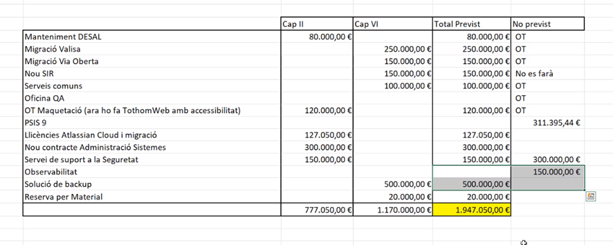

Gestió de l'Àrea de Tecnologia : Acta reunió de Tecnologia (TEC-200) 13/02/2023  

1.  [Gestió de l'Àrea de Tecnologia](index.md)
2.  [Página de inicio de Gestió de l'Àrea de Tecnologia](13893786.md)
3.  [Actes de reunió de seguiment](34505308.md)
4.  [Seguiment de Tecnologia 2023](Seguiment-de-Tecnologia-2023_81855426.md)

Gestió de l'Àrea de Tecnologia : Acta reunió de Tecnologia (TEC-200) 13/02/2023
===============================================================================

Created by Albert Ciffone, last modified on 13 febrero 2023

Data

30-ene-2023

Assistents
----------

*   [Andreu Martinez](https://confluence.aoc.cat/display/~amartinez) [Antoni Llebaria](https://confluence.aoc.cat/display/~allebaria) [Artur Barbeta](https://confluence.aoc.cat/display/~abarbeta) [Áurea Alcaide](https://confluence.aoc.cat/display/~aalcaide) [Carlos Mena](https://confluence.aoc.cat/display/~cmena) [Cristian Morales](https://confluence.aoc.cat/display/~cmorales) [David Tejada](https://confluence.aoc.cat/display/~dtejada) [Èric Antonell](https://confluence.aoc.cat/display/~eantonell) [Francesc Ferrer](https://confluence.aoc.cat/display/~FFerre) [Ivan Caballero](https://confluence.aoc.cat/display/~icaballero) [Jordi Florit](https://confluence.aoc.cat/display/~JFlorit) [José Luis Pastor](https://confluence.aoc.cat/display/~jlpastor) [Kenneth Capseta](https://confluence.aoc.cat/display/~kcapseta) [Manel Rella](https://confluence.aoc.cat/display/~mrella) [Oscar Trapote](https://confluence.aoc.cat/display/~otrapote) [Rafael Carrasco](https://confluence.aoc.cat/display/~rcarrasco) [Ramon Grangé](https://confluence.aoc.cat/display/~RGrange) [Roger Noguera](https://confluence.aoc.cat/display/~rnoguera) [Rubén Cortés](https://confluence.aoc.cat/display/~rcortes) [Sergio Figueras](https://confluence.aoc.cat/display/~sfigueras) [Sergio Gutierrez](https://confluence.aoc.cat/display/~sgutierrez) [Toni Muñoz Serrano](https://confluence.aoc.cat/display/~TMunoz) [Toni Vierge](https://confluence.aoc.cat/display/~tvierge.admin) [Albert Ciffone](https://confluence.aoc.cat/display/~aciffone)
    

Ordre del dia
-------------

*   [TEC-200](https://contacte.aoc.cat/browse/TEC-200?src=confmacro) - Los datos no se pueden recuperar debido a un error inesperado.

Acta
----

Punt

Ponent

Títol

Notes

1

[Ivan Caballero](https://confluence.aoc.cat/display/~icaballero)

PoC d'Extended EDR

*   Nou sistema antivirus. Prova de concepte amb un del fabricant FORTINET.
*   Test 25 servidors, estacions de treball, AD i transparència (per similitud amb EACAT però menys crític)
*   Objectiu: Activació a PRO EACAT (on hi ha problemes activant kaspersky) sempre previa activació a TRANSPARENCIA PRE / PRO.
*   [David Tejada](https://confluence.aoc.cat/display/~dtejada)Coordinar activació amb ST.
    *   Qualsevol problema saltarà sonda OMI i s'avisarà
*   A diferència de kaspersky només hi ha configurada la detecció (no accions)
*   També és farà una segona prova més endavant amb un EDR de MIcrosoft.

2

[Ivan Caballero](https://confluence.aoc.cat/display/~icaballero)

Activació de Kaspersky a EACAT

*   Configuració revisada per fabricant. Config de mínims. Només mira exec fitxers no IPS no comportaments. Comprova si el hash del fitxer en execució és sospitós contra la seva BDD (LR i WINDOWS) -> AUDITOR REQUEREIX KASPERSKY RUNNING.
*   Activat a PRE. Divendres 10/02. Proposta: Mantenir a PRE 7 dies. Activar PRO setmana vinent si no hi ha problemes.
*   [Rubén Cortés](https://confluence.aoc.cat/display/~rcortes) : Demana Coordinar l’arrencada ST + DEV + SEG + Fabricant.
*   [José Luis Pastor](https://confluence.aoc.cat/display/~jlpastor) : Demana prudència i no interferir amb una pujada crítica de integració EACAT → MUXv3-DESAL prevista per la primera quinzena de Març.
*   EQUIP TR + SEG: Sessió validació instal·lació PRO EACAT –TR. Dilluns 20/02 a les 15:00. PL6 + TR. (PL6 PART CRÍTICA)

3

[Andreu Martinez](https://confluence.aoc.cat/display/~amartinez)

IOP's urgents a ORA12 MC

*   NTT Avia: No es poden realitzar actuacions degut al límit db\_files sobre l’entorn ora12 MC. Cal aturar per a ampliar el paràmetre. Sense ampliació d'aquest paramertre no es pot fer la purga de PSIS, ni donar més espai a BDD etc.
*   Flight plan: Parada ora12 PRO MC tot el RAC, per modificar paràmetre (db\_files = 2000) i arrencada de forma inmediata.
*   Tall: 10 mins. Indisponiblitat serveis > PCI / WL12.
*   Aprofitar per configurar també paràmetre SGA.
*   Proposta dates:

*   Primera intervenció: 14/02/2023 (20h)
*   Segona intervenció: 15/02/2023 (21h)

*   PSIS / VALID no és veuràn afectats. Pivotació previa PSIS a NX.
*   Coordinar amb ST (revisió serveis i reconnexió amb BDD post intervenció)
*   ST ha de realitzar comunicat a estat de serveis.
*   [David Tejada](https://confluence.aoc.cat/display/~dtejada)  comenta que hi ha intervenció prèvia crítica de VALID  MSC-BDSEU 18:00 – 19:00 de la tarda (problema recursos). 

4

[Rubén Cortés](https://confluence.aoc.cat/display/~rcortes)

2M€ atorgats addicional al pressupost (no inclou fons europeus).

*   S'exposen els següents números
*   Es fa incís en la importància de aprofitar-los.
*   S'afegeix una columna de possibles projectes a afegir (no previst)

5

[Francesc Ferrer](https://confluence.aoc.cat/display/~FFerre)

Nou programari lector targetes AOC 

*   Canvi del programari del lector de targetes. Instal·lar a tots els equips de forma automatitzada.
*   [Rubén Cortés](https://confluence.aoc.cat/display/~rcortes)  Demana revisar la possibilitat d'instal·lar només a les persones que necessitin signatura reconeguda.
*   Parlar amb [Áurea Alcaide](https://confluence.aoc.cat/display/~aalcaide)/cap de servei del signador sobre la necessitat de fer proves per al component.
*    [Toni Vierge](https://confluence.aoc.cat/display/~tvierge) Es mostra partidari d'Identificar només equips que faran ús de les targetes i no instal·lar programari extra si no és necessari
*   Finalment: Manteniment intern valora si cal que sigui desatès a tothom, o manual a les persones que ho requereixin. Ho segueixen internament al tiquet. INT-2948

6

[José Luis Pastor](https://confluence.aoc.cat/display/~jlpastor)

Pregunta per l'estat del volum CIFS

*   [Andreu Martinez](https://confluence.aoc.cat/display/~amartinez)Pendent projecte ampliació de cabines. Aproximadament entrega d'aqui 2 mesos. A banda, ha traslladat a NTT viabilitat de instal·lar calaixos de discos nous.
*   [Albert Ciffone](https://confluence.aoc.cat/display/~aciffone)  En paral·lel s'està intentant fer espai a LHNFS (amb l'esborrat de docs d'enotum que es troben a DESA'L) per moure contingut de CIFS a NFS o per donar memoria d'un volum a un altre directament.

  

Attachments:
------------

 [image2023-2-13\_13-6-42.png](attachments/81855591/81855592.png) (image/png)  

Document generated by Confluence on 06 junio 2025 23:40

[Atlassian](http://www.atlassian.com/)