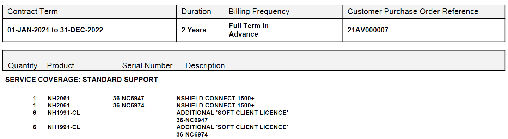

Gestió de l'Àrea de Tecnologia : HSM  

1.  [Gestió de l'Àrea de Tecnologia](index.md)
2.  [Página de inicio de Gestió de l'Àrea de Tecnologia](13893786.md)
3.  [Inventari de manteniments de maquinari i programari](Inventari-de-manteniments-de-maquinari-i-programari_41520223.md)
4.  [Maquinari](Maquinari_41520225.md)

Gestió de l'Àrea de Tecnologia : HSM
====================================

Created by Ivan Caballero, last modified on 22 agosto 2022

HSM TALES:
----------

  

  

  

Aquests dos dispositius tenen anunciat el End of mainstream support pel 31/12/2022:

  

HSM Entrust
-----------

  

**Codi de producte**

**Descripció**

**Unitats**

3P‐AC3183R

Standard Support - Remote Admin Kit ‐ Tier1 (1 to 10 HSMs)

1

P‐I‐NH2089‐M‐CC

Standard Support - nShield Connect XC Mid eIDAS CC (SN: 46‐SC1249)

1

P‐I‐NH2089‐M‐CC

Standard Support - nShield Connect XC Mid eIDAS CC (SN; 46‐SC1238)

1

P‐I‐NH2089‐M‐CC

Standard Support - nShield Connect XC Mid eIDAS CC (SN; 46‐SC0940)

1

P‐I‐NH2089‐M‐CC

Standard Support - nShield Connect XC Mid eIDAS CC (46‐SC1187)

1

3P‐I‐NH1991‐CL

Standard Support - nShield Connect Additional Client Lic

32

Attachments:
------------

 [image2021-1-21\_23-48-9.png](attachments/41520446/41520447.png) (image/png)  

Document generated by Confluence on 06 junio 2025 23:40

[Atlassian](http://www.atlassian.com/)