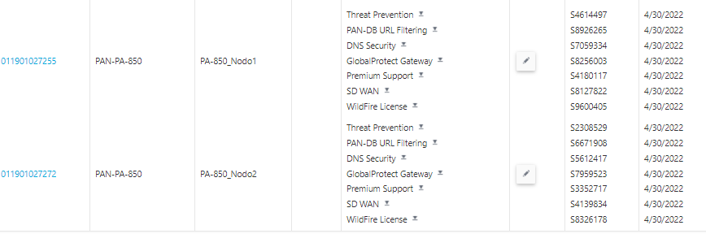

Gestió de l'Àrea de Tecnologia : Palo Alto Oficines  

1.  [Gestió de l'Àrea de Tecnologia](index.md)
2.  [Página de inicio de Gestió de l'Àrea de Tecnologia](13893786.md)
3.  [Inventari de manteniments de maquinari i programari](Inventari-de-manteniments-de-maquinari-i-programari_41520223.md)
4.  [Maquinari](Maquinari_41520225.md)
5.  [Palo Alto Plataforma](Palo-Alto-Plataforma_41522492.md)

Gestió de l'Àrea de Tecnologia : Palo Alto Oficines
===================================================

Created by Ivan Caballero on 26 abril 2021

Data de finalització: **30/4/2022 .**

  

  

Manteniment: SCC

Contacte: Stefano Dazi <stefano.dazi@[es.scc.com](http://es.scc.com)\>

Attachments:
------------

 [image2021-4-26\_10-8-12.png](attachments/41522687/41522688.png) (image/png)  

Document generated by Confluence on 06 junio 2025 23:40

[Atlassian](http://www.atlassian.com/)