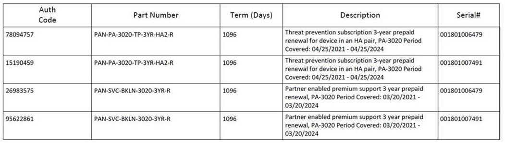

Gestió de l'Àrea de Tecnologia : Palo Alto Plataforma  

1.  [Gestió de l'Àrea de Tecnologia](index.md)
2.  [Página de inicio de Gestió de l'Àrea de Tecnologia](13893786.md)
3.  [Inventari de manteniments de maquinari i programari](Inventari-de-manteniments-de-maquinari-i-programari_41520223.md)
4.  [Maquinari](Maquinari_41520225.md)

Gestió de l'Àrea de Tecnologia : Palo Alto Plataforma
=====================================================

Created by Ivan Caballero, last modified on 26 abril 2021

**Auth Code**

**Part Number**

**Description**

**Serial**

76694229

PAN-SVC-BKLN-3020-R

Partner enabled premium support PA-3020 Period Covered: 19/03/2021 - 20/03/2024

1801007491

34871795

PAN-PA-3020-TP-HA2-R

Threat prevention subscription renewal for devices in HA pair, PA-3020, periodo de cobertura hasta 20/03/2024

1801007491

42900374

PAN-PA-3020-TP-HA2-R

Threat prevention subscription renewal for devices in HA pair, PA-3020, periodo de cobertura hasta 20/03/2024

1801006479

81652323

PAN-SVC-BKLN-3020-R

Partner enabled premium support PA-3020 Period Covered: 19/03/2021 - 20/03/2024

1801006479

  

La vigència del pla de manteniment i de la llicència serà del 19/03/21 **fins al 20/03/2024.**

  

****

  

Mètode per reportar incidències:

  

[soporte@impala-net.com](mailto:soporte@impala-net.com)

902.108.480

  

Fuera de horas para lo que es 24x7 es el teléfono 902.108.480 y el código 1994

El email no se atiende fuera de horas.

Attachments:
------------

 [image2021-4-20\_9-43-2.png](attachments/41522492/41522595.png) (image/png)  

Document generated by Confluence on 06 junio 2025 23:40

[Atlassian](http://www.atlassian.com/)