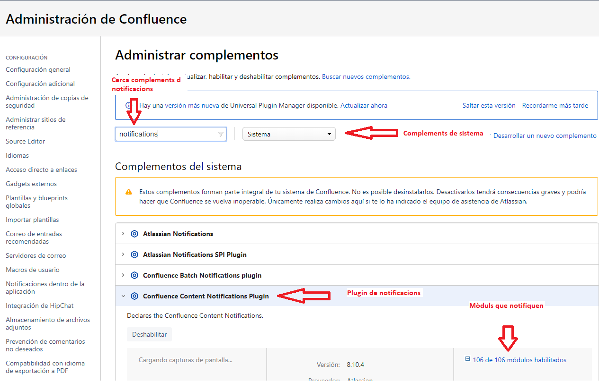

Manteniment Intern : Desactivar les notificacions per edició de pàgines.  

1.  [Manteniment Intern](index.md)
2.  [Serveis de Manteniment Intern](Serveis-de-Manteniment-Intern_15368305.md)
3.  [Fitxa de servei de Intranet Confluence](Fitxa-de-servei-de-Intranet-Confluence_15368308.md)
4.  [Troubleshooting i canvis de configuració a la Intranet en Confluence](24215564.md)

Manteniment Intern : Desactivar les notificacions per edició de pàgines.
========================================================================

Created by Ivan Caballero Admin, last modified on 08 julio 2019

  

Accedir a "Administrar complementos" dins de la configuració de sistema:

[https://intranet.aoc.cat/plugins/servlet/upm/manage/system](https://intranet.aoc.cat/plugins/servlet/upm/manage/system)

  

Seleccionar els complements de sistema.

Cercar els plugins de "notifications" i desplegar la llista de mòduls que notifiquen:

  

  

Deshabilitar els mòduls "page-created-notifications" i "page-edited-notification"

  

  

Attachments:
------------

 [image2019-7-8\_15-42-30.png](attachments/24216065/24216066.png) (image/png)  
 [image2019-7-8\_15-45-21.png](attachments/24216065/24216067.png) (image/png)  

Document generated by Confluence on 06 junio 2025 23:57

[Atlassian](http://www.atlassian.com/)