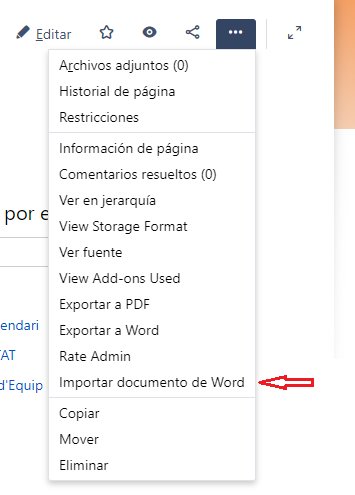
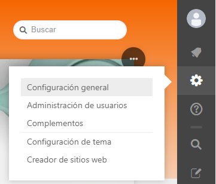
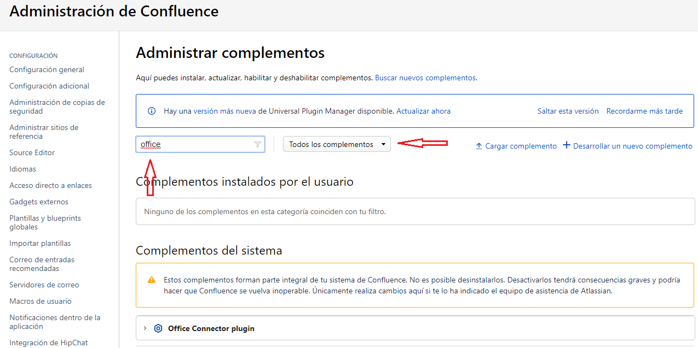

Manteniment Intern : No es pot "Importar" documents al confluence  

1.  [Manteniment Intern](index.md)
2.  [Serveis de Manteniment Intern](Serveis-de-Manteniment-Intern_15368305.md)
3.  [Fitxa de servei de Intranet Confluence](Fitxa-de-servei-de-Intranet-Confluence_15368308.md)
4.  [Troubleshooting i canvis de configuració a la Intranet en Confluence](24215564.md)

Manteniment Intern : No es pot "Importar" documents al confluence
=================================================================

Created by Ivan Caballero Admin on 08 julio 2019

La importació de documents word es fa des de el menú de qualsevol pàgina.

  

Pot desaparèixer la opció de importar documents. En aquest cas cal verificar si el Plugin Office Connector està habilitat:

*   Accedir amb usuari administrador a la configuració del sistema  
      
    
*   Anar a la secció "Administrar complementos".
*   Canviar el filtre per poder veure tots els complements, posar el el filtre "office".  
      
    
*   El complement està deshabilitat cal activar-ho per poder fer importacions de documents word.

Attachments:
------------

 [image2019-6-17\_10-35-35.png](attachments/24216070/24216071.png) (image/png)  
 [image2019-6-17\_10-39-27.png](attachments/24216070/24216072.png) (image/png)  
 [image2019-6-17\_10-43-3.png](attachments/24216070/24216073.png) (image/png)  

Document generated by Confluence on 06 junio 2025 23:57

[Atlassian](http://www.atlassian.com/)