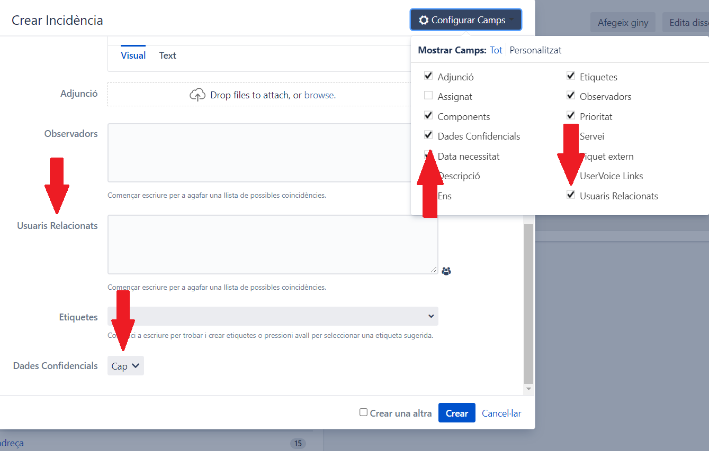
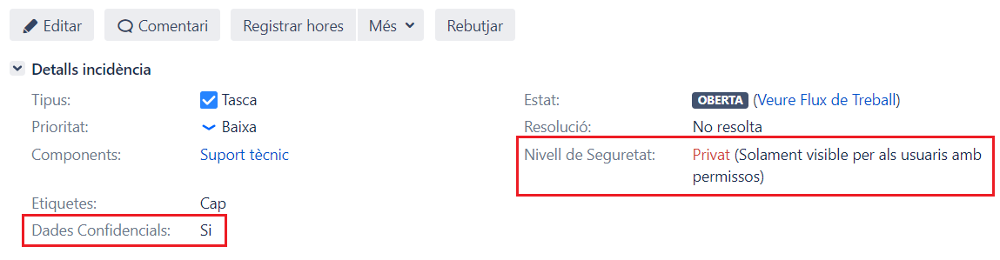

Manteniment Intern : Botó de privacitat en tiquets de JIRA  

1.  [Manteniment Intern](index.md)
2.  [Serveis de Manteniment Intern](Serveis-de-Manteniment-Intern_15368305.md)
3.  [Servei JIRA](Servei-JIRA_61931655.md)

Manteniment Intern : Botó de privacitat en tiquets de JIRA
==========================================================

Created by Ivan Caballero, last modified on 27 septiembre 2021

Els tiquets de JIRA per defecte són visibles per tots els usuaris excepte en alguns projectes concrets.

El botó de dades confidencials permet canviar els permisos d'un tiquet per fer-lo visible per un grup reduït d'usuaris. S'hauria de fer servir aquesta opció quan un tiquet contingui **dades de caràcter personal** o **informació confidencia**l.

Un tiquet amb les dades confidencials activades serà visible únicament per:

*   Usuari assignat
*   Usuari Informador
*   Usuaris relacionats
*   Integrants del projecte

Com activar la privacitat en un tiquet.
---------------------------------------

Al crear un tiquet, cal fer visible els camps de dades confidencials i el d'usuaris relacionats:

  

Activar el camp de dades confidencials (posant-lo a "SI") i posar usuaris relacionats si és necessaris.

El camp "Nivell de Seguretat" indicarà que és un tiquet privat.

  

Tant el camp de dades confidencials com el d'usuaris relacionats es poden modificar en qualsevol moment i els permisos s'actualitzen.

Aquesta funcionalitat està disponible en els següents projectes:

*   [Agenda](https://contacte.aoc.cat/plugins/servlet/project-config/AG/summary)
    
*   [Assessoria Jurídica Serveis](https://contacte.aoc.cat/plugins/servlet/project-config/AJS/summary)
    
*   [Contractació](https://contacte.aoc.cat/plugins/servlet/project-config/CON/summary)
    
*   [DEMO](https://contacte.aoc.cat/plugins/servlet/project-config/DEMO/summary)
    
*   [Desplegaments de productes](https://contacte.aoc.cat/plugins/servlet/project-config/DES/summary)
    
*   [Dinamització i Assessorament al Territori](https://contacte.aoc.cat/plugins/servlet/project-config/DET/summary)
    
*   [Finances](https://contacte.aoc.cat/plugins/servlet/project-config/FIN/summary)
    
*   [Gabinet tècnic](https://contacte.aoc.cat/plugins/servlet/project-config/GT/summary)
    
*   [Innovació](https://contacte.aoc.cat/plugins/servlet/project-config/INN/summary)
    
*   [Inventari Organismes](https://contacte.aoc.cat/plugins/servlet/project-config/ENS/summary)
    
*   [Manteniment JIRA](https://contacte.aoc.cat/plugins/servlet/project-config/MJ/summary)
    
*   [Manteniment intern](https://contacte.aoc.cat/plugins/servlet/project-config/INT/summary)
    
*   [Organitzacio](https://contacte.aoc.cat/plugins/servlet/project-config/OGI/summary)
    
*   [Projectes](https://contacte.aoc.cat/plugins/servlet/project-config/PRJ/summary)
    
*   [Serveis](https://contacte.aoc.cat/plugins/servlet/project-config/SE/summary)
    
*   [Serveis EACAT](https://contacte.aoc.cat/plugins/servlet/project-config/EACAT/summary)
    
*   [Sistemes](https://contacte.aoc.cat/plugins/servlet/project-config/SIS/summary)
    
*   [Suport Usuaris](https://contacte.aoc.cat/plugins/servlet/project-config/AOC/summary)
    
*   [Suport Usuaris Proves](https://contacte.aoc.cat/plugins/servlet/project-config/SUP/summary)
    
*   [Suport tècnic](https://contacte.aoc.cat/plugins/servlet/project-config/ST/summary)
    
*   [Tecnologia](https://contacte.aoc.cat/plugins/servlet/project-config/TEC/summary)
    
*   [Unitat de Suport](https://contacte.aoc.cat/plugins/servlet/project-config/SU/summary)
    

  

Attachments:
------------

 [image2021-9-16\_16-14-8.png](attachments/61931658/61931659.png) (image/png)  
 [image2021-9-16\_17-6-50.png](attachments/61931658/61931663.png) (image/png)  
 [image2021-9-16\_17-8-13.png](attachments/61931658/61931664.png) (image/png)  
 [image2021-9-21\_14-41-8.png](attachments/61931658/61931697.png) (image/png)  

Document generated by Confluence on 06 junio 2025 23:57

[Atlassian](http://www.atlassian.com/)