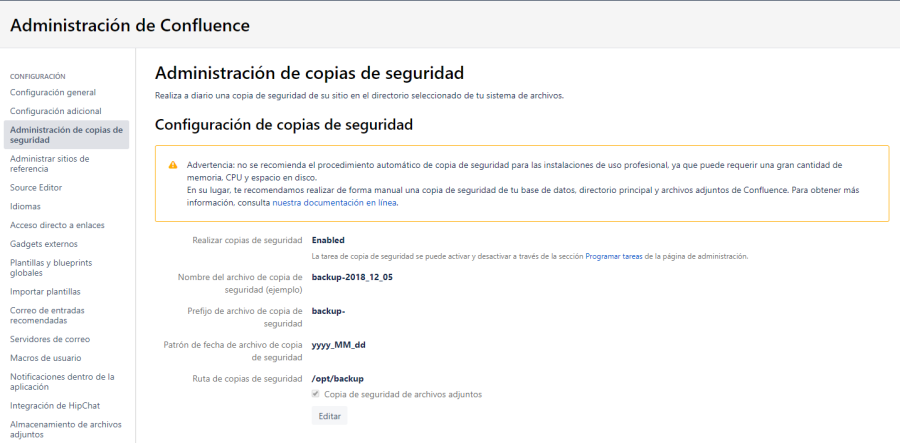

Manteniment Intern : Backup  

1.  [Manteniment Intern](index.md)
2.  [Serveis de Manteniment Intern](Serveis-de-Manteniment-Intern_15368305.md)
3.  [Fitxa de servei de Intranet Confluence](Fitxa-de-servei-de-Intranet-Confluence_15368308.md)

Manteniment Intern : Backup
===========================

Created by Ivan Caballero, last modified on 02 junio 2020

Documentació oficial estratègies de backup:  
[https://confluence.atlassian.com/conf69/configuring-backups-950285450.html#ConfiguringBackups-EnablingBackupPathConfiguration](https://confluence.atlassian.com/conf69/configuring-backups-950285450.html#ConfiguringBackups-EnablingBackupPathConfiguration)

  

### Backup des de Confluence

Això està configurat a configuración global – administración de copias de Seguridad: 

  
  
  
Els backups diaris es guarden a: /opt/backup 

### Backup des de Bacula

El servidor aoc-int-conf01 fa backup amb el Bacula d'oficines. Els directoris que es copien són:

/confluence   
/confluence-home   
/opt/backup 

### Backup de la base de dades

Per fer backup es fa servir la comanda: pg\_dump. (amb usuari postgres)

postgres@aoc-int-db01:~$ pg\_dump confluence > /opt/backup/confluence.bak

  

Restore:

Eliminar la base de dades i tornar a crear:

dropdb dbname

createdb dbname

Restaurar

psql test < dbname.bak

  

  

En el de JIRA también se tendrá que poner. Las bases de datos son estas:

  

Attachments:
------------

 [worddav7da6c0454aed5e99b11319544d7259b5.png](attachments/15368318/15368317.png) (image/png)  

Document generated by Confluence on 06 junio 2025 23:57

[Atlassian](http://www.atlassian.com/)