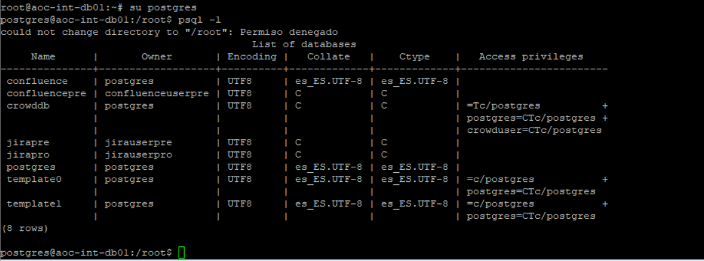

Manteniment Intern : Base de dades  

1.  [Manteniment Intern](index.md)
2.  [Serveis de Manteniment Intern](Serveis-de-Manteniment-Intern_15368305.md)
3.  [Fitxa de servei de Intranet Confluence](Fitxa-de-servei-de-Intranet-Confluence_15368308.md)

Manteniment Intern : Base de dades
==================================

Created by Ivan Caballero, last modified on 02 junio 2020

La base de dades està ubicada a aoc-int-db01

Per llistar les bases de dades:

  

#------------------------------------------------------------------------------

1.  FILE LOCATIONS  
    #------------------------------------------------------------------------------

1.  The default values of these variables are driven from the -D command-line
2.  option or PGDATA environment variable, represented here as ConfigDir.

data\_directory = '/var/lib/postgresql/9.5/main' # use data in another directory

1.  (change requires restart)  
    hba\_file = '/etc/postgresql/9.5/main/pg\_hba.conf' # host-based authentication file
2.  (change requires restart)  
    ident\_file = '/etc/postgresql/9.5/main/pg\_ident.conf' # ident configuration file
3.  (change requires restart)

1.  If external\_pid\_file is not explicitly set, no extra PID file is written.  
    external\_pid\_file = '/var/run/postgresql/9.5-main.pid' # write an extra PID file
2.  (change requires restart)

Attachments:
------------

 [image2020-6-2\_23-35-5.png](attachments/40763454/40763455.png) (image/png)  

Document generated by Confluence on 06 junio 2025 23:57

[Atlassian](http://www.atlassian.com/)