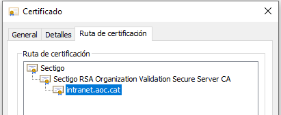
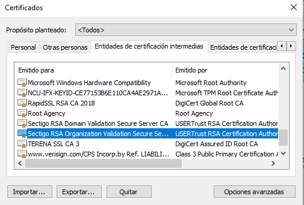

Manteniment Intern : Canvi de certificat de la Intranet  

1.  [Manteniment Intern](index.md)
2.  [Serveis de Manteniment Intern](Serveis-de-Manteniment-Intern_15368305.md)
3.  [Fitxa de servei de Intranet Confluence](Fitxa-de-servei-de-Intranet-Confluence_15368308.md)
4.  [Desplegament del Apache](Desplegament-del-Apache_15368326.md)

Manteniment Intern : Canvi de certificat de la Intranet
=======================================================

Created by Ivan Caballero, last modified on 11 junio 2024

Objecte del procediment

Aquest procediment és per canviar el certificat quan es caduqui l'anterior.

Renovació del certificat
------------------------

Els certificats els renova la unitat de Suport i els deixa en el repositori: \\\\endreca.aoc.local\\TECNOLOGIA\\SUPORT\_TECNIC\\CERTIFICATS\\CDS\\CESICAT

Preparar els arxius dels certificats
------------------------------------

El certificat vindrà amb el nom intranet\_aoc\_cat\_cert.cer

Obrir aquest arxiu amb un editor de text sencill (notepad). Mai fer servei editors tipus word.

Sense fer cap modificació guardar amb la extensió .crt

Si la CA ha canviat respecte al certificat antic, **caldrà també instal·lar el certificat intermig de la CA nova**. Per fer això cal extreure el certificat intermig del certificat nou:

Obrir el certificat i anar a la pestanya "Ruta de certificación":

Importar el certificat.

Obrir "Internet Explorer - Eines - Opciones de Internet - Contingut - Certificats" i localitzar la clau, en aquest cas "Sectigo RSA Orga..."

Exportar el certificat intermig amb extensió .crt

Copiar arxius en el servidor
----------------------------

Copiar els arxius en el servidor frontal de la intranet que actualment es aoc-int-f01 (192.168.166.138).

*   intranet\_aoc\_cat\_cert.crt
*   Sectigo.crt (si ha canviat la CA)
*   intranet.aoc.cat.key (si ha canviat la CA)

La ubicació del arxius es: /etc/apache2/ssl (fer una còpia de seguretat dels certificats anteriors per si cal fer marxa enrere)

Intal·lar nous certificats
--------------------------

Fer còpia de seguretat de l'arxiu si cal.

Llistar el fitxer de configuració del vhost de la Intranet: cat /etc/apache2/sites-enabled/default-ssl.conf

Localitzar la ubicació dels certificats i actualitzar els noms:

SSLCertificateFile /etc/apache2/ssl/intranet.aoc.cat.crt  
SSLCertificateKeyFile /etc/apache2/ssl/intranet\_aoc\_cat.key  
SSLCertificateChainFile /etc/apache2/ssl/intranet.aoc.cat.cer

Guardar l'arxiu i provar la configuració:  apachectl configtest

Si és correcte, reiniciar Apache:

apachectl stop  
apachectl start

  

Attachments:
------------

 [image2020-10-23\_8-1-59.png](attachments/41519562/41519563.png) (image/png)  
 [image2020-10-23\_8-11-10.png](attachments/41519562/41519564.png) (image/png)  

Document generated by Confluence on 06 junio 2025 23:57

[Atlassian](http://www.atlassian.com/)