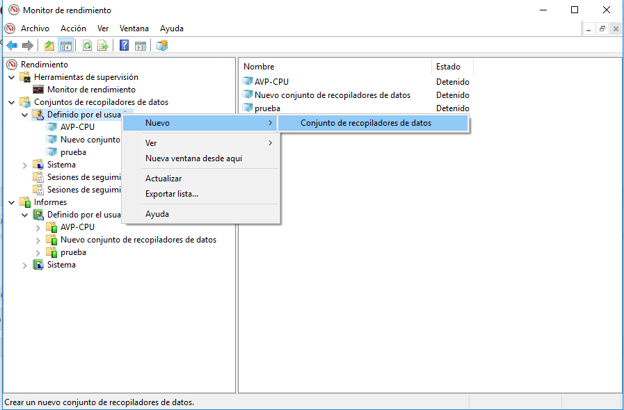
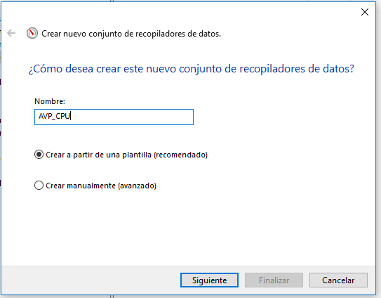
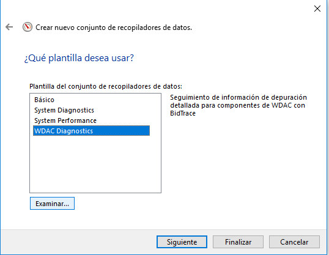
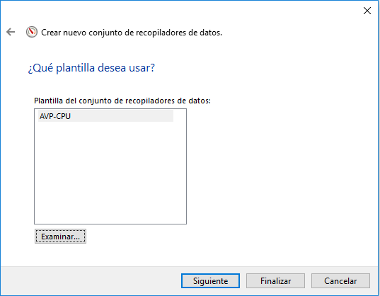
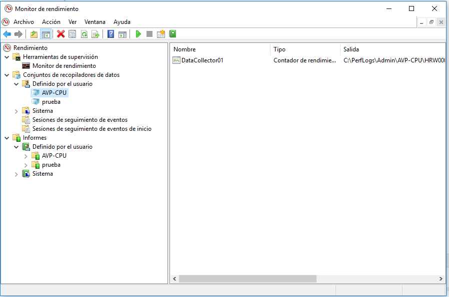
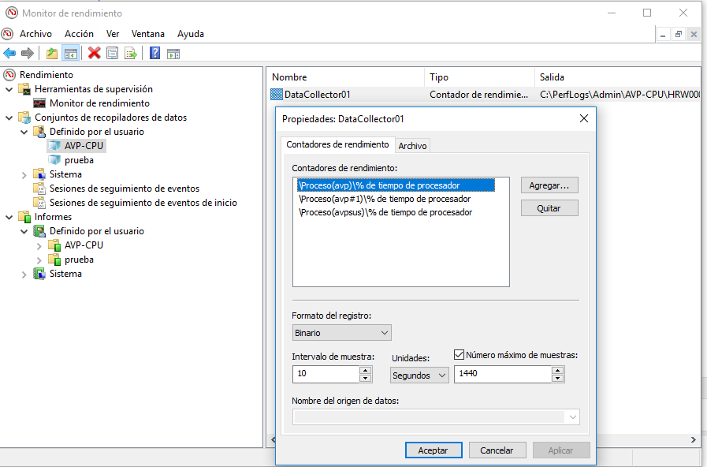
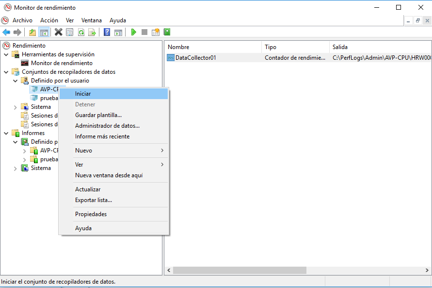
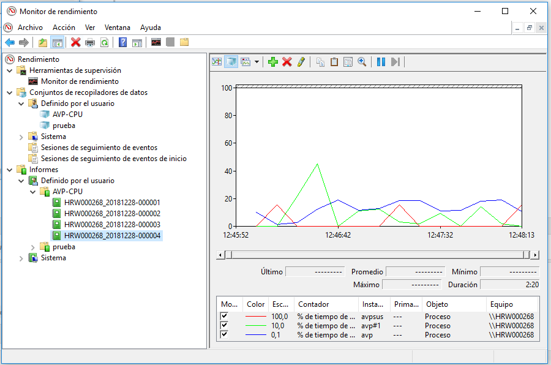

Manteniment Intern : Mesurar consum de CPU de Kaspersky  

1.  [Manteniment Intern](index.md)
2.  [Serveis de Manteniment Intern](Serveis-de-Manteniment-Intern_15368305.md)
3.  [Servei de kaspersky](Servei-de-kaspersky_15368383.md)

Manteniment Intern : Mesurar consum de CPU de Kaspersky
=======================================================

Created by Ivan Caballero, last modified on 28 diciembre 2018

Aquest procediment s'aplica quan es detecten consum de CPU elevats per part del kaspersky

Guía detallada
--------------

1.  Descarregar la següent plantilla i ubicar-la en al algún lloc del disc. Es farà servir més endavant.  
    [AVP-CPU.xml](attachments/15368426/15368430.xml)
2.  A la estació de treball afectada, obrir el programa "Monitor de rendimiento" (perfmon.exe)
3.  A la secció de "Conjuntos de recopiladores de datos" - "Definido por el usuario", crear un nou recopilador de dades:  
      
      
    Posar un nom descriptiu i crear en base a una plantilla:  
      
    Premer "Examinar" i seleccionar la plantilla AVP-CPU descarregada en el punt 1.  
      
    Premer Finalitzar:  
      
    El nou recopilador de dades s'ha de veure amb el nom donat:  
    
4.  Fent doble clic a DataCollector es poden canviar el paràmetres d'execució. Per defecte s'agafen dades cada 10 segons durant 4 hores.  
    
5.  Amb el botó dret sobre el nom del recopilador fer "Iniciar"  
    
6.  El resultat es pot veure al finalitzar el temps de recol·lecció, als Informes d'usuari:  
    

Artículos Relacionados
----------------------

*   Página:
    
    [Mesurar consum de CPU de Kaspersky](/display/MI/Mesurar+consum+de+CPU+de+Kaspersky)
    

  

  

Attachments:
------------

 [image2018-12-28\_12-59-54.png](attachments/15368426/15368427.png) (image/png)  
 [image2018-12-28\_13-2-46.png](attachments/15368426/15368428.png) (image/png)  
 [image2018-12-28\_13-4-44.png](attachments/15368426/15368429.png) (image/png)  
 [AVP-CPU.xml](attachments/15368426/15368430.xml) (text/xml)  
 [image2018-12-28\_13-9-57.png](attachments/15368426/15368431.png) (image/png)  
 [image2018-12-28\_13-11-1.png](attachments/15368426/15368432.png) (image/png)  
 [image2018-12-28\_13-13-2.png](attachments/15368426/15368433.png) (image/png)  
 [image2018-12-28\_13-14-42.png](attachments/15368426/15368434.png) (image/png)  
 [image2018-12-28\_13-16-6.png](attachments/15368426/15368435.png) (image/png)  

Document generated by Confluence on 06 junio 2025 23:57

[Atlassian](http://www.atlassian.com/)