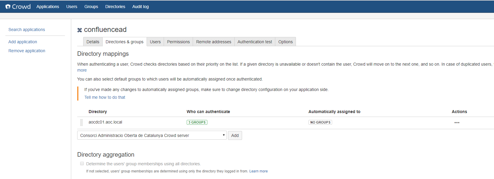
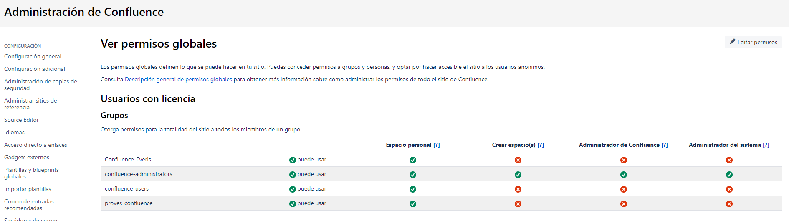
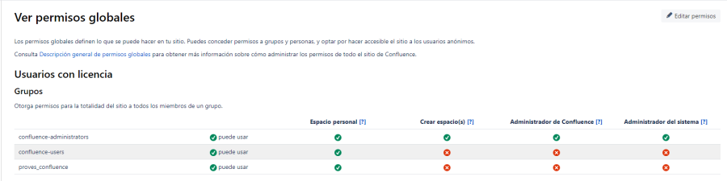
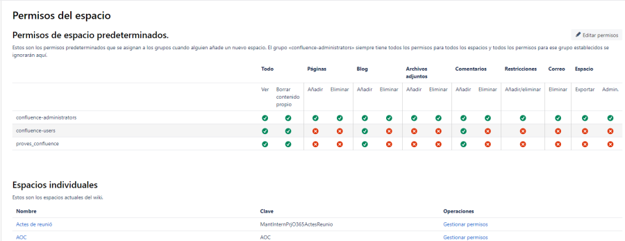
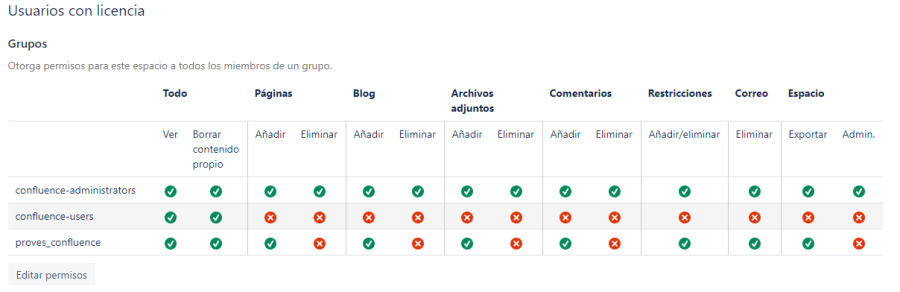
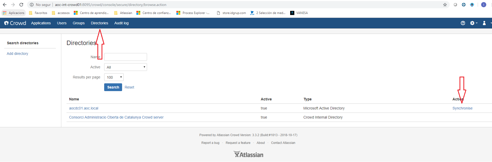
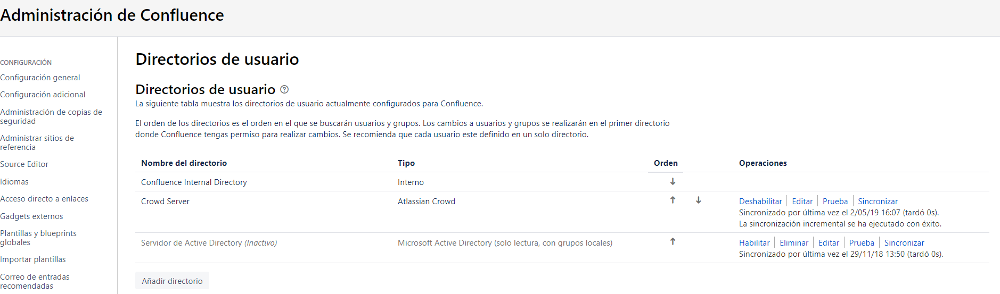
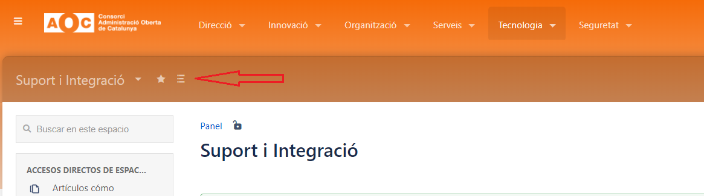
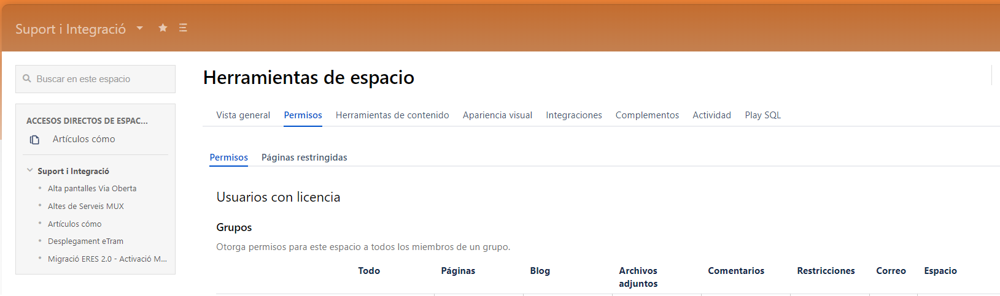

Manteniment Intern : Permisos  

1.  [Manteniment Intern](index.md)
2.  [Serveis de Manteniment Intern](Serveis-de-Manteniment-Intern_15368305.md)
3.  [Fitxa de servei de Intranet Confluence](Fitxa-de-servei-de-Intranet-Confluence_15368308.md)

Manteniment Intern : Permisos
=============================

Created by Ivan Caballero, last modified by Ivan Caballero Admin on 16 marzo 2020

Hi ha una explicació de com funcionen els permisos a la part de Formació de Confluence: [Gestió de permisos a la Intranet](https://confluence.aoc.cat/pages/viewpage.action?pageId=18743514)

  

Procediment operatiu

Hi ha un procediment genèric d'Endreça que crida a aquest procediment. Qualsevol canvi ha d'estar alineat amb el procediment d'Endreça.

  

Dar acceso a usuarios externos
------------------------------

Los usuaris externos no deben acceder a la Intranet, pero puede haber excepciones (ver procedimiento de [gestión de usuarios a la Intranet](https://intranet.aoc.cat/pages/viewpage.action?pageId=24216296)).

Para dar acceso a un usuario externo:

*   Crear el usuario en el Active Directory en aoc.local \\ AOC \\ Usuaris \\ Externs
*   Crea un grupo en aoc.local \\ AOC \\ Grups \\Atlassian
*   Esperar a que los cambios repliquen en Crowd i Confluence (1h mas o menos).

  

Una vez el grupo està creado en el AD y replicado a Crown y Confluence, se le debe dar permiso de login.

### Permisos iniciales de login para grupos nuevos.

Los grupos que tienen permisos de login en la Intranet deben estar registrados en el Crowd. Para ver los grupos con permisos de login ir a:

*   Acceder al servei Crowd, Ir a "Application \\confluencead \\ Directories & Groups" ([Directories & Groups](http://aoc-int-crowd01:8095/crowd/console/secure/application/viewdirectories.action?ID=786433)):

  

Por defecto, los grupos con permisos de login son confluence-administrators y confluence-users. Todos los usuaris de Consorci deben estar en uno de estos grupos. 

Estos grupos tienen acceso acomo mínimo de lectura a toda la Intranet.

Pulsar en el campo "Who can authenticate" y añadir el grupo nuevo.

  

Una vez el grupo ya tiene permiso de login en el Crowd, se le debe dar permiso global en el confluence: [https://intranet.aoc.cat/admin/permissions/globalpermissions.action](https://intranet.aoc.cat/admin/permissions/globalpermissions.action)

En permisios globales, añadir el grupo.

  

Cuando ya tiene permiso global, se le tiene que dar permisos a los Espacios concretos.

Documentar la excepción de que un usario externo acceda la Intranet: [Accessos de personal extern](Accessos-de-personal-extern_22937621.md)

Permisos de Espacio
-------------------

El permisos estan definits primer a nivell de site.  
Els usuaris i els usuaris de proves poden accedir a la intranet i crear un pàgina personal. No tenen cap permís de crear espais ni administrar el confluence.  
  
Els grups estan definits al Active Directory, excepte el grup confluence-administrators que es local.  
El grup de usuaris de confluence té els grups de les àrees de l'AOC. Són tots usuaris d'AOC.  
  
Després estan definits a nivell d'espai:  
  
  
Els permisos per defecte són aquests:  

  

Como añadir un grupo con permisos a un Espacio
----------------------------------------------

Confluence valida los usuarios y grupos del Crowd: [http://aoc-int-crowd01:8095/crowd/console/login.action](http://aoc-int-crowd01:8095/crowd/console/login.action), quien a su vez los importa del directorio activo.

La importació se hace cada hora, tanto del AD a Crowd, como de Crowd A Confluence.

Para crear un grupo nuevo se tiene que hacer primero en AOCDC01: aoc.local\\AOC\\Grups\\Atlassian. Crear el grupo y sus integrantes. Esperar a la siguinte sincronización.

Se puede forzar la sincronización. Para ello acceder a Crowd / Directories i pulsar Synchronise.

  

Una vez el grupo está en Crowd, ir a Administración de Confluence / Directoio de usuarios y pulsar Sincronizar

  

  

Una vez el grupo ya se puede ver en la seccióin de "Grupos" de confluence, se puede añadir a un Espacio:

Acceder a las propiedades del espacio

  

Ir a la sección de Permisos

Pulsar en "Editar Permisos" y añadir el grupo nuevo con los permisos que toque.

Attachments:
------------

 [worddav8652f8b10a544fd95879f3fda5100c82.png](attachments/15368322/15368321.png) (image/png)  
 [worddav66e83ab5054882d87fc605ab715918c0.png](attachments/15368322/15368323.png) (image/png)  
 [worddavaab4d0fb586db4e31af5d41e3affc911.png](attachments/15368322/15368324.png) (image/png)  
 [image2019-5-2\_15-46-8.png](attachments/15368322/20906060.png) (image/png)  
 [image2019-5-2\_15-50-38.png](attachments/15368322/20906061.png) (image/png)  
 [image2019-5-2\_15-55-43.png](attachments/15368322/20906062.png) (image/png)  
 [image2019-5-2\_15-57-5.png](attachments/15368322/20906063.png) (image/png)  
 [image2019-5-2\_16-10-27.png](attachments/15368322/20906065.png) (image/png)  
 [image2019-5-3\_16-19-38.png](attachments/15368322/20906121.png) (image/png)  
 [image2019-5-21\_10-20-36.png](attachments/15368322/22937680.png) (image/png)  

Document generated by Confluence on 06 junio 2025 23:57

[Atlassian](http://www.atlassian.com/)