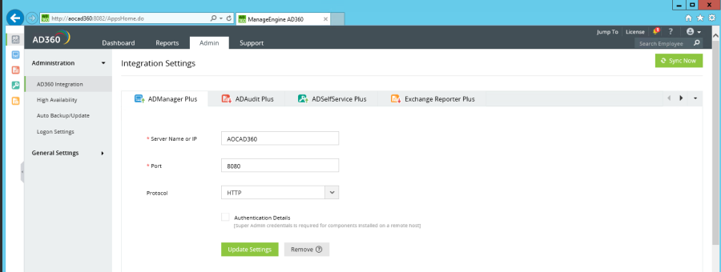
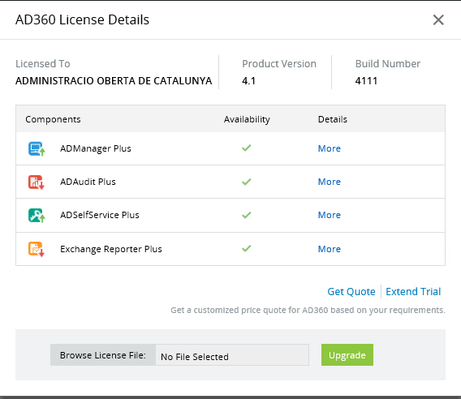
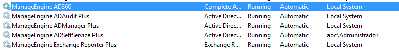
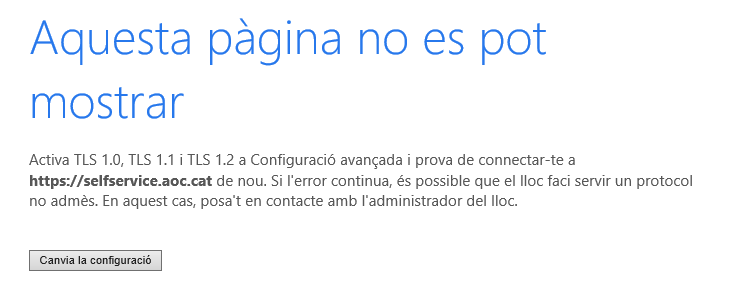
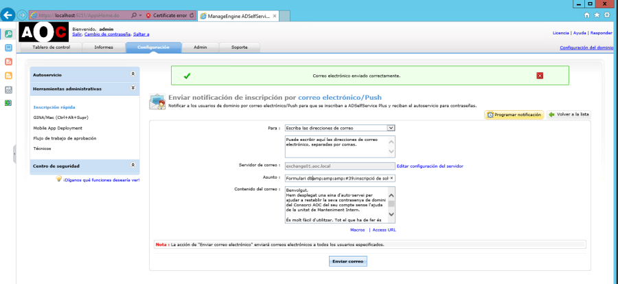
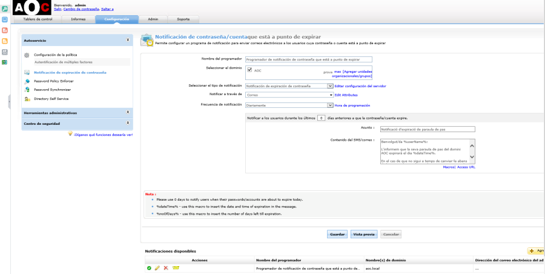
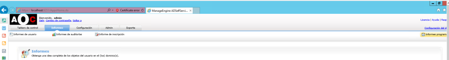

Manteniment Intern : Servei - Manage Engine AD360  

1.  [Manteniment Intern](index.md)
2.  [Serveis de Manteniment Intern](Serveis-de-Manteniment-Intern_15368305.md)

Manteniment Intern : Servei - Manage Engine AD360
=================================================

Created by Ivan Caballero, last modified on 26 agosto 2021

  

Descripció
----------

Manage Engine AD360 es un software per gestionar l'Active Directory.

Dispositius implicats
---------------------

Màquina virtual AOCAD360 (192.168.166.118).  
Cal entrar al servidor amb l'usuari Administrador de domini.

Maquinari i programari del que depèn
------------------------------------

Màquina virtual AOCAD360 (192.168.166.118)  
[https://www.manageengine.com/active-directory-360/](https://www.manageengine.com/active-directory-360/)  
Usuaris al KeePass d'oficines.

Configuració de xarxa
---------------------

La màquina virtual ha d'estar connectada al switch virtual "VM Network", i el host ha d'estar punxat a la vlan 666.

Llicencia
---------

[\\\\aocfs01\\operacions\\Infraestructures\\Inventari i manteniments HW\\Inventari de software\\ManageEngine AD360](file://aocfs01/operacions/Infraestructures/Inventari i manteniments HW/Inventari de software/ManageEngine AD360)

### Aplicar llicència nova.

1.  Accedir al servidor i obrir el AD360: [http://aocad360:8082/AppsHome.do](http://aocad360:8082/AppsHome.do)
2.  Obrir la consola amb l'usuari Admin

  

1.  Obrir el menu "License" (cantonada dreta superior)

  

1.  Aplicar l'arxiu xml de llicència.

Soport
------

[ad360-support@manageengine.com](mailto:ad360-support@manageengine.com)

Configuració general
--------------------

La configuració general es fa des del component AD360 ([http://aocad360:8082/AppsHome.do](http://aocad360:8082/AppsHome.do)): Ports i URLs de servei, notificacions, mail de contacte, Proxy, llicencia, backup, etc.  
Cada mòdul a més té la seva configuració pròpia.

URL del servei
--------------

Maneger Engine 360: [http://aocad360:8082/AppsHome.do](http://aocad360:8082/AppsHome.do)  
Manager Plus:  
Self Service:

Url del servei: [https://aocad360:9251](https://aocad360:9251)  
Consola admin.: [https://AOCAD360:9251/adminLogin.cc](https://AOCAD360:9251/adminLogin.cc)   
[https://selfservice.aoc.local](https://selfservice.aoc.local)  
[https://aocad360](https://aocad360) \- la redirecció de Palo Alto et porta al port correcte.  
  
Pàgines d'ajuda: [http://aocad360:8888/help/user-guide/index.html](http://aocad360:8888/help/user-guide/index.html)  
[http://aocad360:8888/help/user-guide/How-to-self-subscribe-mail-groups.html](http://aocad360:8888/help/user-guide/How-to-self-subscribe-mail-groups.html)  
  
[https://selfservice.aoc.cat/help/user-guide/index.html](https://selfservice.aoc.cat/help/user-guide/index.html)  
[https://selfservice.aoc.cat/help/user-guide/How-to-self-subscribe-mail-groups.html](https://selfservice.aoc.cat/help/user-guide/How-to-self-subscribe-mail-groups.html)  
  
  
Nota: selfservice té una redirecció al Palo Alto per anar del 443 al 9251.

**Component**

**Port http**

**Port https**

**URL**

**AD Manage Engine**

8082

8445

http://aocad360:8082/AppsHome.do

**AD Manager Plus**

8080

  

[http://aocad360:8080/](http://aocad360:8080/)

**AD Self Service**

8888

9251

[https://aocad360:9251/authorization.do](https://aocad360:9251/authorization.do)  
[https://selfservice.aoc.cat/showLogin.cc](https://selfservice.aoc.cat/showLogin.cc)  
[https://selfservice.aoc.local/showLogin.cc](https://selfservice.aoc.local/showLogin.cc)

  

Monitorització
--------------

  
Es monitorització la URL de servei selfservice.  
[https://op5-aoc.atlasit.com/monitor/index.php/extinfo/details/service?host=NMH00435\_AOCAD360&service=HTTPS\_selfservice-aoc-cat%2FshowLogin-cc\_171983](https://op5-aoc.atlasit.com/monitor/index.php/extinfo/details/service?host=NMH00435_AOCAD360&service=HTTPS_selfservice-aoc-cat%2FshowLogin-cc_171983)

Aturar i reanudar el servei
---------------------------

Anar a serveis de Windows  
El servei es: ManageEngine AD360  
Cada component té un servei:  

Còpia de seguretat
------------------

Les còpies es fan a la mateixa màquina C:\\ManageEngine\\AD360\\Backup  
S'ha guardat un copia a [\\\\aocfs01\\Operacions\\Informàtica interna\\Backups\\ManageEngineAD360](file://aocfs01/Operacions/Informàtica interna/Backups/ManageEngineAD360)

### AD Self Service

Backup:

*   Abrir un cmd de Windows e ir a C:\\ManageEngine\\ADSelfService Plus\\bin
*   Ejecutar el comando **backupDB.bat**
*   Se crearà un backup en C:\\ManageEngine\\ADSelfService Plus\\Backup
*   Hacer una copia del backup en la carpeta: \\\\aocfs01\\operacions\\Informàtica interna\\Backups\\ManageEngineAD360

  
Restore:

*   Abrir un cmd de Windows e ir a C:\\ManageEngine\\ADSelfService Plus\\bin
*   Ejecutar el comando de restauración y el backup a restaurar, ejemplo **restoreDB.bat** **C:\\ManageEngine\\ADSelfService Plus\\Backup\\081224-1547.zip**

  
AD SelfServices  
[https://aocad360.aoc.local:9251/showLogin.cc](https://aocad360.aoc.local:9251/showLogin.cc)

Certificat:
-----------

Seguir les instruccions a: [https://download.manageengine.com/products/self-service-password/adselfservice-plus-ssl-installation-guide.pdf](https://download.manageengine.com/products/self-service-password/adselfservice-plus-ssl-installation-guide.pdf)  
S'ha generat un CSR des de l'eina de SelfService. El CSR està a  
C:\\ManageEngine\\ADSelfService Plus\\webapps\\adssp\\Certificates  
La contrasenya es: "123456"  
Baixar les arrels de:  
Acc.crt  
EC-SectorPublic  
S'ha fet una còpia de l'arxiu selfservice.keystore original com selfservice.keystore.bk  
Es carrega els certificats en aquest ordre:  
keytool -import -alias acc -keystore selfservice.keystore -trustcacerts -file acc.crt  
keytool -import -alias cross -keystore selfservice.keystore -trustcacerts -file ec-sectorpublic.crt  
keytool -import -alias tomcat -keystore selfservice.keystore -trustcacerts -file 9ce56543-d8c9-11e6-ad87-0050569864cc.crt  
NOTA: el certificat del servei ha de tenir el alias "tomcat", ja que té aquest alias també la clau privada dins del keystore  
keytool -list -keystore selfservice.keystore

Mesures de seguretat aplicades.
-------------------------------

### Deshabilitar protocols de transport i ciphers poc segurs:

  
Aturar el servei SelfService  
Fer còpia de seguretat del fitxer de configuració: C:\\ManageEngine\\ADSelfService Plus\\conf\\server.xml  
S'ha modificat la línia que posava:  
<Connector SSLEnabled="true" acceptCount="100" clientAuth="false" connectionTimeout="20000" debug="0" disableUploadTimeout="true" enableLookups="false" keystoreFile="./conf/SelfService.aoc.keystore" keystorePass="123456" maxSpareThreads="75" maxThreads="150" minSpareThreads="25" name="SSL" port="9251" scheme="https" secure="true" sslProtocol="TLS" sslProtocols="TLSv1"/>  
Per aquesta:  
<Connector SSLEnabled="true" acceptCount="100" clientAuth="false" connectionTimeout="20000" debug="0" disableUploadTimeout="true" enableLookups="false" keystoreFile="./conf/SelfService.aoc.keystore" keystorePass="123456" maxSpareThreads="75" maxThreads="150" minSpareThreads="25" name="SSL" port="9251" scheme="https" secure="true" sslProtocol="TLS" sslProtocols="TLSv1.1,TLSv1.2" ciphers="TLS\_RSA\_WITH\_AES\_128\_CBC\_SHA, TLS\_ECDHE\_RSA\_WITH\_AES\_128\_CBC\_SHA, TLS\_ECDHE\_RSA\_WITH\_AES\_128\_CBC\_SHA256, TLS\_ECDHE\_RSA\_WITH\_AES\_128\_CBC\_SHA, TLS\_ECDHE\_RSA\_WITH\_AES\_256\_C"/>  
... on els protocols de transport acceptats són TLSv1.1,TLSv1.2  
i els **SSL Cipher:**

*   TLS\_RSA\_WITH\_AES\_128\_CBC\_SHA (0x2f)
*   TLS\_ECDHE\_RSA\_WITH\_AES\_128\_CBC\_SHA (0xc013)
*   TLS\_ECDHE\_RSA\_WITH\_AES\_128\_CBC\_SHA256,
*   TLS\_ECDHE\_RSA\_WITH\_AES\_128\_CBC\_SHA,
*   TLS\_ECDHE\_RSA\_WITH\_AES\_256\_C

  
  
Un navegador amb només el protocol TLS 1.0 activat tindria aquest error:  

### Deshabilitar Cross-frame scripting

  
**Issue:** Cross Frame Scripting (XSF)/Click Jacking  
In an XFS attack, the attacker exploits a specific cross-frame-scripting bug in a web browser to access private data on a third-party website.  
**Fix:** This vulnerability has been fixed by adding X-Frame-Options as same origin in the response header. This prevents third party sites from loading ADSelfService Plus in IFrames.  
**Note:** To enable this fix, open the file conf\\security-params.xml from the installation folder and remove the # at the beginning of X-Frame-Options.  
This issue has been fixed in the ADSelfService Plus build 5300 released on May 2015.  
[https://www.manageengine.com/products/self-service-password/self-service-password-application-security-importance.html](https://www.manageengine.com/products/self-service-password/self-service-password-application-security-importance.html)

### Enviament de notificació per inscripció d'usuaris

  
  

### Customització de missatges

  
En aquest arxiu es poden posar missatges concrets per les planes web:  
C:\\ManageEngine\\ADSelfService Plus\\webapps\\adssp\\html\\CustomLayOut.txt

Configuracions de SelfService
-----------------------------

### Enviament de notificació d'expiració de contrasenya.

  
S'ha configurat la notificació d'expiració de contrasenya que informa 5 dies abans de que caduqui.  
Avisa al usuari de AOC\\usuaris i aoc\\AltresUsuaris.  
  
També s'ha programat un informe que envia a [oficines@aoc.cat](mailto:oficines@aoc.cat) els usuaris a punt d'expirar.  
Cal anar a Informes programados:  

  

  

  

URL d'enviament per recuperar la contrasenya
--------------------------------------------

  

[https://contacte.aoc.cat:8443/browse/SEG-223](https://contacte.aoc.cat:8443/browse/SEG-223)

Attachments:
------------

 [worddavd4e4c7d1a753468e82ed4b5ff5569500.png](attachments/15368373/15368372.png) (image/png)  
 [worddav0a05d4ea8a72cd3d93392ca76710e8b7.png](attachments/15368373/15368374.png) (image/png)  
 [worddav498cabded2294cf256b7703c97e63bb9.png](attachments/15368373/15368375.png) (image/png)  
 [worddava4e064df797bc8db444575379b75e281.png](attachments/15368373/15368376.png) (image/png)  
 [worddavba0c8d44c967e9681531f76bea625168.png](attachments/15368373/15368377.png) (image/png)  
 [worddav4cba30fb7ceb52c35107c038e88aa239.png](attachments/15368373/15368378.png) (image/png)  
 [worddav443b0e13219f2cd9a0ddef2dcc5c4281.png](attachments/15368373/15368379.png) (image/png)  

Document generated by Confluence on 06 junio 2025 23:57

[Atlassian](http://www.atlassian.com/)