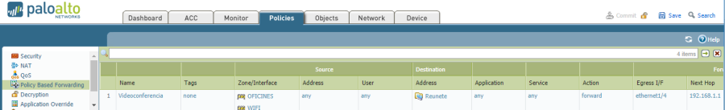

Manteniment Intern : Servei - REUNETE  

1.  [Manteniment Intern](index.md)
2.  [Serveis de Manteniment Intern](Serveis-de-Manteniment-Intern_15368305.md)

Manteniment Intern : Servei - REUNETE
=====================================

Created by Ivan Caballero, last modified on 21 diciembre 2018

  

**Índex**

/\*<!\[CDATA\[\*/ div.rbtoc1749247075897 {padding: 0px;} div.rbtoc1749247075897 ul {list-style: disc;margin-left: 0px;} div.rbtoc1749247075897 li {margin-left: 0px;padding-left: 0px;} /\*\]\]>\*/

*   [Descripció.](#ServeiREUNETE-Descripció.)
*   [Dispositius implicats.](#ServeiREUNETE-Dispositiusimplicats.)
*   [Serveis dels que depenen.](#ServeiREUNETE-Serveisdelsquedepenen.)
*   [Interlocució.](#ServeiREUNETE-Interlocució.)
*   [URL de servei.](#ServeiREUNETE-URLdeservei.)
*   [Enrutament](#ServeiREUNETE-Enrutament)
*   [Operació.](#ServeiREUNETE-Operació.)

  

  

Descripció.
-----------

El servei reúnete es portal per fer video conferencia.

  

Dispositius implicats.
----------------------

Cap. Es un servei extern.

  

Serveis dels que depenen.
-------------------------

DNS intern.  
login-reunete.redsara.es ho resol el DNS intern.

  

Interlocució.
-------------

Per incidències en temps real, es pot contactar amb el servei de suport al telèfon 912733333  
Dades de persona de contacte.  
Incidències  reunete.redsara <reunete.redsara@seap.minhap.es>  
Maria Angeles Gonzalo Garcia:  
E-mail.: [mariaangeles.gonzalo@seap.minhap.es](mailto:mariaangeles.gonzalo@seap.minhap.es)  
Tel.: 912732018  
Víctor Balbás Valderrábano  
E-mai.: victor.balbas@seap.minhap.es  
Tel.: 912732412

  

URL de servei.
--------------

Login:  
[_https://login-reunete.redsara.es/portal/join.jsp_](https://login-reunete.redsara.es/portal/join.jsp)

  

Enrutament
----------

L'accés al servei es fa per IP pública, i Palo Alto ho redirecciona cap la router movistar:  
  
Desactualitzat:  
_El servei REUNETE pot consumir gran quantitat d'ample de banda. Per evitar saturar la línia d'internet es recomanable accedir per la xarxa SARA. Per fer-ho cal configurar les següents NATs:_  
_Servei                                  Ip real                   Ip_ _Nateada_ _IP Pública_

  

_login-reunete.redsara.es_

_10.253.252.38_

_10.127.34.37_

_185.73.172.11_

_reunete.redsara.es_

_10.253.252.34_

_10.127.32.157_

_185.73.172.24_

_reunetevideo.redsara.es_

_10.253.252.34_

_10.127.32.157_

_185.73.172.18_

[_portalreunete.redsara.es_](http://portalreunete.redsara.es/)

_10.253.249.133_

_10.127.34.31_

_185.73.172.11_

  

  
_El DNS intern ha de resoldre les IP Nateades._

  

Operació.
---------

A part de la data i hora d'inici de la videoconferència, se'ns proporciona nombre de sala/recurs + password. Nosaltres introduïm un nom d'usuari (exemple Consoci AOC) Una vegada fet el login, passem un test d'altaveus, micròfon, WEBCam i connectivitat.Després accedim a la sala on s'efectua la videoconferència.  
Existeix una sala de proves:  
Sessió: 241  
Id: < el que es vulgui>  
Passwd: aoc.cat77

Attachments:
------------

 [worddav9df0fc35c1ffc3fb4cb208f4a82adbc5.png](attachments/15368407/15368406.png) (image/png)  

Document generated by Confluence on 06 junio 2025 23:57

[Atlassian](http://www.atlassian.com/)