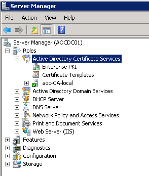

Manteniment Intern : Servei de PKI de domini  

1.  [Manteniment Intern](index.md)
2.  [Serveis de Manteniment Intern](Serveis-de-Manteniment-Intern_15368305.md)

Manteniment Intern : Servei de PKI de domini
============================================

Created by Ivan Caballero on 20 diciembre 2018

  

Introducció
===========

El consorci AOC disposa d'una PKI de domini on pot generar certificats del domini aoc.local.

A la següent carpeta està la documentació que va donar NTT.   
\\\\AOCFS01\\aoc\\Tecnica\\Operacions\\Seguiment de projectes i plataformes\\Fitxa de servei - PKI Oficines Xifrat i signatura

Documentació de Microsoft:   
[https://docs.microsoft.com/en-us/windows/security/information-protection/windows-information-protection/create-and-verify-an-efs-dra-certificate](https://docs.microsoft.com/en-us/windows/security/information-protection/windows-information-protection/create-and-verify-an-efs-dra-certificate)    
[https://technet.microsoft.com/es-es/library/cc162812.aspx](https://technet.microsoft.com/es-es/library/cc162812.aspx) 

Ubicació
========

La PKI d'oficines s'ha implementat com un rol del Controlador de Domini i està ubicat a AOCDC01:   
  

  

Procediment relacionats:
========================

Procediment d'usuari: [Creació de certificats de domini per xifrar arxius](https://intranet.aoc.cat/pages/viewpage.action?pageId=15368234)

Procediment de Manteniment Intern: [Gestió de certificats de domini per xifrar arxius](https://confluence.aoc.cat/pages/viewpage.action?pageId=15368270)

  

  

Attachments:
------------

 [worddav4f463a16dbc3f211ed29614d12abca67.png](attachments/15368369/15368370.png) (image/png)  

Document generated by Confluence on 06 junio 2025 23:57

[Atlassian](http://www.atlassian.com/)