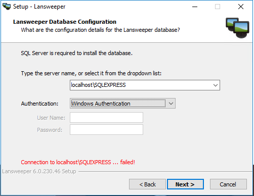

Manteniment Intern : Servei de inventari actius Lansweeper  

1.  [Manteniment Intern](index.md)
2.  [Serveis de Manteniment Intern](Serveis-de-Manteniment-Intern_15368305.md)

Manteniment Intern : Servei de inventari actius Lansweeper
==========================================================

Created by Ivan Caballero, last modified on 21 diciembre 2018

  

**Índex:**

/\*<!\[CDATA\[\*/ div.rbtoc1749247072847 {padding: 0px;} div.rbtoc1749247072847 ul {list-style: disc;margin-left: 0px;} div.rbtoc1749247072847 li {margin-left: 0px;padding-left: 0px;} /\*\]\]>\*/

*   [Descripció](#ServeideinventariactiusLansweeper-Descripció)
*   [Dispositius implicats](#ServeideinventariactiusLansweeper-Dispositiusimplicats)
*   [Maquinari i programari del que depèn](#ServeideinventariactiusLansweeper-Maquinariiprogramaridelquedepèn)
*   [Configuració de xarxa](#ServeideinventariactiusLansweeper-Configuraciódexarxa)
*   [Interlocució](#ServeideinventariactiusLansweeper-Interlocució)
*   [URL de servei](#ServeideinventariactiusLansweeper-URLdeservei)
*   [Aturar i reanudar el servei](#ServeideinventariactiusLansweeper-Aturarireanudarelservei)
*   [Base de dades.](#ServeideinventariactiusLansweeper-Basededades.)
*   [Còpia de seguretat](#ServeideinventariactiusLansweeper-Còpiadeseguretat)
*   [Manteniment de la base de dades](#ServeideinventariactiusLansweeper-Mantenimentdelabasededades)

  

Descripció
----------

El Lansweeper es un software per fer inventari d'actius

Dispositius implicats
---------------------

Màquina virtual Callisto (192.168.166.37)

Maquinari i programari del que depèn
------------------------------------

Màquina virtual Callisto (192.168.166.37)

  

Configuració de xarxa
---------------------

La màquina virtual ha d'estar connectada al switch virtual "VM Network", i el host ha d'estar punxat a la vlan 666.

  

Interlocució
------------

  

URL de servei
-------------

[http://callisto:81/Default.aspx](http://callisto:81/Default.aspx)  
[http://inventari.aoc.local:81/login.aspx](http://inventari.aoc.local:81/login.aspx)

  

Aturar i reanudar el servei
---------------------------

Anar a serveis de Windows  
El servei es: Lansweeper Server

  

Base de dades.
--------------

S'ha instal·lat un "SQL Server 2017 Express Edition" per la base de dades:  
  
  

  

Còpia de seguretat
------------------

El backup es fa des del propi sistema operatiu, manualment amb el següent procediment:

1.  Aturar el servei Lansweeper. El servei es diu "Lansweeper Server":

  

  

1.  Executar el programa de manteniment de la base de dades: C:\\Program Files (x86)\\Lansweeper\\Service\\DatabaseMaintenance.exe

  

1.  Es recomanable fer un buidat de la base de dades abans de fer el backup:
    1.  Trunkate logs
    2.  Compact (da error)

  

1.  Executar el backup i deixar-lo a la carpeta: C:\\Users\\Administrador\\Desktop\\Backup Lansweeper (o C:\\Backups)

1.  Fer una copia del backup a \\\\aocfs01\\operacions\\Informàtica interna\\Backups\\Lansweeper

1.  Activar de nou el servei Lansweeper Server

  

Manteniment de la base de dades
-------------------------------

  
Cal aturar el servei Lansweeper Server abans de fer manteniment.  
Scripts:  
C:\\Program Files (x86)\\Lansweeper\\Service\\DatabaseMaintenance.exe  
Cal iniciar el servei després de fer el manteniment.

Attachments:
------------

 [worddavd27bcd82b4180970d281321a95e05e03.png](attachments/15368398/15368397.png) (image/png)  
 [worddavbb41d6693f6a0939c5ed9c0c61d7b1d8.png](attachments/15368398/15368399.png) (image/png)  
 [worddavd4c5594147b9f310e21ceec9e497a67b.png](attachments/15368398/15368400.png) (image/png)  
 [worddav3cb9aaebbc62977d00de5478d9c316af.png](attachments/15368398/15368401.png) (image/png)  
 [worddavdcca59f21eff18cc5c7d491245714ed9.png](attachments/15368398/15368402.png) (image/png)  

Document generated by Confluence on 06 junio 2025 23:57

[Atlassian](http://www.atlassian.com/)