Manteniment Intern : Servei de kaspersky  

1.  [Manteniment Intern](index.md)
2.  [Serveis de Manteniment Intern](Serveis-de-Manteniment-Intern_15368305.md)

Manteniment Intern : Servei de kaspersky
========================================

Created by Ivan Caballero, last modified on 28 diciembre 2018

**Índex****:**

/\*<!\[CDATA\[\*/ div.rbtoc1749247074697 {padding: 0px;} div.rbtoc1749247074697 ul {list-style: disc;margin-left: 0px;} div.rbtoc1749247074697 li {margin-left: 0px;padding-left: 0px;} /\*\]\]>\*/

*   [Dispositius implicats](#Serveidekaspersky-Dispositiusimplicats)
*   [Accessos externs](#Serveidekaspersky-Accessosexterns)
*   [Interlocució](#Serveidekaspersky-Interlocució)
*   [Adreces d'interes:](#Serveidekaspersky-Adrecesd'interes:)
*   [Backup](#Serveidekaspersky-Backup)
*   [Documentació](#Serveidekaspersky-Documentació)
*   [Instal·lació manual de NetAgent en Windows](#Serveidekaspersky-Instal·laciómanualdeNetAgentenWindows)
*   [Instal·lació manual de l'Antivirus en Windows](#Serveidekaspersky-Instal·laciómanualdel'AntivirusenWindows)
*   [Instal·lació consola d'administació](#Serveidekaspersky-Instal·lacióconsolad'administació)
*   [Instal·lació en MAC-book](#Serveidekaspersky-Instal·lacióenMAC-book)
*   [Solució de problemes](#Serveidekaspersky-Soluciódeproblemes)
    *   [Connectividad con los agentes](#Serveidekaspersky-Connectividadconlosagentes)
*   [Instal·lació en movils Android](#Serveidekaspersky-Instal·lacióenmovilsAndroid)
*   [Instal·lació en iPhone](#Serveidekaspersky-Instal·lacióeniPhone)
*   [Xifrat de discos](#Serveidekaspersky-Xifratdediscos)
*   [Actualización de servidor.](#Serveidekaspersky-Actualizacióndeservidor.)
*   [Instalar Kaspersky EndPoint en Windows Server](#Serveidekaspersky-InstalarKasperskyEndPointenWindowsServer)
*   [Instalar Kaspersky EndPoint en Linux Server](#Serveidekaspersky-InstalarKasperskyEndPointenLinuxServer)
    *   [Inatalar NetworkAgent:](#Serveidekaspersky-InatalarNetworkAgent:)
        *   [Prerequisitos:](#Serveidekaspersky-Prerequisitos:)
    *   [Instalar Kaspersky Endpoint:](#Serveidekaspersky-InstalarKasperskyEndpoint:)
*   [Instalación de aplicaciones en remoto](#Serveidekaspersky-Instalacióndeaplicacionesenremoto)

  

**Annexos:**

*   [Mesurar consum de CPU de Kaspersky](Mesurar-consum-de-CPU-de-Kaspersky_15368426.md)

  

Descripció

Servidor antivíric corporatiu

  

Dispositius implicats
---------------------

Hostname: AOCAV  
IP: 192.168.166.12

  

Accessos externs
----------------

Pac.aoc.cat

  

Interlocució
------------

Cap de servei: oficines@aoc.cat  
SCC comercial: [Stefano.Dazi@es.scc.com](mailto:Stefano.Dazi@es.scc.com)  
Contacte tècnic: Victoriano Cruces i [pasquale.spagnuolo@mss.scc.com](mailto:pasquale.spagnuolo@mss.scc.com)

  

Adreces d'interes:
------------------

Versions per SO del EndPoint:  
[https://www.kaspersky.com/small-to-medium-business-security/downloads/endpoint](https://www.kaspersky.com/small-to-medium-business-security/downloads/endpoint)  
Por tipo de producto (EndPoint, Security Center, Mail Server, File Server, etc.):  
[https://www.kaspersky.com/small-to-medium-business-security/downloads/total?\_ga=2.254339656.1521921848.1497951682-39934733.1485860171](https://www.kaspersky.com/small-to-medium-business-security/downloads/total?_ga=2.254339656.1521921848.1497951682-39934733.1485860171)  
Actualitzacions del servidor:  
[https://support.kaspersky.com/ksc10/new](https://support.kaspersky.com/ksc10/new)  
Version actuales de Kaspersky para Windows Server  
[https://support.kaspersky.com/ksws10#kb](https://support.kaspersky.com/ksws10#kb)

  

Backup
------

El producte fa backup diàriament a la ubicació:  
C:\\ProgramData\\Application Data\\KasperskySC\\SC\_Backup  
El backup a cinta es fa amb Bacula  
Pe fer un backup puntual, o restauració executar la utilitat klbackup (Utilidad de copias de Seguridad de Kaspersky)

  

Documentació
------------

Es guarda en el compartit del servidor:  
C:\\Program Files (x86)\\Kaspersky Lab\\Kaspersky Security Center\\Share\\Documentacio

  

Instal·lació manual de NetAgent en Windows
------------------------------------------

\\\\aocav\\c$\\Program Files (x86)\\Kaspersky Lab\\Kaspersky Security Center\\Share\\Packages\\NetAgent\\exec

  

Instal·lació manual de l'Antivirus en Windows
---------------------------------------------

\\\\aocav\\c$\\Program Files (x86)\\Kaspersky Lab\\Kaspersky Security Center\\Share\\Packages\\KES\\exec  
Durant la instal·lació demana el serial o el certificat del producte que es el següent:  
Serial: XUAWB-BCQ8Q-ECSY1-HGDGM  
Els certificats són a la carpeta:  
\\\\aocav\\c$\\KASPERSKY\\codis activacio

  

Instal·lació consola d'administació
-----------------------------------

  

  
\\\\aocav\\c$\\KASPERSKY\\KSC10 SP1MR2\\Console\\setup.exe  
Para editar las directives, cal instal·lar el plugin "klcfginst" corresponent a cada paquet que tenim instal·lat (Windows, MAC, server, etc.)  
Per la consola:  
\\\\aocav\\c$\\KASPERSKY\\KSC10 SP1MR2\\Plugins  
Pel servidor:  
\\\\aocav\\c$\\KASPERSKY\\KFS 10\\klcfginst  
Tots els plugins són en aquesta URL:  
[http://support.kaspersky.com/9333](http://support.kaspersky.com/9333)

  

Instal·lació en MAC-book
------------------------

  
La instal·lació del Net Agent s'ha de fer manualment des del MAC.  
Accedir al MAC amb permisos d'administració.  
Accedir al share KLSHARE de aocav  
Ir  conectarse al servidor  smb://aocac.aoc.loac  conectar  
Nombre: [icaballero@aoc.local](mailto:icaballero@aoc.local)  
Psswd: <passws>  
Accedir al share KLSHARE/packeges/NetAgent/10.1.0.16/klnagentmac.dmg  
Després de que el Net Agent ja està instal3lat, es pot instal·lar l'antivirus des de la consola com en un Windows.

  

Solució de problemes
--------------------

### Connectividad con los agentes

  

Des del client que té problemes:  
C:\\Program Files\\Kaspersky Lab\\NetworkAgent\\klcsngtgui  
Permite reconnectar con el servidor si un agente se ha quedado colgado. Hace una auditoria de la conexión. Puede reconectar si es necesario

  

Instal·lació en movils Android
------------------------------

Anar a Play Store i baixar l'aplicació "Kasperky ens point for bussiness"  
Configurar servidor (pac.aoc.cat) y port.  
Poner mail del usuario  
En Settings – Start Syncronization per sincronitzar amb el servidor.  
El dispositivo aparece en la parte dispositives no administrados (por motivos de Seguridad) y se debe mover a nuestro grupo. Si en 3 dias no se ha movido, dejará de funcionar en ese movil.

  

Instal·lació en iPhone
----------------------

Kaspersky només es control de dispositiu. No hi ha antivirus per iPhone  
Cal instal·lar el Safe Browser de Karspersky  
I configurar el servidor.  
El dispositiu apareix a la zona de dispositius no administrats.  
El dispositiu estarà en vermell. Cal enviar-li el certificat MDM al correu de l'usuari i que aquest el carregui en el dispositiu. Des de "Administracion de dispositives moviles"  "Agregar certificado"  escullir un usuari  enviar-li el certificat.

  

Xifrat de discos
----------------

— Para aplicar cifrado de disco en portatiles, hacer primero un chkdsk –f para marcar sectores defectuosos. En caso contrario el proceso podria quedar interrumpido y perderse la información.  
  
  
  
Configuraciones en pruebas.  
Directiva de proves:

  

*   Todos los eventos Información activados

  

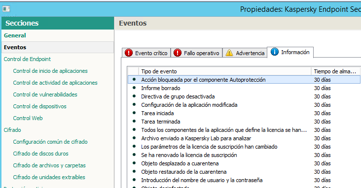

  

Actualización de servidor.
--------------------------

  
Bajar el paquete de instalación de la web de Kaspersky:  
[https://www.kaspersky.com/small-to-medium-business-security/downloads/security-center](https://www.kaspersky.com/small-to-medium-business-security/downloads/security-center)

  

*   Importante: bajar la versión en castellano.
*   Bajar la versión Full

  

  
Ejecutar en el servidor. El software detectarà que està instalado y hará una actualiazación.

  

Instalar Kaspersky EndPoint en Windows Server
---------------------------------------------

  
Instal·lar primer l'agent actual del servidor:  
[\\\\aocav\\c$\\Program Files (x86)\\Kaspersky Lab\\Kaspersky Security Center\\Share\\Packages\\NetAgent\\exec\\Setup.exe](file://aocav/c$/Program Files \(x86\)/Kaspersky Lab/Kaspersky Security Center/Share/Packages/NetAgent/exec/Setup.exe)  
  
Ver si hay actualizaciones del cliente para Windows server:  
[https://support.kaspersky.com/ksws10#kb](https://support.kaspersky.com/ksws10#kb)  
Des de el servidor donde se quiere instalar, ir al repositorio de paquetes de AOCAV para Windows server:  
\[\\\\aocav\\KLSHARE\\Packages\\WSEE\_10.1.0.622|\\\\aocav\\KLSHARE\\Packages\\WSEE\_10.1.0.622\]  
  
Instalar ejecutando setup.exe.  
Des de el Security Center, el servidor debería ser visible:  
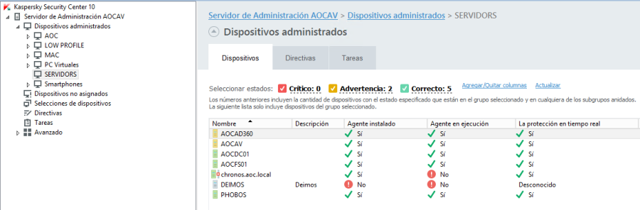  
  
Entrar en las propiedades del servidor, ir a la sección de tareas y ejecutar

  

*   Actualizacion de signatures
*   DataBase Update

  

  
Si diera un error de que la aplicación no està activada:

  

*   \- Activación nueva key

  

  
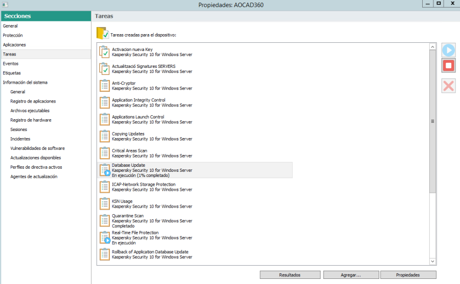

  

Instalar Kaspersky EndPoint en Linux Server
-------------------------------------------

  
Los paquetes de instalación se pueden bajar de:  
[https://www.kaspersky.com/small-to-medium-business-security/downloads/endpoint](https://www.kaspersky.com/small-to-medium-business-security/downloads/endpoint)

  

### Inatalar NetworkAgent:

  

  

  

#### Prerequisitos:

  

  
apt-get Update  
root@KASvsUbuntu:~# perl -v  
This is perl 5, version 22, subversion 1 (v5.22.1)  
root@KASvsUbuntu:~# which bash  
/bin/bash  
apt-get install build-essential  
apt-get install binutils  
binutils is already the newest version.  
ld --version  
GNU ld (GNU Binutils for Ubuntu) 2.24  
apt-get install linux-headers-amd64  
The following NEW packages will be installed:  
cpp-4.6 gcc-4.6 gcc-4.6-base linux-headers-3.2.0-4-amd64 linux-headers-3.2.0-4-common linux-headers-amd64 linux-kbuild-3.2  
   
apt-get install libc6-i386  
The following NEW packages will be installed:  
libc6-i386  
  
  
Con privilegios de root:

  

1.  dpkg -i --force-architecture klnagent\_<build number>\_i386.deb  
    O  
    El paquete instal·lador està en el repositorio: [\\\\aocav\\KLSHARE\\Packages\\NetAgent\_10.1Linux](file://aocav/KLSHARE/Packages/NetAgent_10.1Linux)  
    Poner el paquete en el servidor Linux.  
    Instalar desde el paquetes:
2.  dpkg -i --force-architecture /tmp/klnagent\_10.1.0-101\_i386.deb  
      
    Donde build number es la versión del paquete.  
    Para ver la última versión disponible: [https://support.kaspersky.com/sp/linux\_file80#downloads](https://support.kaspersky.com/sp/linux_file80#downloads)  
    Después de la instalación, ejecutar el script de configuración:  
    /opt/kaspersky/klnagent/lib/bin/setup/postinstall.pl  
    root@LABJIRA01:/tmp# /opt/kaspersky/klnagent/lib/bin/setup/postinstall.pl  
    Please enter Administration Server DNS-name or static IP-address  
    192.168.166.12  
    Please enter Administration Server port number \[14000\]:  
    Please enter Administration Server ssl port number \[13000\]:  
    Please enter 'Y' to confirm that you want to use SSL encryption  
    or enter 'N' to use non-encrypted communication \[Y\]:  
    Y  
    The Network Agent being installed can be used as connection  
    gateway. It will allow you to connect to Administration Server  
    using the specified connection gateway.  
    1) Do not configure connection gateway  
    2) Do not use connection gateway  
    3) Connect to server using connection gateway  
    4) Use as connection gateway  
    Please choose connection gateway mode: \[1\]:  
    1  
    /opt/kaspersky/klnagent/sbin/klnagent -unregserver 1>/tmp/klinstallexec.1289.tmp 2>&1/opt/kaspersky/klnagent/sbin/klnagent -regserver -pkgver 10.1.0.101 -server aocav.aoc.local -port 14000 -sslport 13000 -usessl 1 -gwmode 1 1>/tmp/klinstallexec.1289.tmp 2>&1Starting klnagent: klnagent started  
    Kaspersky Network Agent is installed.  
    Binaries were installed in /opt/kaspersky/klnagent/bin  
      
    root@KASvsUbuntu:~# service klnagent status  
    â klnagent.service - LSB: Kaspersky Network Agent  
    Loaded: loaded (/etc/init.d/klnagent; bad; vendor preset: enabled)  
    Active: inactive (dead)  
    Docs: man:systemd-sysv-generator(8)  
      
    Después de la instalación, ir a la consola de administración de Security center, localitzar el servidor y moverlo a la carpeta de servidors (se puede hacer des de buscar dispositivos)  
    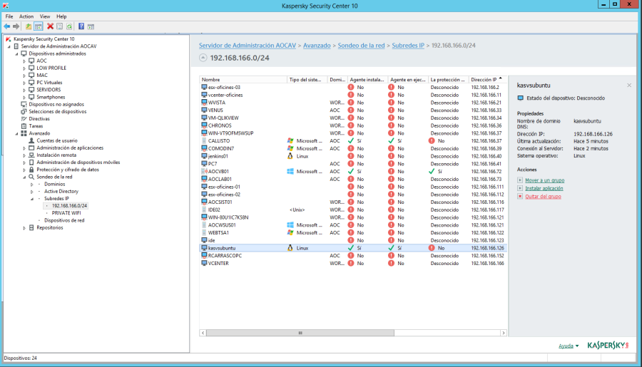  
      
    
    ### Instalar Kaspersky Endpoint:
    
    dpkg –i /tmp/kesl\_10.0.0-3458\_amd64.deb  
    Después de instalar el EndPoint ejecutar el script de configuración:  
    /opt/kaspersky/kesl/bin/kesl-setup.pl  
      
      
    
    Instalación de aplicaciones en remoto
    -------------------------------------
    
      
    Deixar els instal·ladors a:  
    \\\\aocav\\KLSHARE\\Programes per desplegar  
    Aquest share apunta a aquesta ubicació:  
    C:\\Program Files (x86)\\Kaspersky Lab\\Kaspersky Security Center\\Share\\Programes per desplegar\\Java 8.162  
      
    Anar a la Consola de Kaspersky Tareas – Crear nueva tarea – Servidor de administración de Kaspersky.... – Instalar aplicación en remoto  
    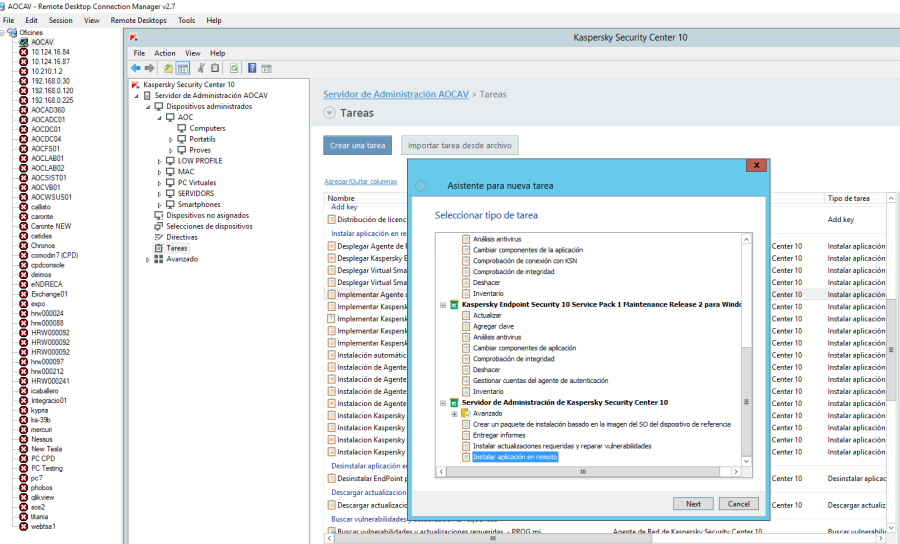  
      
    Crear un nou paquet d'instal·lació: nuevo ... – Crear paquete de instalación para el archivo ejecutable especificado.  
    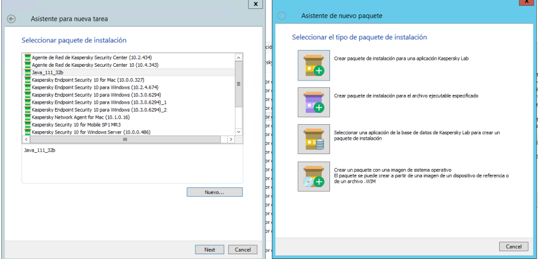  
    Donar un nom al paquet d'instal·lació.  
    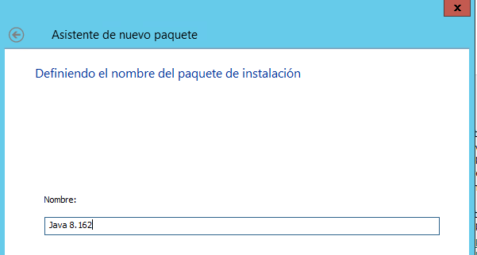  
      
    Seleccionar l'arxiu executable que es vol desplegar  
    Indicar la ubicació de l'arxiu executable i la línia de comandes per fer la instal·lació desassistida.  
      
    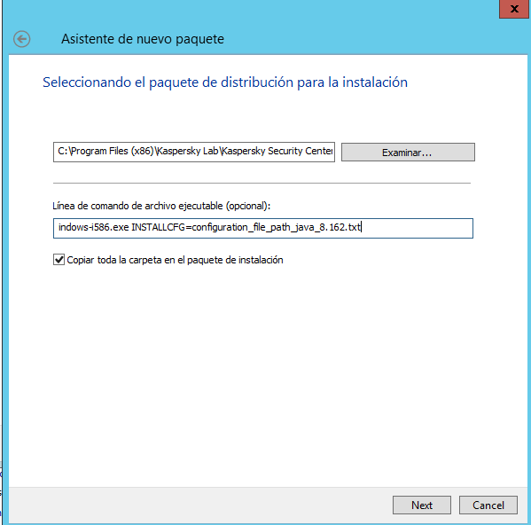  
      
    Amb això es crearà el paquet de instal3lació:  
    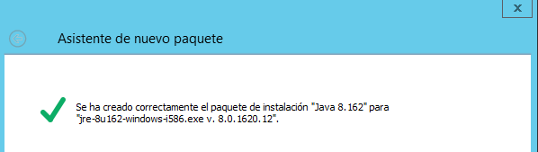  
      
    Seleccionar el paquet que acabem de crear:  
    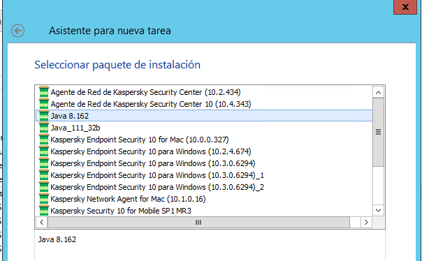  
      
    Configurar que no tanqui les aplicacions per fer la instal·lació, si no que sigui l'usuari qui ho faci.  
    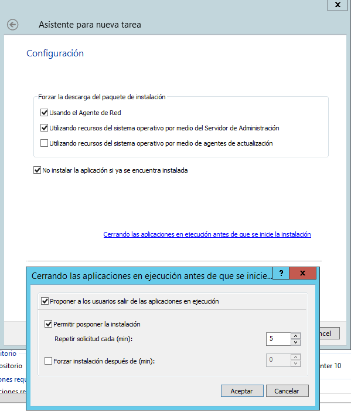  
    Acabar la configuració i donar un nom a la tasca.

Attachments:
------------

 [worddavd43047ec21664e0f8ac8200c0808e56e.png](attachments/15368383/15368382.png) (image/png)  
 [worddav4f6c835fdf512c0323aee532ab2dac3a.png](attachments/15368383/15368384.png) (image/png)  
 [worddav2e3334ab1d730afb33414703c0317e4d.png](attachments/15368383/15368385.png) (image/png)  
 [worddavb73004f3237ccf2d0f5f8f5f4c21a181.png](attachments/15368383/15368386.png) (image/png)  
 [worddavaa12b078228f9d5c7df07958e7e33f1f.png](attachments/15368383/15368387.png) (image/png)  
 [worddav03e500856e89fa12d94b488dea2dee6d.png](attachments/15368383/15368388.png) (image/png)  
 [worddavf78ea977a81c2ea4092e81e347cb5ae1.png](attachments/15368383/15368389.png) (image/png)  
 [worddav1581e532310d21cedbfd7ab13ebc911c.png](attachments/15368383/15368390.png) (image/png)  
 [worddav0e1050f1610afe1f8cbf06994e39b24d.png](attachments/15368383/15368391.png) (image/png)  
 [worddav695e6c80242a08d66ce603f2105d3168.png](attachments/15368383/15368392.png) (image/png)  
 [worddav0f95ab07c73e7caff10f6f33f6464734.png](attachments/15368383/15368393.png) (image/png)  

Document generated by Confluence on 06 junio 2025 23:57

[Atlassian](http://www.atlassian.com/)