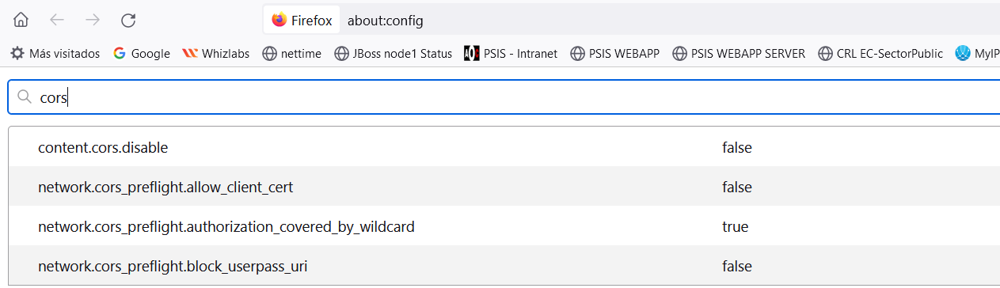
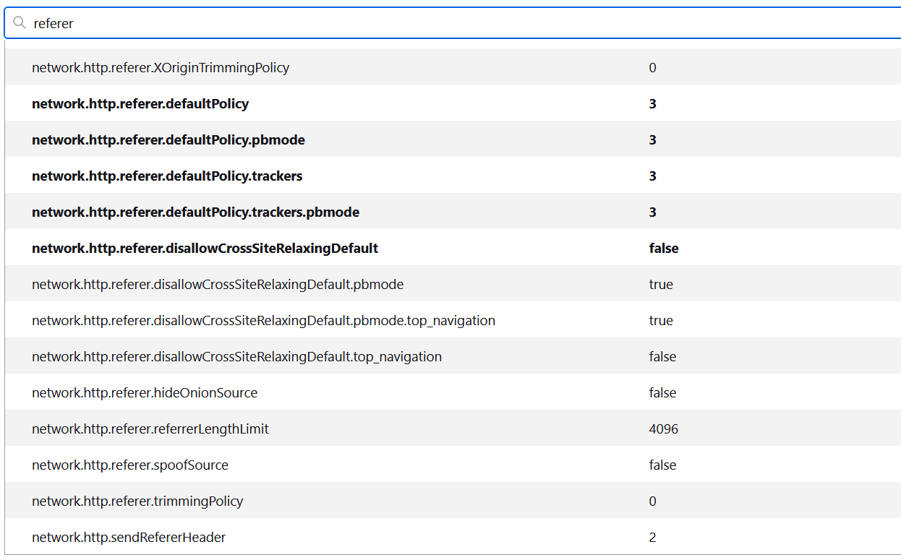

Projectes : Problemes amb Firefox i Aplicació Nativa (CORS)  

1.  [Projectes](index.md)
2.  [SIGNADOR](SIGNADOR_41523646.md)

Projectes : Problemes amb Firefox i Aplicació Nativa (CORS)
===========================================================

Created by Áurea Alcaide on 11 enero 2024

Firefox a vegades no aplica les polítiques menys restrictives configurades, i simplement denega el CORS.

No he trobat la combinació correcta, però ara mateix em funciona amb:

**about:config**

Els valors en negreta són els que s'han modificat en relació als valors per defecte.

  

Informació sobre CORS en Firfox:

[https://developer.mozilla.org/en-US/docs/Web/HTTP/CORS](https://developer.mozilla.org/en-US/docs/Web/HTTP/CORS)

Attachments:
------------

 [image2024-1-11\_16-10-7.png](attachments/100008706/100008707.png) (image/png)  
 [image2024-1-11\_16-11-2.png](attachments/100008706/100008708.png) (image/png)  
 [image2024-1-11\_16-11-58.png](attachments/100008706/100008709.png) (image/png)  
 [image2024-1-11\_16-12-20.png](attachments/100008706/100008710.png) (image/png)  

Document generated by Confluence on 07 junio 2025 00:00

[Atlassian](http://www.atlassian.com/)