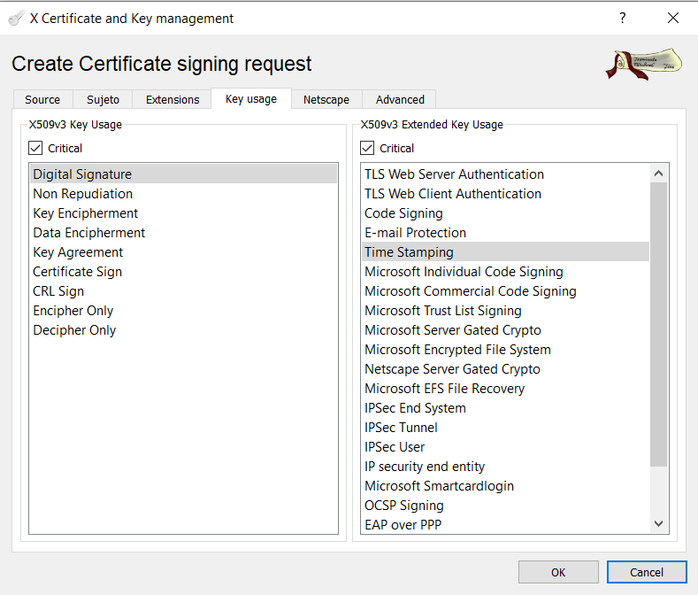

Projectes : Renovació de la TSA (XCA)  

1.  [Projectes](index.md)
2.  [PSIS](PSIS_24215797.md)
3.  [PSIS - WIKI](PSIS---WIKI_24215598.md)
4.  [Procediments](Procediments_24215610.md)

Projectes : Renovació de la TSA (XCA)
=====================================

Created by Áurea Alcaide, last modified on 21 mayo 2025

* * *

**Generació del CSR:**

Ubicació fitxers necessaris per la generació del CSR:

\\\\endreca\\TECNOLOGIA\\PROJECTES\\PSIS\\CanvisPrograma\\TSA\\xca\\

Fer-ho amb la base de dades:  XCA\_TSA\_database.xdb

Ja té definides unes plantilles per PRE i PRO.

**1.-** **Generar la clau privada**.

**2.- Generar el CSR** a partir de la plantilla corresponent:

PRO:   **_Servei de segellat de temps de PSIS_**

PRE:   **_Servei de segellat de temps de PSIS INTEGRACIO_**

 **_ Comprovar que estiguin marcades com a crítiques les extensions "Digital Signature" i "Time Stamping"._**

**__**

**3.-** **Exportar el CSR en format PEM**, i enviar-lo a la gent de l'SCD.

  

  

* * *

  

**0.- IMPORTANT: C****omprovar que el certificat té marcada l'extensió extendedKeyUsage com a crítica.**

Abans de carregar la nova TSA, cal comprovar que el certificat té marcada l'extensió extendedKeyUsage com a crítica. Sinó, eines com Adobe no donen per vàlids els segells de temps.

Codi:

package utils;
import java.io.FileInputStream;
import java.io.IOException;
import java.io.InputStream;
import java.security.cert.CertificateFactory;
import java.security.cert.X509Certificate;
import java.util.Set;

import psis.common.utils.X500NameUtils;
import psis.common.utils.X500NameUtils.Format;

public class GetCertDNAndExtendedKeyUsage {

	private static String EXTENDEDKEYUSAGE\_OID = "2.5.29.37";
	
	public static void main(String\[\] args) throws IOException {
		 InputStream inStream = null;
		 try {
			 /\*\* certificate must be binary encoded \*\*/
			 inStream = new FileInputStream("C:\\\\E\\\\PSIS\\\\TSA\\\\Servei\_de\_segellat\_de\_temps\_de\_PSIS\_2022-07-19.cer");
			 
		     CertificateFactory cf = CertificateFactory.getInstance("X.509");
		     X509Certificate cert = (X509Certificate)cf.generateCertificate(inStream);
		     
		     /\*\* DN \*\*/
		     //RFC2253 (Lightweight Directory Access Protocol (v3): UTF-8 String Representation of Distinguished Names, December 1997)
		     String dn = X500NameUtils.serialize(cert.getSubjectX500Principal(), Format.RFC2253, true);
		     System.out.println(dn);
		     
		     /\*\* extendedKeyUsage \*\*/
		     Set<String> criticalExtensionsOids = cert.getCriticalExtensionOIDs();
		     boolean extendedKeyUsageMarkedCritical = false;
		     for(String criticalExtOid:criticalExtensionsOids) {
		    	 System.out.println(criticalExtOid);
		    	 if(criticalExtOid.equals(EXTENDEDKEYUSAGE\_OID)) {
		    		 extendedKeyUsageMarkedCritical = true;
		    		 break;
		    	 }
		     }
		     System.out.println("extendedKeyUsage marked as critical: "+extendedKeyUsageMarkedCritical);
		     
		 } catch (Exception e) {
			e.printStackTrace();
		 } finally {
		     if (inStream != null) {
		         inStream.close();
		     }
		 }
	}
}

  

Si la extensió no està marcada com a crítica, cal que tornin a generar el certificat de la TSA.

  

**1.- Comprovació de certificat vs clau  
**

  

* * *

**Primer cal comprovar que el certificat generat es correspon amb la clau privada.**

Faig copy&paste de les instruccions:

To verify if a private key corresponds to a certificate in OpenSSL, you can compare their moduli. The modulus is a key part of the public key, and it must match the modulus of the corresponding private key. 

Here's how to do it:

1\. Extract the modulus from the certificate:

openssl x509 -noout -modulus -in certificate.crt | openssl md5

2\. Extract the modulus from the private key:

openssl rsa -noout -modulus -in private\_key.pem | openssl md5

3\. Compare the MD5 hashes:

If the MD5 hashes generated in steps 1 and 2 are identical, then the private key corresponds to the certificate. If they are different, the private key does not match the certificate. 

  
Explanation:

*   `openssl x509 -noout -modulus -in certificate.crt`:   This command extracts the modulus from the X.509 certificate file (`certificate.crt`). `-noout` suppresses the default output, and `-modulus` specifies that you want the modulus.
*   `openssl rsa -noout -modulus -in private_key.pem`:   This command extracts the modulus from the private key file (`private_key.pem`). `-noout` suppresses the default output, and `-modulus` specifies that you want the modulus. 
*   `openssl md5`: This command calculates the MD5 hash of the input. The MD5 hash is used to compare the moduli in a compact and easily comparable way. 

* * *

  

**2.- Creació del P12:**

A partir de la clau privada amb què s'ha generat el CSR i el certificat emès amb aquest CSR, en format PEM ambdós, creem el P12.

Per fer-ho necessitem executar la següent comanda OpenSSL:

openssl pkcs12 -export -in certificate.pem -inkey private\_key.pem -name "alias" -out keystore.p12

Per exemple:

openssl pkcs12 -export -in Servei\_de\_segellat\_de\_temps\_de\_PSIS\_2019-07-16.pem -inkey PRIVATE\_PSIS\_2019-07-16.pem -name "servei de segellat de temps de psis" -out Servei\_de\_segellat\_de\_temps\_de\_PSIS\_2019-07-16.p12

openssl pkcs12 -export -in Servei\_de\_segellat\_de\_temps\_de\_PSIS\_INTEGRACIO\_2019-07-16.pem -inkey PRIVATE\_PSIS\_INTEGRACIO\_2019-07-16.pem -name "servei de segellat de temps de psis integracio" -out Servei\_de\_segellat\_de\_temps\_de\_PSIS\_INTEGRACIO\_2019-07-16.p12

  

NOTA: Si tenim el CSR i no la clau privada directament, podem extreure-la del CSR fent servir el programa XCA ([http://sourceforge.net/projects/xca/](http://sourceforge.net/projects/xca/)).

  

→ Amb XCA també és possible exportar el P12. Cal importar primer el certificat generat. I després sobre aquest certificat, exportar-lo com a P12. XCA ja agafa la clau privada que correspongui.

  

**3.- Eliminar TSA existent.**  
Per carregar una clau que substitueixi a una ja existent a punt de caducar, cal primer eliminar la que caducarà.  
Per eliminiar-la, aturar el servei, i executar el procedure Oracle:  
**DELETE\_OLD\_TSA\_PRE**  
Abans d'executar-ho, cal substituir els valors del **subject** i el **certificate finger print** pels del certificat a eliminar.

  

**4.- Carregar la nova clau des de la consola java.**

**4.1.- Actualització arxius de bindings.**

Per tal de carregar la nova clau, cal actualitar els següents arxius amb la informació del nou P12:

**4.1.1.-** Primer cal **extreure el DN del nou certificat en format RFC2253**. Per fer-ho, fem servir el següent codi java, per formatejar-lo a RFC2253 (_Lightweight Directory Access Protocol (v3): UTF-8 String Representation of Distinguished Names, December 1997_):

import java.io.FileInputStream;
import java.io.IOException;
import java.io.InputStream;
import java.security.cert.CertificateFactory;
import java.security.cert.X509Certificate;
import psis.common.utils.X500NameUtils;
import psis.common.utils.X500NameUtils.Format;

public class GetCertDN {

	public static void main(String\[\] args) throws IOException {
		 InputStream inStream = null;
		 try {		 
			 inStream = new FileInputStream("C:\\\\\\\\Users\\\\\\\\aalcaide\\\\\\\\Desktop\\\\\\\\cert.cer");
		     CertificateFactory cf = CertificateFactory.getInstance("X.509");
		     X509Certificate cert = (X509Certificate)cf.generateCertificate(inStream);
		     //RFC2253 (Lightweight Directory Access Protocol (v3): UTF-8 String Representation of Distinguished Names, December 1997)
		     String dn = X500NameUtils.serialize(cert.getSubjectX500Principal(), Format.RFC2253, true);
		     System.out.println(dn);
		 } catch (Exception e) {
			e.printStackTrace();
		 } finally {
		     if (inStream != null) {
		         inStream.close();
		     }
		 }
	}
}

IMPORTANT: Eliminar del DN qualsevol aparició de "\\00"

Aquest DN serà el valor del camp _X500Name_ del **_Binding_**, i el que haurem d'afegir al ftxer de configuració **_Cfg-SignatureFactory-vX-CatcertTest-YYYYMMDD.xml_**.

**4.1.2.- Binding:**

**catcert-TSA\_PRE/O\_xxxxx.xml**:

<Binding xmlns="[http://www.netfocus.es/psis/management](http://www.netfocus.es/psis/management)">  
<Entity name=" **TSA** " domain=" **serviceEntity** " schema="X500BasedSchema">  
<Attribute name="X500Name">  
<Value> _**X500Name**_ </Value>  
</Attribute>  
</Entity>  
<Key>  
<KeyPair>  
<StorePath>./psis-config/configuracio\_psis/bindings/P12s/_**nom p12**_ </StorePath>  
<StorePass> _**password**_ </StorePass>  
</KeyPair>  
<Usages>  
<Usage name=" **Identifiers/KeyUsages/Timestamping** "/>  
</Usages>  
<Applications>  
<Application name="app\_name" URI="urn:ietf:rfc:2633"/>  
</Applications>  
</Key>  
<Certificate>  
<Encoding> _**cert en Base 64**_ </Encoding>  
</Certificate>  
</Binding>

**4.1.3.- BindingDataLoaderConfig.xml**

Actualitzar-lo per a que apunti a l'arxiu anterior.

  

**4.2.- Aixecar un node en mode IOP, i des de la consola, carregar la clau corresponent**.

Si fem servir la consola java de WildFly, no cal aixecar en mode IOP. Però l'accés al servidor serà al port 9990 i cal usuari/password (mgmt-users.properties).

  

**4.3.- Reiniciar el servei en mode normal.**

  

**5.-** **Actualitzar _Cfg-SignatureFactory-vX-CatcertTest-YYYYMMDD.xml_**.

Aquest pas només cal fer-ho si ha canviat el DN del certificat respecte de la TSA anterior.

Si és així, caldrà actualitzar el nou valor al fitxer de configuració, i carregar la nova configuració des de la consola web.

Un cop carregada la nova configuració, reiniciar el servei en mode normal.

  

**5.1.- En cas de degradació del temps de consulta a BD, regenerar, si s'escau, les estadístiques de les taules de configuració i de claus.**

[Regenerar les estadístiques de les taules de configuració](C_CORE-tables-generate-statistics_24215897.md)

[Regenerar les estadístiques de les taules de claus](CRYPTOGRAPHIC-KEYS-tables-generate-statistics_24215900.md)

**NOTES**:

**1.-** Assegurar-se sempre de que el password del P12 i de la clau privada sigui el mateix.

**2.-** Després d'esborrar una clau, cal sempre reiniciar el servei.

**3.-** En cas de problemas durant la càrrega, lo més ràpid és eliminar totes les claus ([Script per esborrar les taules de claus criptogràfiques](24215706.md)), i tornar a carregar-ho tot des de la consola java.

  

Attachments:
------------

 [image2023-6-1\_14-21-3.png](attachments/24215648/93356294.png) (image/png)  

Document generated by Confluence on 07 junio 2025 00:00

[Atlassian](http://www.atlassian.com/)