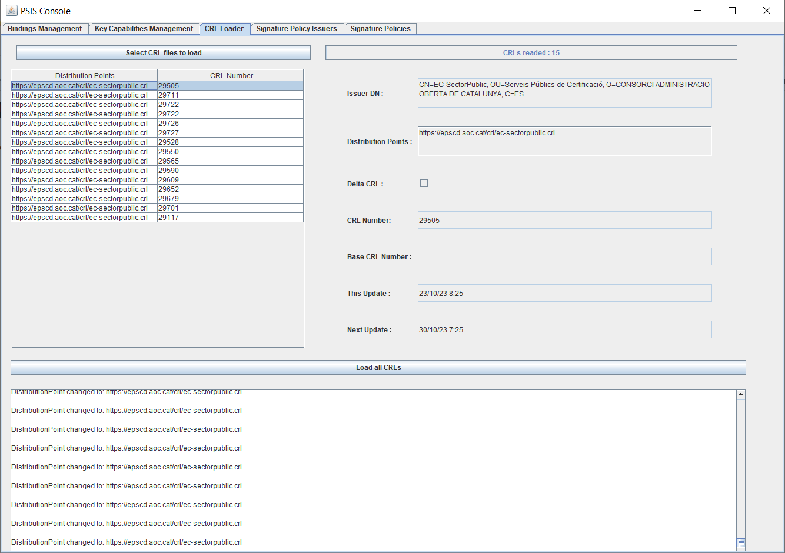
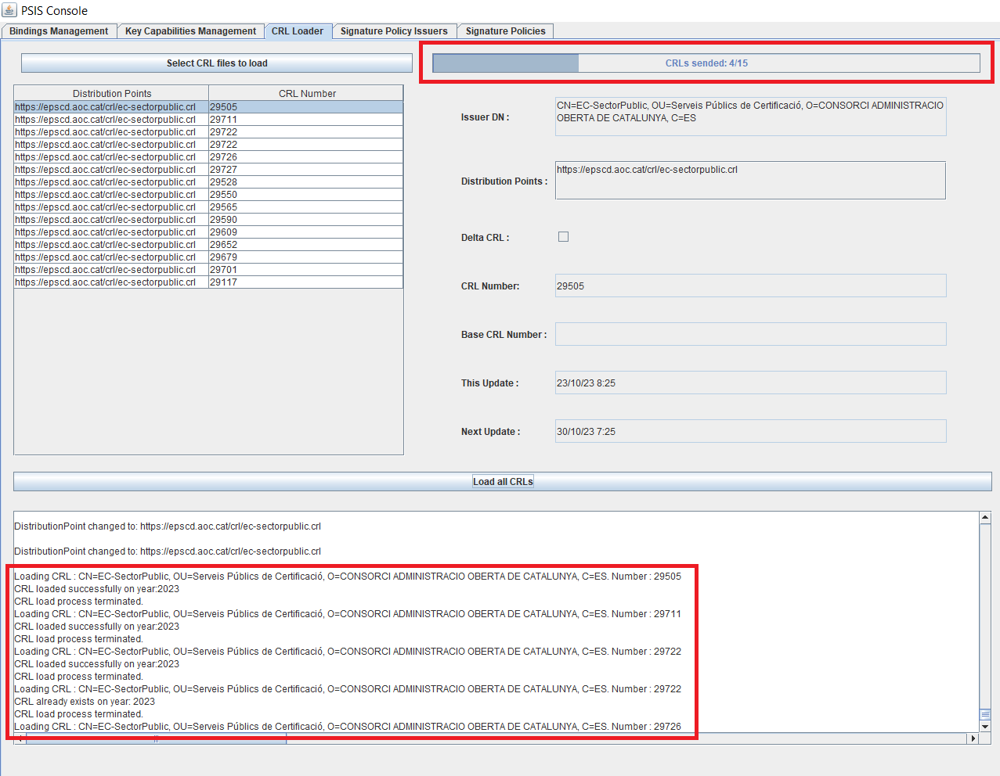
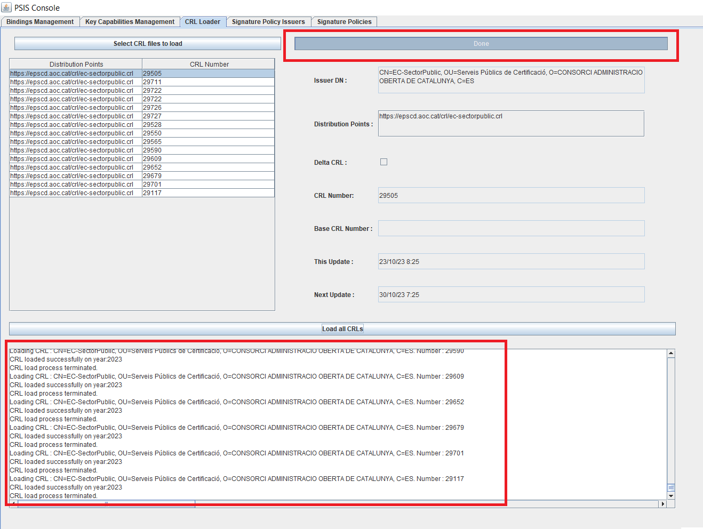

Projectes : Càrrega de CRLs  

1.  [Projectes](index.md)
2.  [PSIS](PSIS_24215797.md)
3.  [PSIS - WIKI](PSIS---WIKI_24215598.md)
4.  [Procediments](Procediments_24215610.md)

Projectes : Càrrega de CRLs
===========================

Created by Áurea Alcaide, last modified on 07 noviembre 2023

La càrrega de CRLs a PSIS es realitza mitjançant la **consola java**. Per poder arrencar la consola java cal que el **JBoss contra el que es vulgui treballar estigui aixecat en mode -iop**.

Classe **psis.core.adapters.management.client.BindingDataGuiLoader**  
Ubicada dins el codi font a: **/psis\_config/src/main/java/**

Executar la classe anterior. S'obrirà la consola java de PSIS.

Especificar els valors de:

Organization:
  catcert -> PRO
  catcert-test -> PRE

JMX Server:
  IP:9990

Anar a la pestanya **"CRL Loader"**. Des d'aquí podrem pujar per fitxer les CRLs dessitjades.

Podem pujar més d'una de cop, en un zip, o bé sel·leccionant varis fitxers a l'hora. Si sel·leccionem d'un en un, no acumula.

Important

Si la CRL no inclou el distribution point, cal afegir-lo manualment a la textarea.

Per afegir-lo correctament, cal que la CRL estigui sel·leccionada, sinó no funciona.

Si hem pujat vàries CRLs, cal afegir el distribution point a cadascuna individualment.

Info de progrés:

Procés de càrrega finalitzat:

  

  

Attachments:
------------

 [image2023-11-7\_13-23-28.png](attachments/24215651/100008299.png) (image/png)  
 [image2023-11-7\_13-24-46.png](attachments/24215651/100008300.png) (image/png)  
 [image2023-11-7\_13-26-3.png](attachments/24215651/100008301.png) (image/png)  
 [image2023-11-7\_13-26-36.png](attachments/24215651/100008302.png) (image/png)  

Document generated by Confluence on 07 junio 2025 00:00

[Atlassian](http://www.atlassian.com/)