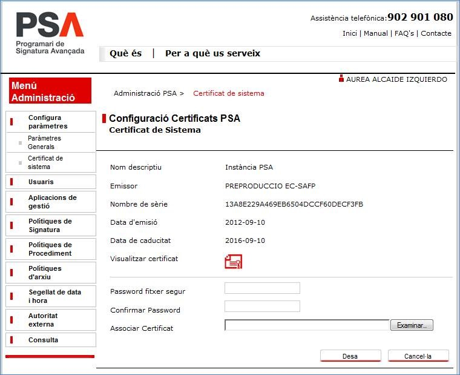

Projectes : Actualització del CDA de PSA  

1.  [Projectes](index.md)
2.  [PSA](PSA_24216342.md)
3.  [PSA - WIKI](PSA---WIKI_24216306.md)
4.  [Procediments PSA](Procediments-PSA_24216373.md)

Projectes : Actualització del CDA de PSA
========================================

Created by Áurea Alcaide, last modified on 05 septiembre 2019

[RV Nous CDAs de PSA PRE i PRO (certificats d\_instància de PSA).msg](attachments/24216375/24216376.msg)

  

**Els certificats CDA de PSA dels entorns de PREPRODUCCIÓ  i PRODUCCIÓ, caduquen el 29 de juliol de 2020. Caldrà doncs procedir a sol·licitar un nou certificat entre abril i maig.**

Es tracta dels certificats adjunts:

**[PSA Preproduccio.crt](attachments/24216375/26318890.crt)** -> CDA de PRE

****[PSA.crt](attachments/24216375/26318891.crt)**** -> CDA de PRO

Per tal de renovar aquests certificats abans de que caduquin, caldrà seguir aquests passos:

1.  **Sol·licitar nous CDAs a CATCert**, amb dades similars als certificats adjunts, un per PRE i un per PRO. No demanarem una renovació, perquè la renovació implica la revocació del certificat actual, i això podria comportar problemes als clients. Per tant demanarem nous certificats per ambdós entorns, i deixarem que els actuals caduquin sense revocar-los.  
      
    
2.  Un cop CATCert ens lliuri els P12s amb les claus i els certificats amb les claus públiques, afegirem les noves claus públiques al truststore adjunt (**trustedcerts.jks**).  
    Àlies actuals:  
    Àlies del CDA de PRE -> **cda\_xifra\_pre**  
    Àlies del CDA de PRO -> **cda\_xifra\_pro**  
      
    
3.  **Caldrà informar a tots els clients de que el certificat de PSA canvia**, i que hauran de canviar el truststore, afegint el nou certificat. En el mail, li proporcionarem al client.  
    El nou truststore, informant dels àlies dels nous certificats.  
    Els certificats.  
    El client podrà escollir entre fer servir aquest truststore o afegir els certificats al seu propi truststore.  
    **També caldrà informar al client de les dates previstes d’actualització del certificat tant a PRE com a PRO.** És molt important que no facin els canvis abans de que es facin a PSA, doncs no els hi funcionaria el client.  
    La llista de clients de PSA la té l’Iván.  
      
    
4.  **A PSA només pot haver un certificat, per tant, un cop decidides les dates del canvi a PRE i a PRO, caldrà portar-lo a terme**. Enrecordeu-vos que abans cal informar als clients, doncs si no actualitzen el truststore, els hi deixarà de funcionar l’accés a PSA.  
    
    Per **canviar el certificat d’instància de PSA**, cal fer lo següent:
    
    **1.-** **Entrar en la consola com a administrador, i anar al menú “Configura paràmetres > Certificat de sistema”, i carregar el P12 del nou CDA amb el seu password corresponent.**
    
     
    
    Un cop fet el canvi, per consola ens apareixerà un missatge que dirà que cal reiniciar el servei.
    
    **2.- Reiniciar els JBoss**.
    
5.  A partir d’aquí, els clients han de fer servir el mateix certificat al seu truststore, doncs en canviar-lo a PSA, l’antic els hi deixarà de funcionar.  
    Si l’àlies que fan servir pel nou CDA és diferent de l’antic, hauran de modificar els fitxers següents:
    
    **signatureService.xml**
    
    **queryService.xml**
    
    **utilService.xml**
    
    En la definició del truststore, hauran d’especificar l’àlies del nou CDA, substituint el valor en negreta pel que correspongui:
    
    _<sc:TrustStore wspp:visibility="private" location="stores/trustedcerts.jks" storepass="111111" peeralias="**cda\_xifra\_pre**" />_
    
6.  **Actualitzar el pack d’integració** de PSA amb els nous CDAs de PRE i de PRO, i publicar-los.

En principi és molt senzill. Resumint:

\-          **Demanar nous certificats.**

\-          **Decidir les dates d’actualització dels certificats a PRE i a PRO.**

\-          **Proporcionar al client només la part pública, indicant que l’han d’afegir al truststore. Informar-li de les dates del canvia a PRE i a PRO.**

\-          **Fer el canvi a PRE i a PRO.**

  

Attachments:
------------

 [RV Nous CDAs de PSA PRE i PRO (certificats d\_instància de PSA).msg](attachments/24216375/24216376.msg) (application/vnd.ms-outlook)  
 [psa1.jpg](attachments/24216375/26318888.jpg) (image/jpeg)  
 [PSA Preproduccio.crt](attachments/24216375/26318890.crt) (application/octet-stream)  
 [PSA.crt](attachments/24216375/26318891.crt) (application/octet-stream)  

Document generated by Confluence on 07 junio 2025 00:00

[Atlassian](http://www.atlassian.com/)