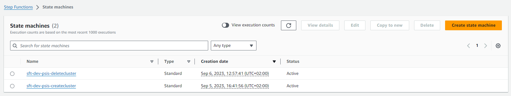

Projectes : CloudHSM a DEV  

1.  [Projectes](index.md)
2.  [PSIS](PSIS_24215797.md)
3.  [PSIS - WIKI](PSIS---WIKI_24215598.md)
4.  [PSIS 8.0](PSIS-8.0_64981431.md)

Projectes : CloudHSM a DEV
==========================

Created by Áurea Alcaide on 11 marzo 2024

Mail del Jordi Palà:

  

Per altra banda, en Miguel (Claranet) va implementar-ho lo més semblant possible al que teniu:

*   1 step functions per arrencar el cloudhsm --> realment arrenca del últim backup que hi hagi al llistat del servei (en un compte només pot haver-hi 1 cloud hsm, sempre es fa backup i no es pot desactivar). De fet, fa backup al arrencar-se i al parar-se automaticament si no recordo malament. Com bé dius, es guarda tot (inclús usuaris).
*   1 step functions per parar el cloudhsm --> l'esborra com ho feieu vosaltres.

  

Aquests step-functions els podeu executar com sempre, quan vulgueu.

  

El Cloudhsm esta definit mitjançant terraform per desplegar-ho el primer cop a DEV, però després al estar recreant-se, el terraform es queda orfan i no es necessari (simplement manté l'estat i creació dels passwords admin i psisuser).

  

En el cas de PRO ja no serà així, perquè no el destruirem i quedarà desplegat sempre. Per tant, tot el tema de step-functions i aquesta metodologia d'esborrar i crear no hi serà. 

  

Attachments:
------------

 [image2024-3-11\_9-48-21.png](attachments/100009707/100009708.png) (image/png)  

Document generated by Confluence on 07 junio 2025 00:00

[Atlassian](http://www.atlassian.com/)