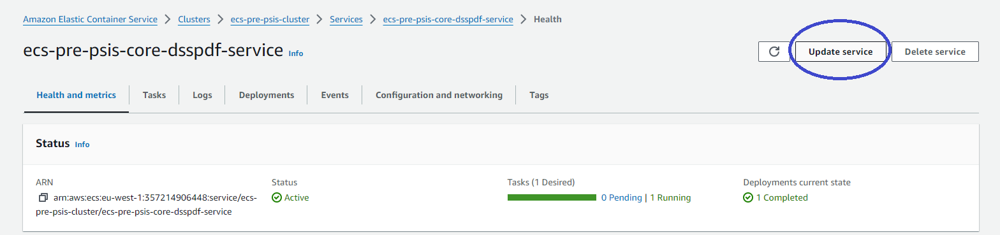
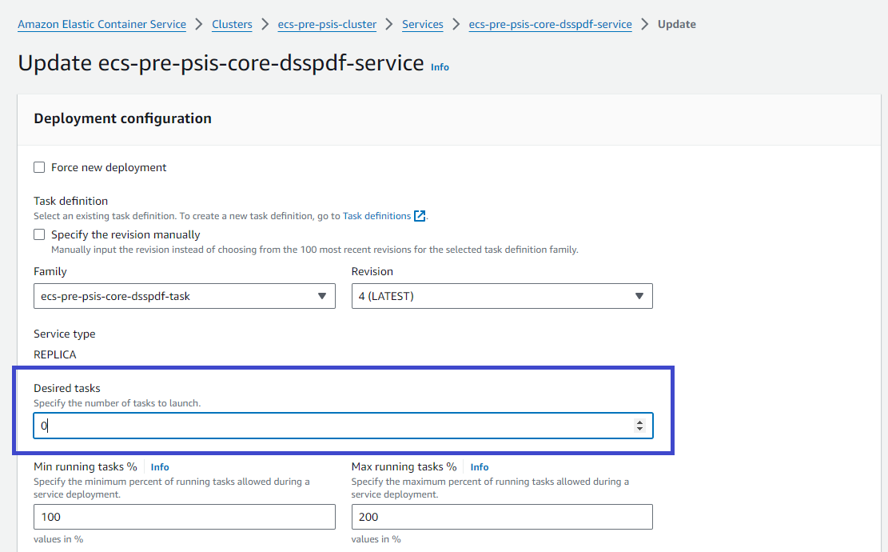

Projectes : Com aturar un servei  

1.  [Projectes](index.md)
2.  [PSIS](PSIS_24215797.md)
3.  [PSIS - WIKI](PSIS---WIKI_24215598.md)
4.  [Procediments](Procediments_24215610.md)
5.  [ECS](ECS_100008918.md)

Projectes : Com aturar un servei
================================

Created by Áurea Alcaide, last modified on 19 enero 2024

Per aturar un servei, ho farem des de la consola d'AWS.

Anar a **Elastic Container Service** > **Clusters**

Clicar sobre el cluster corresponent.

En la llista de serveis del cluster, clicar sobre el servei que es vulgui aturar.

En la pantalla que apareix, clicar al botó "**Update service**". Per exemple:

I a la pantalla d'"Update Service", especificar que el número de "**Desired tasks**" sigui "**0**".

**La resta de valors cal deixar-los igual.**

**No marcar "Force new deployment".**

**No fer "Delete service"**, ja que si l'esborrem, cal recrear-lo des del Terraform, i no tenim permisos.

Attachments:
------------

 [image2024-1-19\_14-10-45.png](attachments/100008920/100008925.png) (image/png)  
 [image2024-1-19\_14-11-12.png](attachments/100008920/100008926.png) (image/png)  
 [image2024-1-19\_14-12-46.png](attachments/100008920/100008928.png) (image/png)  

Document generated by Confluence on 07 junio 2025 00:00

[Atlassian](http://www.atlassian.com/)