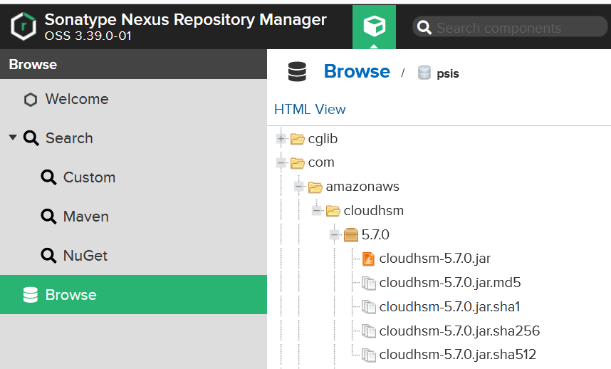

Projectes : Compilar amb CloudHSM  

1.  [Projectes](index.md)
2.  [PSIS](PSIS_24215797.md)
3.  [PSIS - WIKI](PSIS---WIKI_24215598.md)
4.  [PSIS 8.0](PSIS-8.0_64981431.md)

Projectes : Compilar amb CloudHSM
=================================

Created by Áurea Alcaide on 06 marzo 2023

Client SDK de Amazon AWS
------------------------

Per poder compilar el codi de PSIS, necessitarem la llibreria del **client SDK per CloudHSM**.

L'hem de baixar de la web d'Amazon. En la següent pàgina tenim informació per descarregar i instal·lar la llibreria:

[https://docs.aws.amazon.com/cloudhsm/latest/userguide/java-library-install\_5.html](https://docs.aws.amazon.com/cloudhsm/latest/userguide/java-library-install_5.html)

Windows:

URL de descàrrega:

[.rwui\_id\_04d4feeb-405b-45a1-b77c-959774109c67 {color: #666666 !important; background: rgb(237,237,237);}.rwui\_id\_04d4feeb-405b-45a1-b77c-959774109c67:hover {background: rgb(219,219,219);}.rwui\_id\_04d4feeb-405b-45a1-b77c-959774109c67 .rwui\_icon {color: #666666 !important;}https://s3.amazonaws.com/cloudhsmv2-software/CloudHsmClient/Windows/AWSCloudHSMJCE-latest.msi](https://s3.amazonaws.com/cloudhsmv2-software/CloudHsmClient/Windows/AWSCloudHSMJCE-latest.msi "https://s3.amazonaws.com/cloudhsmv2-software/CloudHsmClient/Windows/AWSCloudHSMJCE-latest.msi")

Executar, des de PowerShell:

Start-Process msiexec.exe -ArgumentList '/i C:\\AWSCloudHSMJCE-latest.msi /quiet /norestart /log C:\\client-install.txt' -Wait

Si no s'ha copiat, caldrà que crear aquesta carpeta i ficar el jar següent:

C:\\opt\\cloudhsm\\java\\cloudhsm-jce-5.7.0.jar

Repositori AOC
--------------

He pujat també el jar al repositori **Nexus** d'AOC:

El maven ha d'estar configurat per fer servir també aquest repositori:

C:\\E\\Programas\\apache-maven-3.0.5\\conf\\settings.xml

   	<profile>
     <id>psis</id>
     <repositories>
	   <repository>
		 <id>AOC repo</id>
         <name>Repositori AOC</name>
		 <url>http://10.123.1.43:8080/repository/psis/</url>
       </repository>
     </repositories>
   </profile>

  

  

Attachments:
------------

 [image2023-3-6\_16-9-16.png](attachments/81855693/81855694.png) (image/png)  

Document generated by Confluence on 07 junio 2025 00:00

[Atlassian](http://www.atlassian.com/)