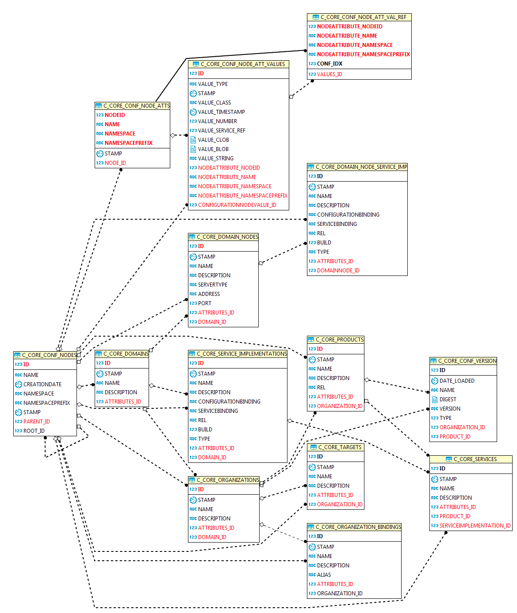
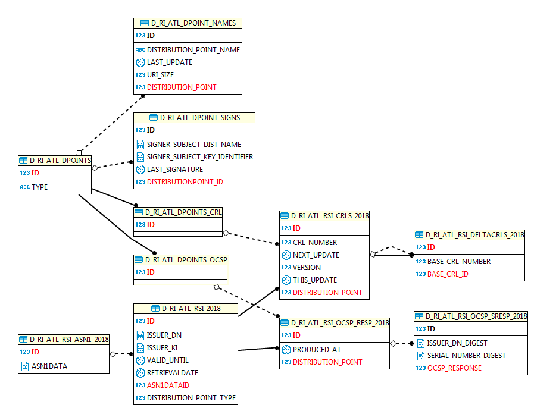
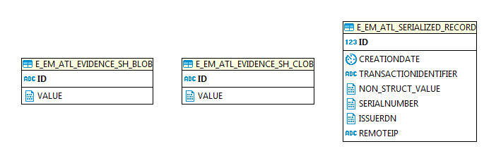
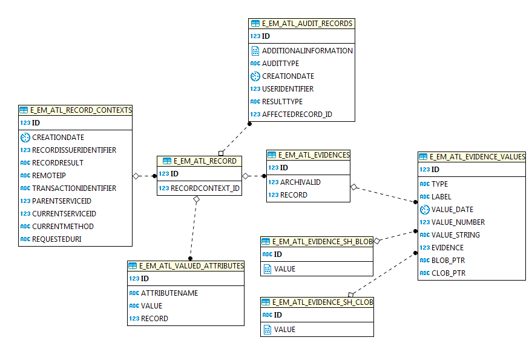
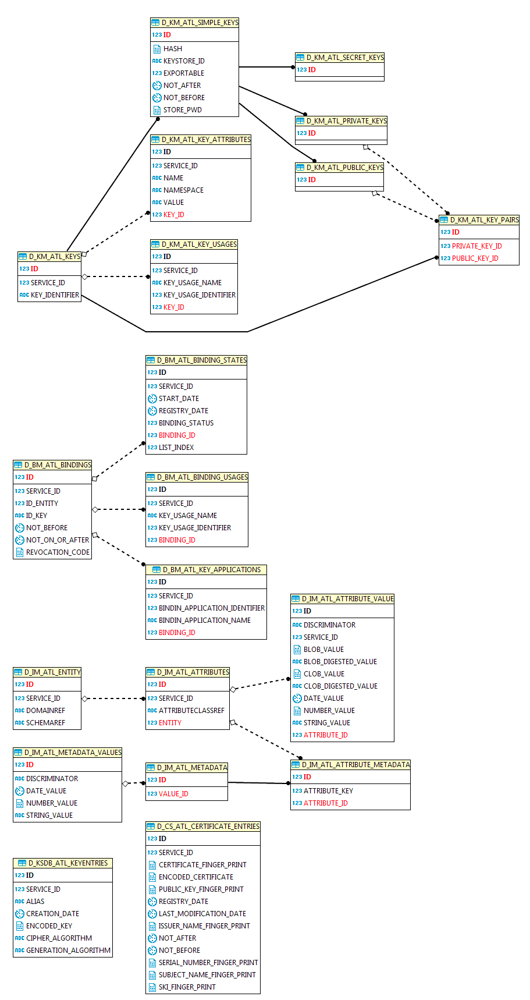

Projectes : Oracle esquemes  

1.  [Projectes](index.md)
2.  [PSIS](PSIS_24215797.md)
3.  [PSIS - WIKI](PSIS---WIKI_24215598.md)
4.  [Documentació](24215931.md)

Projectes : Oracle esquemes
===========================

Created by Áurea Alcaide, last modified on 09 julio 2019

**Configuració**
----------------

* * *

**Informació de revocació**
---------------------------

* * *

**Evidències aplanades**
------------------------

* * *

**Evidències full**
-------------------

* * *

  

**Claus criptogràfiques**
-------------------------

* * *

Attachments:
------------

 [E\_EM\_ATL\_originalTables.png](attachments/24216091/24216097.png) (image/png)  
 [CRYPTOKEYS\_tables.png](attachments/24216091/24216094.png) (image/png)  
 [D\_RI\_ATL\_RSI\_segmentedTables.png](attachments/24216091/24216095.png) (image/png)  
 [E\_EM\_ATL\_flattenedTables.png](attachments/24216091/24216096.png) (image/png)  
 [E\_EM\_ATL\_originalTables.png](attachments/24216091/24216093.png) (image/png)  
 [C\_CORE\_tables.png](attachments/24216091/24216099.png) (image/png)  

Document generated by Confluence on 07 junio 2025 00:00

[Atlassian](http://www.atlassian.com/)