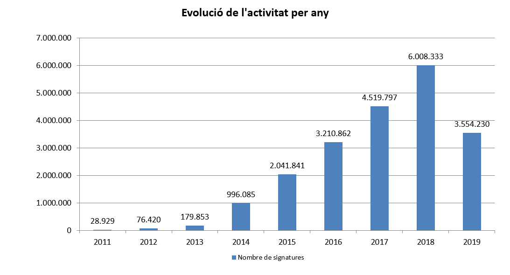
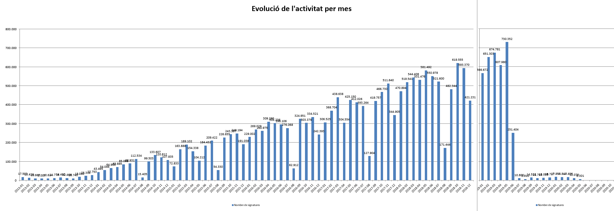

Projectes : PSA  

1.  [Projectes](index.md)

Projectes : PSA
===============

Created by Áurea Alcaide, last modified on 15 mayo 2020

Informació general del servei PSA

 Aquí trobaràs la següent informació:

*   Wiki
*   Estadístiques de consum  
      
    

  

**WIKI**

   

Contraer todo

[Expandir todos](#)   [Contraer todo](#)

             

  

ESTAT DEL SERVEI ALS DIFERENTS ENTORNS

AJS.toInit(function() { aptis.plugins.serverStatus.startAjaxRequestHttpRequest('APTIS\_44711', 'https://confluence.aoc.cat/rest/serverStatus/1.0/service/httpRequest', 'http://www.psa.cat/engineWS/signature/service?wsdl', '30'); AJS.$('#APTIS\_44711').click(function(e) { if (!AJS.$('#APTIS\_44711').hasClass('loading')) { aptis.plugins.serverStatus.updateUserInterface("loading", "", 'APTIS\_44711'); aptis.plugins.serverStatus.startAjaxRequestHttpRequest('APTIS\_44711', 'https://confluence.aoc.cat/rest/serverStatus/1.0/service/httpRequest', 'http://www.psa.cat/engineWS/signature/service?wsdl', '30'); } }); });

AJS.toInit(function() { aptis.plugins.serverStatus.startAjaxRequestHttpRequest('APTIS\_43160', 'https://confluence.aoc.cat/rest/serverStatus/1.0/service/httpRequest', 'http://157.97.64.37/engineWS/signature/service?wsdl', '30'); AJS.$('#APTIS\_43160').click(function(e) { if (!AJS.$('#APTIS\_43160').hasClass('loading')) { aptis.plugins.serverStatus.updateUserInterface("loading", "", 'APTIS\_43160'); aptis.plugins.serverStatus.startAjaxRequestHttpRequest('APTIS\_43160', 'https://confluence.aoc.cat/rest/serverStatus/1.0/service/httpRequest', 'http://157.97.64.37/engineWS/signature/service?wsdl', '30'); } }); });

AJS.toInit(function() { aptis.plugins.serverStatus.startAjaxRequestHttpRequest('APTIS\_6114', 'https://confluence.aoc.cat/rest/serverStatus/1.0/service/httpRequest', 'http://www.preproduccio.psa.cat/engineWS/signature/service?wsdl', '30'); AJS.$('#APTIS\_6114').click(function(e) { if (!AJS.$('#APTIS\_6114').hasClass('loading')) { aptis.plugins.serverStatus.updateUserInterface("loading", "", 'APTIS\_6114'); aptis.plugins.serverStatus.startAjaxRequestHttpRequest('APTIS\_6114', 'https://confluence.aoc.cat/rest/serverStatus/1.0/service/httpRequest', 'http://www.preproduccio.psa.cat/engineWS/signature/service?wsdl', '30'); } }); });

**CONSUM ANUAL**

  

**CONSUM MENSUAL**

Attachments:
------------

 [wiki2.png](attachments/24216342/24216343.png) (image/png)  
 [wiki.png](attachments/24216342/24216344.png) (image/png)  
 [psaStats1.png](attachments/24216342/24216410.png) (image/png)  
 [psaStats2.png](attachments/24216342/24216411.png) (image/png)  
 [image2020-5-15\_8-45-35.png](attachments/24216342/36341329.png) (image/png)  
 [image2020-5-15\_8-50-42.png](attachments/24216342/36341330.png) (image/png)  

Document generated by Confluence on 07 junio 2025 00:00

[Atlassian](http://www.atlassian.com/)