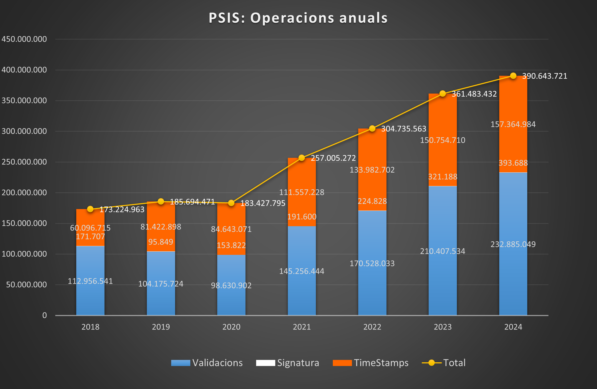

Projectes : PSIS  

1.  [Projectes](index.md)

Projectes : PSIS
================

Created by Áurea Alcaide, last modified on 03 febrero 2025

Informació general del servei PSIS

 Aquí trobaràs la següent informació:

*   Wiki
*   Estat del servei als diferents entorns
*   Estadístiques de consum
*   Incidències amb afectació a clients  
      
    

**WIKI**

   

Contraer todo

[Expandir todos](#)   [Contraer todo](#)

             

ESTAT DEL SERVEI ALS DIFERENTS ENTORNS

AJS.toInit(function() { aptis.plugins.serverStatus.startAjaxRequestHttpRequest('APTIS\_84649', 'https://confluence.aoc.cat/rest/serverStatus/1.0/service/httpRequest', 'https://psis.aoc.cat/psis/catcert/dss', '30'); AJS.$('#APTIS\_84649').click(function(e) { if (!AJS.$('#APTIS\_84649').hasClass('loading')) { aptis.plugins.serverStatus.updateUserInterface("loading", "", 'APTIS\_84649'); aptis.plugins.serverStatus.startAjaxRequestHttpRequest('APTIS\_84649', 'https://confluence.aoc.cat/rest/serverStatus/1.0/service/httpRequest', 'https://psis.aoc.cat/psis/catcert/dss', '30'); } }); });

AJS.toInit(function() { aptis.plugins.serverStatus.startAjaxRequestHttpRequest('APTIS\_88669', 'https://confluence.aoc.cat/rest/serverStatus/1.0/service/httpRequest', 'https://psis-pre.aoc.cat/psis/catcert-test/dss', '30'); AJS.$('#APTIS\_88669').click(function(e) { if (!AJS.$('#APTIS\_88669').hasClass('loading')) { aptis.plugins.serverStatus.updateUserInterface("loading", "", 'APTIS\_88669'); aptis.plugins.serverStatus.startAjaxRequestHttpRequest('APTIS\_88669', 'https://confluence.aoc.cat/rest/serverStatus/1.0/service/httpRequest', 'https://psis-pre.aoc.cat/psis/catcert-test/dss', '30'); } }); });

AJS.toInit(function() { aptis.plugins.serverStatus.startAjaxRequestHttpRequest('APTIS\_13921', 'https://confluence.aoc.cat/rest/serverStatus/1.0/service/httpRequest', 'https://psis-dev.aoc.cat/psis/catcert-test/dss', '30'); AJS.$('#APTIS\_13921').click(function(e) { if (!AJS.$('#APTIS\_13921').hasClass('loading')) { aptis.plugins.serverStatus.updateUserInterface("loading", "", 'APTIS\_13921'); aptis.plugins.serverStatus.startAjaxRequestHttpRequest('APTIS\_13921', 'https://confluence.aoc.cat/rest/serverStatus/1.0/service/httpRequest', 'https://psis-dev.aoc.cat/psis/catcert-test/dss', '30'); } }); });

**ESTADÍSTIQUES DEL SERVEI**

**CONSUM ANUAL**

**CONSUM MENSUAL**

Attachments:
------------

 [wiki.png](attachments/24215797/24215842.png) (image/png)  
 [wiki.png](attachments/24215797/24215840.png) (image/png)  
 [wiki2.png](attachments/24215797/24215843.png) (image/png)  
 [image2021-7-14\_15-17-30.png](attachments/24215797/41523826.png) (image/png)  
 [image2025-2-3\_13-54-12.png](attachments/24215797/118555217.png) (image/png)  
 [image2025-2-3\_13-57-1.png](attachments/24215797/118555219.png) (image/png)  
 [image2025-2-3\_13-58-45.png](attachments/24215797/118555221.png) (image/png)  
 [image2025-2-3\_14-30-44.png](attachments/24215797/118555226.png) (image/png)  
 [image2025-2-3\_14-30-54.png](attachments/24215797/118555227.png) (image/png)  

Document generated by Confluence on 07 junio 2025 00:00

[Atlassian](http://www.atlassian.com/)