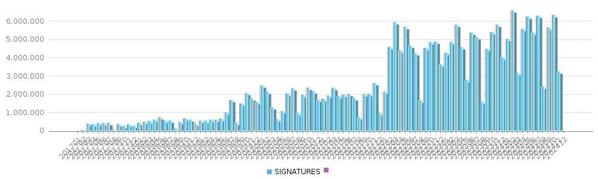
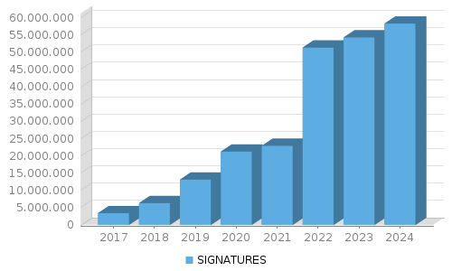

Projectes : SIGNADOR  

1.  [Projectes](index.md)

Projectes : SIGNADOR
====================

Created by Áurea Alcaide, last modified on 08 abril 2025

Informació general del servei Signador

 Aquí trobaràs la següent informació:

*   Wiki
*   Entorn de prestació del servei per data
*   Estadístiques de consum  
      
    

**WIKI**

   

Contraer todo

[Expandir todos](#)   [Contraer todo](#)

             

PLATAFORMA ACTUAL

Actualment el servei s'està oferint a la plataforma de NEXICA.

**CONSUM MENSUAL**

**CONSUM ANUAL**

  

ANY

SIGNATURES

2017

3.421.670

2018

6.316.515

2019

13.111.660

2020

21.222.602

2021

22.900.758

2022

51.336.313

2023

54.261.627

2024

58.276.646

Document generated by Confluence on 07 junio 2025 00:00

[Atlassian](http://www.atlassian.com/)