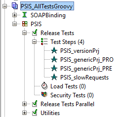

Projectes : Tests funcionals de PSIS  

1.  [Projectes](index.md)
2.  [PSIS](PSIS_24215797.md)
3.  [PSIS - WIKI](PSIS---WIKI_24215598.md)
4.  [Procediments](Procediments_24215610.md)

Projectes : Tests funcionals de PSIS
====================================

Created by Áurea Alcaide, last modified on 10 marzo 2020

Els tests funcionals de PSIS s'executen amb **SoapUI**.

**1.- Els tests es poden descarregar del GiT**

[ssh://git@192.168.166.69:7999/PSIS/psis\_soapui.git](ssh://git@192.168.166.69:7999/PSIS/psis_soapui.git)

  

**2.- WorkSpace**

El worspace és:

**PSIS Release Tests-workspace.xml**

**3.- Projectes**

**3.1.- Tests funcionals  
**

Els projectes es divideixen en 3 grups:

*   **Tests genèrics** que apliquen a qualsevol entorn:
    *   PSIS:  
        Tests antics que inclouen tests històrics.
    *   PSIS-CATCert-generics  
        Validació i completat de signatures generades amb certificats de CATCert.
    *   PSIS-DEVEL  
        Tests antics que inclouen també tests històrics.
    *   PSIS-FNMT-DNIe  
        Validació de certificats i validació/completat de signatures fetes amb certificats de la FNMT i el DNIe.
    *   PSIS-TSA  
        Creació/validació de segells de temps.
*   **Tests genèrics** de funcionalitats principals per l'entorn de **PRODUCCIÓ**.
    *   PSIS-PRO-specific  
        Tests antics amb validacions d'incidències.
    *   PSIS-ASC-PRO  
        Generació, validació, i completat de signatures fetes amb les clausc arregades a PRODUCCIÓ.
*   **Tests genèrics** de funcionalitats principals per l'entorn de **PREPRODUCCIÓ**.
    *   PSIS-PRE-specific  
        Tests antics amb validacions d'incidències.
    *   PSIS-ASC-PRE  
        Generació, validació, i completat de signatures fetes amb les clausc arregades a PRODUCCIÓ.
*   **Tests** de validació de cada **versió**.
    *   PSIS-3.1.1-C32
    *   PSIS-3.2.0-C32-project
    *   .....

**3.2.- PSIS-AllTestsGroovy-project.xml**

Es tracta d'un projecte que inclou uns **scripts en groovy que ens permeten llençar els projectes anteriors en grup**. Així ens estalviem obrir i tancar projectes cada cop que hem de llençar els tests.

  

**4.-Validació d'un desplegament  
**

**4.1.-PRODUCCIÓ**

Per validar un desplegament en PRO, caldrà passar els tests:

**PSIS\_AllTestsGroovy:**

1.  **PSIS\_genericPrj\_PRO**
2.  **PSIS\_versionPrj**

**4.2.-PREPRODUCCIÓ**

Per validar un desplegament en PRE, caldrà passar els tests:

**PSIS\_AllTestsGroovy:**

1.  **PSIS\_genericPrj\_PRE**
2.  **PSIS\_versionPrj**

  

Attachments:
------------

 [image2020-3-10\_13-39-32.png](attachments/36339979/36339980.png) (image/png)  

Document generated by Confluence on 07 junio 2025 00:00

[Atlassian](http://www.atlassian.com/)