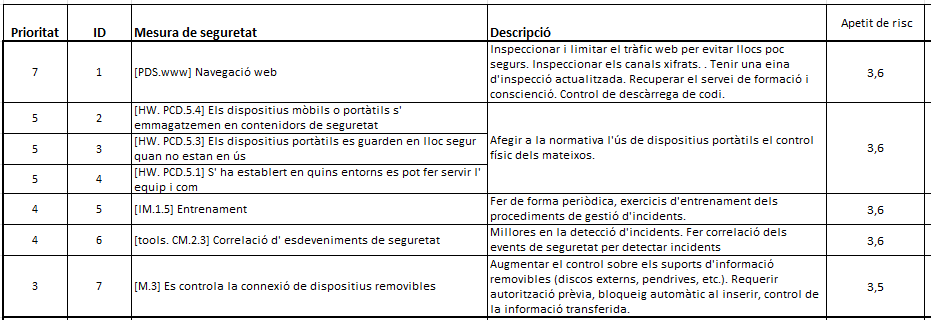

Seguretat : 2023-11-23 Comitè Executiu de Seguretat  

1.  [Seguretat](index.md)
2.  [Pàgina d'inici de la Unitat de Seguretat](15368362.md)
3.  [Actes de reunió](26317880.md)
4.  [Comitè Executiu de Seguretat](81855049.md)

Seguretat : 2023-11-23 Comitè Executiu de Seguretat
===================================================

Created by Ivan Caballero, last modified on 13 febrero 2024

Data

23-nov-2023 

Assistents
----------

*   [Usuario desconocido (sgallardo)](https://confluence.aoc.cat/display/~SGallardo)
*   [Ignasi Albors](https://confluence.aoc.cat/display/~ialbors)
*   [Usuario desconocido (marderiu)](https://confluence.aoc.cat/display/~marderiu)
*   [Miquel Estape](https://confluence.aoc.cat/display/~mestape)
*   [Rubén Cortés](https://confluence.aoc.cat/display/~rcortes)
*   [Ivan Caballero](https://confluence.aoc.cat/display/~icaballero)

Ordre del dia
-------------

*   Aprovació del risc residual de Desa'l. Aprovació del Pla de Tractament de riscos de Desa'l: [https://llicenciesaoc.sharepoint.com/:f:/s/CiberseguretatAOC/Enjfmc77oj1Ms-deZT47ZjABC04QGI\_bb6B9CkhuA9IrIw?e=b05IhV](https://llicenciesaoc.sharepoint.com/:f:/s/CiberseguretatAOC/Enjfmc77oj1Ms-deZT47ZjABC04QGI_bb6B9CkhuA9IrIw?e=b05IhV)
*   Aprovació del Pla de Contingència de Desa'l: [https://llicenciesaoc.sharepoint.com/:f:/s/CiberseguretatAOC/EuoAnE0s7ZtBqS-4lE8Mt5ABq3zFt0qTqA4rHXBIZrUUKQ?e=tte1h6](https://llicenciesaoc.sharepoint.com/:f:/s/CiberseguretatAOC/EuoAnE0s7ZtBqS-4lE8Mt5ABq3zFt0qTqA4rHXBIZrUUKQ?e=tte1h6)El Pla de Continuïtat té 3 documents:
    *   BIA: on es justifica el RTO, RPO i MTPD
    *   Estratègies de continuïtat: anàlisi de les estratègies de continuïtat per analitzar si s'ajusten al RTO i RPO.

Acta
----

Punt

Ponent

Títol

Notes

1

[Ivan Caballero](https://confluence.aoc.cat/display/~icaballero)

Aprovació de l'anàlisi de riscos

S'explica amb detall l'anàlisi de riscos, fent èmfasi en els següents punts:

*   Descripció de subdominis de seguretat
*   Valoració del servei
*   Càlcul del risc potencial
*   Càlcul del risc actual
*   Nivell de risc raonable

El Comitè Executiu aprova l'anàlisi de riscos.

2

[Ivan Caballero](https://confluence.aoc.cat/display/~icaballero)

Aprovació del risc residual de Desa'l

S'explica amb detall el risc actual i amenaces per dominis.

Es presenta un pla de tractament dels riscos identificats.

**El comitè executiu de Seguretat aprova el nivell de risc residual en 3,5.**

El comitè executiu aprova el pla de tractament del qual s'aplicaran les mesures addicionals per baixar el risc residual a 3.5:

3

[Ivan Caballero](https://confluence.aoc.cat/display/~icaballero)

Aprovació del pla de contingència de negoci (PCN)

Es presenten els documents del Pla de Contingència.

**BIA.**

El Comitè Executiu no està d'acord amb el nivell MTPD a 24h per ser massa restrictiu i decideix fixar aquest valor en 48h.

El Comitè Operatiu aprova la resta del document.

**Estratègies de continuïtat.**

El Comitè Operatiu deixa constància de la seva preocupació perquè una restauració total de les dades no es podria fer dins del temps de RTO. Segons s'ha extret de les proves de restauració de backup, una restauració complerta de les dades trigaria 13h.

El Comitè Operatiu aprova el document d'estratègies de continuïtat, però fa l'encàrrec al Comitè Operatiu d'estudiar nous mecanismes de restauració on no calgui restaurar la totalitat de les dades en el procediment de Disaster Recovery.

  

Acta signada:

[Acta Comitè Executiu de Seguretat 2023-11-23.pdf](attachments/100008408/100009245.pdf)

Attachments:
------------

 [image2023-11-24\_21-44-23.png](attachments/100008408/100008468.png) (image/png)  
 [image2023-11-24\_21-44-54.png](attachments/100008408/100008469.png) (image/png)  
 [Acta Comitè Executiu de Seguretat 2023-11-23.pdf](attachments/100008408/100009245.pdf) (application/pdf)  

Document generated by Confluence on 07 junio 2025 00:08

[Atlassian](http://www.atlassian.com/)