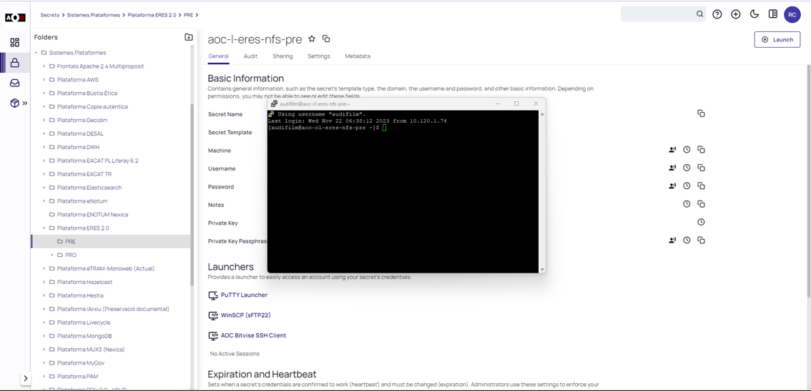

Seguretat : Procediment execució del DR del servei PAM  

1.  [Seguretat](index.md)
2.  [Pàgina d'inici de la Unitat de Seguretat](15368362.md)
3.  [Procediments Unitat de Seguretat](Procediments-Unitat-de-Seguretat_81856210.md)
4.  [PAM - Manuals i Procediments](PAM---Manuals-i-Procediments_93356107.md)

Seguretat : Procediment execució del DR del servei PAM
======================================================

Created by Rafael Carrasco, last modified on 03 abril 2025

/\*<!\[CDATA\[\*/ div.rbtoc1749247719870 {padding: 0px;} div.rbtoc1749247719870 ul {list-style: disc;margin-left: 0px;} div.rbtoc1749247719870 li {margin-left: 0px;padding-left: 0px;} /\*\]\]>\*/

*   [Proves anteriors documentades](#ProcedimentexecuciódelDRdelserveiPAM-Provesanteriorsdocumentades)
*   [Diagrama d'Arquitectura Plataforma PAM Delinea Secret Server 2025](#ProcedimentexecuciódelDRdelserveiPAM-Diagramad'ArquitecturaPlataformaPAMDelineaSecretServer2025)
*   [Missió de les proves de DR](#ProcedimentexecuciódelDRdelserveiPAM-MissiódelesprovesdeDR)
*   [Requeriments previs:](#ProcedimentexecuciódelDRdelserveiPAM-Requerimentsprevis:)
*   [Flightplan](#ProcedimentexecuciódelDRdelserveiPAM-Flightplan)
    *   [Pivotació del entorn - Failover](#ProcedimentexecuciódelDRdelserveiPAM-Pivotaciódelentorn-Failover)
    *   [Proves funcionals](#ProcedimentexecuciódelDRdelserveiPAM-Provesfuncionals)
    *   [Pivotació del entorn - Failback](#ProcedimentexecuciódelDRdelserveiPAM-Pivotaciódelentorn-Failback)
*   [Documentació de l´execució de les proves](#ProcedimentexecuciódelDRdelserveiPAM-Documentaciódel´execuciódelesproves)

* * *

Proves anteriors documentades
-----------------------------

*   22-07-2022 - [SEC - BDD - PAM Thycotic - Configurar SQL Server AlwaysON entre Kyndryl i Nexica](https://contacte.aoc.cat/browse/SIS-4096)
*   22-11-2023 - [Planificació proves DR servei PAM (ara amb AzureAD)](https://contacte.aoc.cat/browse/SEG-456)

  

* * *

Diagrama d'Arquitectura Plataforma PAM Delinea Secret Server 2025
-----------------------------------------------------------------

  

Ubicació al Sharepoint –> [PAM Diagrama arquitectura](https://llicenciesaoc.sharepoint.com/:f:/s/CiberseguretatAOC/EufUBQWX-2NDsS6k3XF9U6wB1P2SQ2vwDb8RdE2F9wV2ag?e=8YPI7H)

  

  

* * *

Missió de les proves de DR
--------------------------

La missió d’aquestes proves és comprovar el nivell de maduresa del procediment de DR i les possibilitats de recuperació del servei en cas d’indisponibilitat total del entorn de Kyndryl, ja sigui per caiguda parcial o total de les peces del servei o problemes d’accés a nivell de xarxa.

El Pla d’acció inicial contempla: 

*   Proves inicials del servei sobre Kyndryl, si tenim encara el Primary del AlwaysON a Nexica, caldrà executar el failback.
*   Aturada de serveis IIS i SQL Server als servidors del servei PAM ubicats a Kyndryl, si pot ser aturada total dels servidors implicats mc-w-pam-front-pro (10.120.1.74) i mc-w-pam-bd-pro (10.120.1.44).
*   Intentar recuperar el servei de manera autònoma per part d’AOC + proveïdors amb els procediments de DR que tenim de la part de BDD SQL Server AlwaysON i fer les comprovacions i accions que calguin per mirar de donar servei des de Nexica. 

Si en qualsevol cas necessitem ajuda/intervenció dels proveïdors, es documentarà per poder garantir el DR en cas de necessitat real.

  

* * *

Requeriments previs:
--------------------

*    **IMPORTANT**: S´obrirà tasca interna a l'eina de seguiment JIRA per documentar la prova i resultats finals.
*    Temps estimat de la durada de les proves → 2 hores
*    Planificació  de les proves de DR amb els següents actors involucrats i responsabilitats
    *   Equip Seguretat AOC ([seguretat@aoc.cat](mailto:seguretat@aoc.cat)) - planificació i govern de les proves de DR, seguiment i coordinació de les tasques, i validacions funcionals.
    *   Equip Manteniment Intern ([tvierge@aoc.cat](mailto:tvierge@aoc.cat)) - modificació de la resolució del DNS privat.
    *   Equip proveïdor Delinea Secret Server Davinci ([oriol.aguilar@davincigroup.es](mailto:oriol.aguilar@davincigroup.es)) - suport a nivell d'aplicació del Delinea Secret Server i comprovacions d'estat dels serveis desplegats i rols dels nodes.
    *   Equip proveïdor suport 24x7 Claranet ([css@claranet.es](mailto:css@claranet.es)) - aturada de serveis, failover i failback del servei de Database, comprovació de la monitorització del 24x7.
    *   Tota la resta d'equips involucrats de les Unitats d'AOC (Suport Tècnic, Sistemes, Projectes, Arquitectura, Qualitat, ...) - han de ser informats de la finestra de les proces, del inici de les mateixes i també al acabar.

*    Comprovació versions d'aplicació entre els binaris del IIS.  
     Si això no està ben controlat no podrem accedir al servei des del nou node Primari havent fet el canvi de DNS, i tindrem a pantalla el següent error:  
      
      
     Per solucionar-ho hem tingut que demanar al 24x7 fer un .zip de “c:\\inetpub\\wwwroot\\SecretServer” del servidor mc-w-pam-front-pro 10.120.1.74, i desplegar-lo “c:\\inetpub\\wwwroot\\” al nx-w-pam-front-pro 10.123.7.99, i aturant el IIS destí per poder renombrar la carpeta.

  

* * *

Flightplan
----------

### Pivotació del entorn - Failover

*    Notificació als equips involucrats de les Unitats d'AOC del inici de les proves de DR.
*   AOC - Manteniment intern - Canvi de DNS pam.aoc.cat - registre 10.120.1.74 → 10.123.7.99  
    
    C:\\Users\\rcarrasco>nslookup pam.aoc.cat
    Servidor:  AOCDC07.aoc.local
    Address:  192.168.166.77
    
    Nombre:  pam.aoc.cat
    Address:  10.120.7.99
    
*   Claranet 24x7 - Aturada serveis IIS mc-w-pam-front-pro 10.120.1.74:  
      
    
*   Claranet 24x7 - Failover de Database - seguir procediment AlwaysON Failover Database → [AlwaysOnFailover v3.0.pdf](https://llicenciesaoc.sharepoint.com/:b:/s/CiberseguretatAOC/ER5h_t4UgiZOtkpne-bYnfQBrbpozfYooPeFpEW1bidQjA?e=UGcqWU)  
      
      
    
*   Davinci - comprovació del estat dels nodes i rols als nodes disponibles:  
     **IMPORTANT**: un cop efectuat el failover, comprovar que el Maintenance Mode es troba desactivat al nou entorn Primari:  
      
    

### Proves funcionals

Proves de funcionalitats efectuades durant el DR i el servei al secundari Nexica:

*    Validacions d'accés, login i MFA.
*    Heartbeat (necessari pel rotat de contrasenyes) com a Background Worker node de Nexica:  
      
    
*    Execució de launcher Linux ([https://pam.aoc.cat/SecretServer/app/#/secrets/4355/general](https://pam.aoc.cat/SecretServer/app/#/secrets/4355/general))  
      
      
     Execució de launcher Windows ([https://pam.aoc.cat/SecretServer/app/#/secrets/4360/general](https://pam.aoc.cat/SecretServer/app/#/secrets/4360/general))  
      
      
      
    
*    Creació de secret amb el servei a Nexica:  
      
    
*    Comprovació de la rèplica del mateix secret amb el servei a Kyndryl:  
      
    

  

  

### Pivotació del entorn - Failback

*   AOC - Manteniment intern - Canvi de DNS pam.aoc.cat - registre 10.123.7.99 → 10.120.1.74  
    
    C:\\Users\\rcarrasco>nslookup pam.aoc.cat
    Servidor:  AOCDC07.aoc.local
    Address:  192.168.166.77
    
    Nombre:  pam.aoc.cat
    Address:  10.120.1.74
    

*   Claranet 24x7 - Failback de Database - seguir procediment AlwaysON Failover Database → [AlwaysOnFailover v3.0.pdf](https://llicenciesaoc.sharepoint.com/:b:/s/CiberseguretatAOC/ER5h_t4UgiZOtkpne-bYnfQBrbpozfYooPeFpEW1bidQjA?e=UGcqWU)  
      
      
      
    
*   Claranet 24x7 - Inici de serveis IIS mc-w-pam-front-pro 10.120.1.74
*   Davinci - comprovació del estat dels nodes i rols als nodes disponibles.
*   Revisió del darrer punt de les proves funcionals pel recull d'evidències.
*    Notificació als equips involucrats de les Unitats d'AOC del inici de les proves de DR.

  

* * *

Documentació de l´execució de les proves
----------------------------------------

*   Es documentarà de la mateixa manera que s'ha fet al tiquet documentat al inici del procediment, tot indicant:
    *   la planificació de la finestra de les proves
    *   l'inici i final de l'execució de les proves
    *   es documentaràn les evidències que aquest procediment indica
    *   finalment un quadre resum del resultat de les proves, temps d'execucions i lliçons apreses com el següent que es troba al tiquet de les proves del 22-11-2023 - [Planificació proves DR servei PAM (ara amb AzureAD)](https://contacte.aoc.cat/browse/SEG-456) :  
          
        
        **Cuadre resum**  
        Faig un cuadre resum de les tasques realitzades ahir, amb els equips involucrats en les mateixes, descripció i hora d'inici i durada:
        
        Equip/s involucrat/s
        
        Estat
        
        Tasca
        
        Hora Inici
        
        Temps parcial
        
        AOC SEG + MINT
        
        
        
        Canvi del DNS, comprovacions i evidències
        
        14:00 hores
        
        13 minuts
        
        AOC SEG + Claranet
        
        
        
        Petició de les tasques a Kyndryl (Stop IIS MC + failover AlwaysON database)
        
        14:13 hores
        
        27 minuts
        
        AOC SEG
        
        
        
        Comunicació del inici de les proves als equips involucrats
        
        14:23 hores
        
        0 minuts
        
        AOC SEG + Davinci
        
        
        
        Troballa del error de diferent versió del programari i proposta de solució
        
        14:40 hores
        
        8 minuts
        
        AOC SEG + Claranet
        
        
        
        Petició de workaround per copiar els binaris d'un frontal a un altre
        
        14:48 hores
        
        16 minuts
        
        AOC SEG + Claranet
        
        
        
        Refer el workaround aturant el IIS de Nexica
        
        15:04 hores
        
        15 minuts
        
        AOC SEG + Davinci
        
        
        
        Confirmació de servei a Nexica i primeres proves a nivell d'aplicació i servei
        
        15:19 hores
        
        1 minut
        
        AOC SEG
        
        
        
        Proves funcionals i recull d'evidències
        
        15:20 hores
        
        30 minuts
        
        AOC SEG + MINT
        
        
        
        Petició de canvi DNS, comprovacions i evidències
        
        15:50 hores
        
        4 minuts
        
        AOC SEG + Claranet
        
        
        
        Petició de failback (failback AlwaysON database + Restart IIS MC)
        
        15:55 hores
        
        12 minuts
        
        AOC SEG + Davinci
        
        
        
        Validacions finals
        
        16:06 hores
        
        17 minuts
        
        AOC SEG
        
        
        
        Final de les proves i comunicació als equips involucrats
        
        16:23 hores
        
        N/A
        
          
        
        **Lliçons apreses**  
        Destaquem les tasques on han sorgit problemes i/o resistències i si tenim d'altres en les que es podria millorar eficiència de la tasca i la durada:
        
        *   No es va comunicar correctament l'inici de les proves a tots els involucrats, ho vam fer passats 23 minuts amb les proves iniciades.  
            Causa: es van planificar les proves amb 15 dies d'antelació i se'ns va passar per alt.  
            Solució proposada/executada: s'ha afegit al procediment un punt de validació com a requisit previ.
        *   No es va comprovar amb el proveïdor que el versionat dels binaris a frontals estaven alineats en la mateixa versió.  
            Causa: probablement algun desplegament recent de nova versió del programari es va fer a Kyndryl i no a Nexica.  
            Solució proposada/executada: s'ha afegit al procediment un punt de validació com a requisit previ.
        *   Tornarem a revisar el procediment amb Claranet per que ens van comunicar que no sabien que tenien que fer ells els failover/failback de database.  
            Causa: probablement els hi vam dir inicialment que ells no farien aquesta tasca però els hi vam delegar ja que són ells els que porten el 24x7 del servei.  
            Solució: ho parlarem amb la Service Manager per establir de nou els rols adients per que ambdós equips estiguem còmodes amb les responsabilitats de cadascún i es generarà la documentació conjunta que calgui.

  

Attachments:
------------

 [image2023-11-22\_17-52-27.png](attachments/100008431/100008435.png) (image/png)  
 [image2023-11-22\_18-16-32.png](attachments/100008431/100008437.png) (image/png)  
 [image2023-11-22\_18-17-48.png](attachments/100008431/100008438.png) (image/png)  
 [image2023-11-22\_18-18-22.png](attachments/100008431/100008439.png) (image/png)  
 [image2023-11-22\_18-20-6.png](attachments/100008431/100008440.png) (image/png)  
 [image2023-11-22\_18-26-44.png](attachments/100008431/100008441.png) (image/png)  
 [image2023-11-22\_18-27-22.png](attachments/100008431/100008442.png) (image/png)  
 [image2023-11-22\_18-28-12.png](attachments/100008431/100008443.png) (image/png)  
 [image2023-11-22\_18-28-42.png](attachments/100008431/100008444.png) (image/png)  
 [image2023-11-22\_18-29-17.png](attachments/100008431/100008445.png) (image/png)  
 [image2023-11-23\_11-59-56.png](attachments/100008431/100008454.png) (image/png)  
 [image2023-11-23\_19-1-9.png](attachments/100008431/100008461.png) (image/png)  
 [image2023-11-24\_8-27-22.png](attachments/100008431/100008465.png) (image/png)  
 [Diagrama Arquitectura PAM 2024.jpeg](attachments/100008431/113311886.jpeg) (image/jpeg)  
 [Diagrama Arquitectura PAM 2024.jpeg](attachments/100008431/113311762.jpeg) (image/jpeg)  
 [Diagrama Arquitectura PAM 2025.jpeg](attachments/100008431/128647269.jpeg) (image/jpeg)  
 [image2025-3-31\_15-14-48.png](attachments/100008431/128647271.png) (image/png)  

Document generated by Confluence on 07 junio 2025 00:08

[Atlassian](http://www.atlassian.com/)