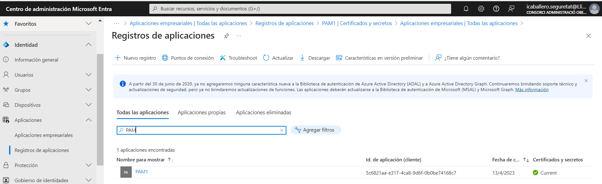
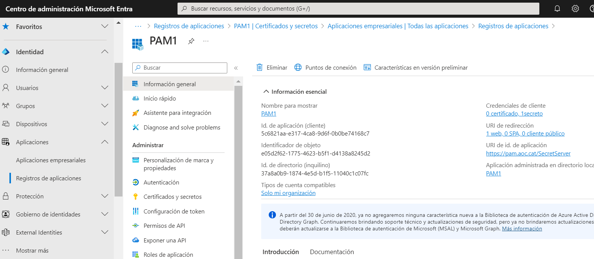
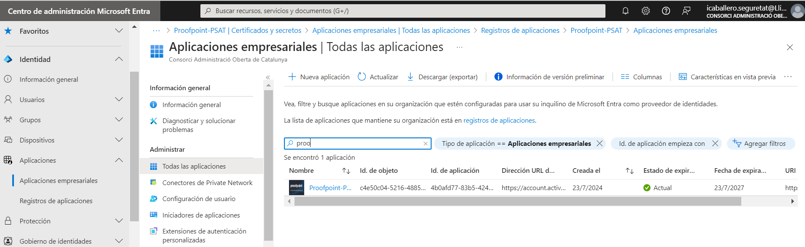
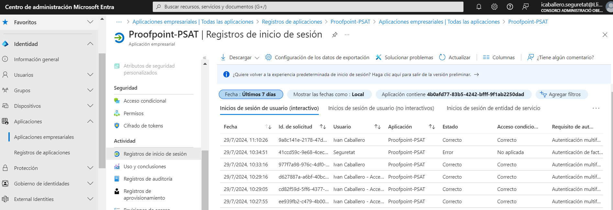

Seguretat : Gestor d'Identitats  

1.  [Seguretat](index.md)
2.  [Pàgina d'inici de la Unitat de Seguretat](15368362.md)
3.  [Procediments Unitat de Seguretat](Procediments-Unitat-de-Seguretat_81856210.md)

Seguretat : Gestor d'Identitats
===============================

Created by Rafael Carrasco, last modified by Ivan Caballero on 30 julio 2024

Segons l'Arquitectura de solucions de Ciberseguretat AOC 2024, el Gestor d'Identitats que tenim és el AzureAD:

  

Accés a la consola d'administració.
===================================

Cada aplicació integrada té un registre En Microsoft Entra:

URL: [https://entra.microsoft.com/#view/Microsoft\_AAD\_RegisteredApps/ApplicationsListBlade/quickStartType~/null/sourceType/Microsoft\_AAD\_IAM](https://entra.microsoft.com/#view/Microsoft_AAD_RegisteredApps/ApplicationsListBlade/quickStartType~/null/sourceType/Microsoft_AAD_IAM)

Dins del registre està configurada la integració:

  

Inventari d'integracions
========================

Les aplicacions que s'integren es registre: [Inventari de serveis integrats.xlsx](https://llicenciesaoc.sharepoint.com/:x:/r/sites/CiberseguretatAOC/Documents%20compartits/General/PROJECTES/Gestor%20Identitats/Inventari%20de%20serveis%20integrats.xlsx?d=w446e6aa087fe41b8873b0d28080f0f39&csf=1&web=1&e=Kc18jo)

Important apuntar la data d'expiració del certificat o secret.

Registre d'inicis de sessió
===========================

Es pot consultar els logins a l'aplicació: [https://entra.microsoft.com/#view/Microsoft\_AAD\_IAM/StartboardApplicationsMenuBlade/~/AppAppsPreview](https://entra.microsoft.com/#view/Microsoft_AAD_IAM/StartboardApplicationsMenuBlade/~/AppAppsPreview)

  

  

Requeriments de conectivitat
============================

En el cas de l'integració que vam fer amb el PAM, sent aquest un servei que no té accés a/des de Internet, vam tindre que:

*   configurar un NAT de sortida i assignar una IP Pública.
*   treballar en un Pool de IPs del servei AzureAD per permetre aquesta conectivitat bidireccional als Firewalls:  
        - el llistat de IPs la vam extreure d'aquesta eina de Microsoft: [https://azureipranges.azurewebsites.net/](https://azureipranges.azurewebsites.net/)  
        - vam agregar per recomanació del consultor de Microsoft totes les ips internacionals del servei AzureAD (“AzureActiveDirectory”)

Dades d'aplicació
=================

Dades Urls SAML al costat de AzureAD:

*   Dirección URL de inicio de sesión: [https://login.microsoftonline.com/37a8a0b9-1874-4e5d-b1f5-11040c1c07fc/saml2](https://login.microsoftonline.com/37a8a0b9-1874-4e5d-b1f5-11040c1c07fc/saml2)
*   Identificador de Azure AD: [https://sts.windows.net/37a8a0b9-1874-4e5d-b1f5-11040c1c07fc/](https://sts.windows.net/37a8a0b9-1874-4e5d-b1f5-11040c1c07fc/)
*   URL de cierre de sesión: [https://login.microsoftonline.com/37a8a0b9-1874-4e5d-b1f5-11040c1c07fc/saml2](https://login.microsoftonline.com/37a8a0b9-1874-4e5d-b1f5-11040c1c07fc/saml2)

Dades del registre de l'aplicació
=================================

*   Domain Name: [llicenciesaoc.onmicrosoft.com](http://llicenciesaoc.onmicrosoft.com)
*   Tenant ID: 37a8a0b9-1874-4e5d-b1f5-11040c1c07fc
*   Client ID: 5c6821aa-e317-4ca8-9d6f-0b0be74168c7
*   Client Secret: aQf8Q~CiBOHcG\_kJW-~D0QF1Zc5uFFMHIhJthbP9

  

  

Attachments:
------------

 [image2024-7-30\_16-38-22.png](attachments/100008663/113311869.png) (image/png)  
 [image2024-7-30\_16-41-25.png](attachments/100008663/113311870.png) (image/png)  
 [image2024-7-30\_16-50-36.png](attachments/100008663/113311871.png) (image/png)  
 [image2024-7-30\_16-52-30.png](attachments/100008663/113311872.png) (image/png)  

Document generated by Confluence on 07 junio 2025 00:08

[Atlassian](http://www.atlassian.com/)