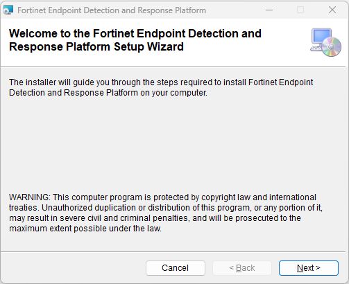
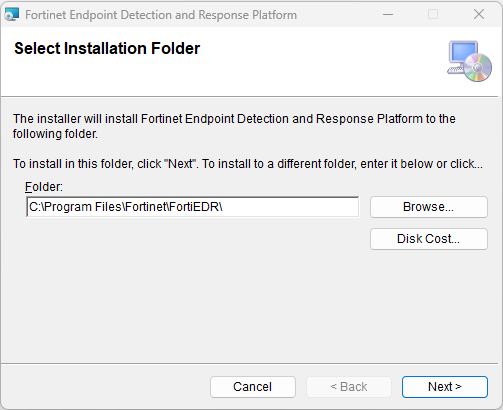
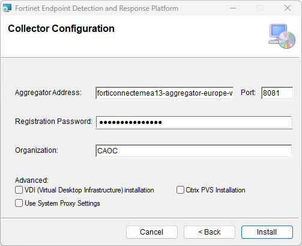
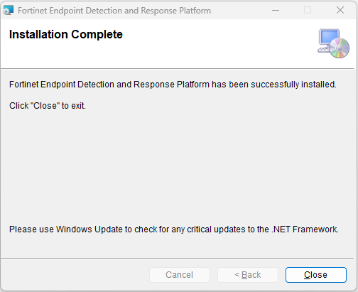
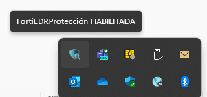
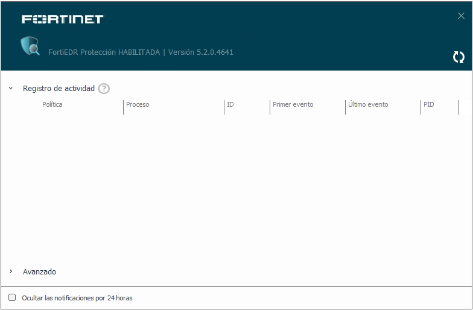
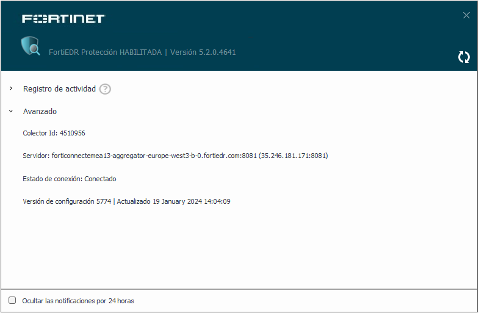

Seguretat : Instal·lació i desinstal·lació del agent/collector del FortiEDR (Windows, MacOS i Linux)  

1.  [Seguretat](index.md)
2.  [Pàgina d'inici de la Unitat de Seguretat](15368362.md)
3.  [Procediments Unitat de Seguretat](Procediments-Unitat-de-Seguretat_81856210.md)
4.  [FortiEDR-MDR (Endpoint Detection & Response)-(Managed)](81856306.md)

Seguretat : Instal·lació i desinstal·lació del agent/collector del FortiEDR (Windows, MacOS i Linux)
====================================================================================================

Created by Rafael Carrasco, last modified on 17 marzo 2025

La distribució del agent/collector es mitjançant un paquet .msi pel cas dels entorns Windows, en format .dmg per entorns MacOS i en format .zip i .sh per entorns Linux.

/\*<!\[CDATA\[\*/ div.rbtoc1749247712112 {padding: 0px;} div.rbtoc1749247712112 ul {list-style: disc;margin-left: 0px;} div.rbtoc1749247712112 li {margin-left: 0px;padding-left: 0px;} /\*\]\]>\*/

*   [Documentació pel Deploy & Installing dels FortiEDR Collectors:](#Instal·lacióidesinstal·laciódelagent/collectordelFortiEDR\(Windows,MacOSiLinux\)-DocumentaciópelDeploy&InstallingdelsFortiEDRCollectors:)
    *   [Documentació per entorns Windows: https://docs.fortinet.com/document/fortiedr/6.2.0/administration-guide/92352/installing-a-fortiedr-collector-on-windows](#Instal·lacióidesinstal·laciódelagent/collectordelFortiEDR\(Windows,MacOSiLinux\)-DocumentacióperentornsWindows:https://docs.fortinet.com/document/fortiedr/6.2.0/administration-guide/92352/installing-a-fortiedr-collector-on-windows)
    *   [Documentació per entorns MacOS: https://docs.fortinet.com/document/fortiedr/6.2.0/administration-guide/589820/installing-a-fortiedr-collector-on-macos](#Instal·lacióidesinstal·laciódelagent/collectordelFortiEDR\(Windows,MacOSiLinux\)-DocumentacióperentornsMacOS:https://docs.fortinet.com/document/fortiedr/6.2.0/administration-guide/589820/installing-a-fortiedr-collector-on-macos)
    *   [Documentació per entorns Linux: https://docs.fortinet.com/document/fortiedr/6.2.0/administration-guide/551398/installing-a-fortiedr-collector-on-linux](#Instal·lacióidesinstal·laciódelagent/collectordelFortiEDR\(Windows,MacOSiLinux\)-DocumentacióperentornsLinux:https://docs.fortinet.com/document/fortiedr/6.2.0/administration-guide/551398/installing-a-fortiedr-collector-on-linux)
*   [Documentació per a la desinstal·lació dels FortiEDR Collectors:](#Instal·lacióidesinstal·laciódelagent/collectordelFortiEDR\(Windows,MacOSiLinux\)-Documentacióperaladesinstal·laciódelsFortiEDRCollectors:)

  

Documentació pel Deploy & Installing dels FortiEDR Collectors:
==============================================================

[https://docs.fortinet.com/document/fortiedr/6.0.0/administration-guide/186029/installing-fortiedr-collectors](https://docs.fortinet.com/document/fortiedr/6.0.0/administration-guide/186029/installing-fortiedr-collectors)

  

*   Documentació per entorns Windows: [https://docs.fortinet.com/document/fortiedr/6.2.0/administration-guide/92352/installing-a-fortiedr-collector-on-windows](https://docs.fortinet.com/document/fortiedr/6.2.0/administration-guide/92352/installing-a-fortiedr-collector-on-windows)
    ------------------------------------------------------------------------------------------------------------------------------------------------------------------------------------------------------------------------------------------------------------------------------------
    

  

*   Documentació per entorns MacOS: [https://docs.fortinet.com/document/fortiedr/6.2.0/administration-guide/589820/installing-a-fortiedr-collector-on-macos](https://docs.fortinet.com/document/fortiedr/6.2.0/administration-guide/589820/installing-a-fortiedr-collector-on-macos)
    --------------------------------------------------------------------------------------------------------------------------------------------------------------------------------------------------------------------------------------------------------------------------------
    
      
     En entorn MacOS cal donar permissos addicionals als anomenants System Extensions i de permisos complerts sobre de disc dur Full Disk Access.  
    Per exemple avís del col·lector del MacOS: "Since: 02-Jul-2024, 13:35:38 Warnings: Please allow FortiEDR.app to have full disk access on the device. Aggregator IP: 35.246.181.171"  
     Pantalles de validació:  
    

  

*   Documentació per entorns Linux: [https://docs.fortinet.com/document/fortiedr/6.2.0/administration-guide/551398/installing-a-fortiedr-collector-on-linux](https://docs.fortinet.com/document/fortiedr/6.2.0/administration-guide/551398/installing-a-fortiedr-collector-on-linux)
    --------------------------------------------------------------------------------------------------------------------------------------------------------------------------------------------------------------------------------------------------------------------------------
    

  
Un cop tinguem a l'abast el fitxer instalador, procedirem a la seva execució i aquestes seran les pases a seguir per tal d'afegir l'agent del FortiEDR:

  

Farem "Next" i passarem a la ubicació de la ruta dels fitxers que deixarem per defecte:

  

El següent pas serà per a la confirmació dels paràmetres del agent en quant a 4 camps, i farem "Install":

*   l'adreça del servidor pels col·lectors (forticonnectemea13-aggregator-europe-west3-b-0.fortiedr.com)
*   el port de comunicació (8081)
*   el registration password per afegir dispositius (estarà ocult)
*   l'organització (CAOC)

  

 IMPORTANT: Aquestes 4 dades anteriors ja venen pre-configurades alhora de generar el fitxer per a l'instal·lació del agent, i les 3 opcions avançades del final de la finestra no s'han d'habilitar.

  

Començarà el procés d'instal·lació i tindria que acabar amb un missatge de "Installation complete":

  

 IMPORTANT  - Encara que no sigui un requisit, és molt recomanable que un cop instal·lat l'agent collector del FortiEDR al nou dispositiu, que fem un reinici per tal de garantir que tots els processos i serveis arrenquen correctament amb l'inici del equip.

S'ha donat algun cas que un cop instal·lat l'agent, no reconeixeia encara l'agent i a la consola del tentant sortia com Disabled quan en principi estava tot engegat al dispositiu.

  

 Als equips Windows, a la zona d'icones d'aplicació a la barra de tasques, abaixa a la dreta tindria que aparèixer la nova icona del del agent del FortiEDR:

  

 Podrem veure informació del agent i el registre d'activitat recent i també en avançat dades de configuració com el ID del collector, servidor emprat, estat i versió de la configuració:

  

Documentació per a la desinstal·lació dels FortiEDR Collectors:
===============================================================

Per Windows, MacOS i Linux

[https://docs.fortinet.com/document/fortiedr/6.0.0/administration-guide/257081/uninstalling-fortiedr-collectors](https://docs.fortinet.com/document/fortiedr/6.0.0/administration-guide/257081/uninstalling-fortiedr-collectors)

  

  

Attachments:
------------

 [image2024-1-19\_13-52-40.png](attachments/100008906/100008908.png) (image/png)  
 [image2024-1-19\_13-54-4.png](attachments/100008906/100008909.png) (image/png)  
 [image2024-1-19\_13-55-16.png](attachments/100008906/100008910.png) (image/png)  
 [image2024-1-19\_14-2-29.png](attachments/100008906/100008912.png) (image/png)  
 [image2024-1-19\_14-3-59.png](attachments/100008906/100008913.png) (image/png)  
 [image2024-1-19\_14-6-3.png](attachments/100008906/100008917.png) (image/png)  
 [image2024-1-19\_14-7-57.png](attachments/100008906/100008921.png) (image/png)  
 [image2024-1-19\_14-8-45.png](attachments/100008906/100008922.png) (image/png)  
 [FortiEDR MacOS permisos.png](attachments/100008906/113311770.png) (image/png)  

Document generated by Confluence on 07 junio 2025 00:08

[Atlassian](http://www.atlassian.com/)