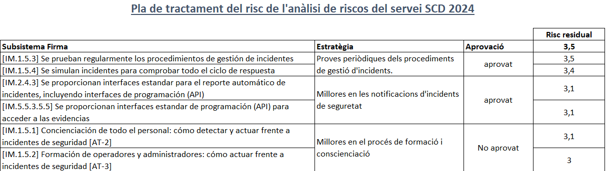

Seguretat : 2024-03-19 Comitè Executiu de Seguretat  

1.  [Seguretat](index.md)
2.  [Pàgina d'inici de la Unitat de Seguretat](15368362.md)
3.  [Actes de reunió](26317880.md)
4.  [Comitè Executiu de Seguretat](81855049.md)

Seguretat : 2024-03-19 Comitè Executiu de Seguretat
===================================================

Created by Ivan Caballero, last modified on 19 marzo 2024

Data

19-mar-2024 

Assistents
----------

*   [Usuario desconocido (sgallardo)](https://confluence.aoc.cat/display/~SGallardo)
    
*   [Rubén Cortés](https://confluence.aoc.cat/display/~rcortes)
*   [Miquel Estape](https://confluence.aoc.cat/display/~mestape)
*   [Ignasi Albors](https://confluence.aoc.cat/display/~ialbors)
*   [Ivan Caballero](https://confluence.aoc.cat/display/~icaballero)

Ordre del dia
-------------

*   Aprovació de Anàlisis de riscos de SCD: [Analisis de riscos SCD 2024.pdf](https://llicenciesaoc.sharepoint.com/:b:/s/CiberseguretatAOC/EcraYVAAaIpIlm9tQwIG59QBdprxQgmF73N5BS2jg9q8Tg?e=9y199s&isSPOFile=1)
*   Aprovació de rols: [TaulaPerfilsV2\_17.pdf](https://llicenciesaoc.sharepoint.com/:b:/s/Serveis/EcjeaPvlS2ZDtkVJfiOPvkABGV0WzdZP1gL33qZwPd7qTA?e=bJbbQN)
    *   El Santi Gallardo substitueix a la Marta Arderiu en els seus rols.
    *   Hi ha hagut canvis en empreses proveïdores: Claranet per NTT i PwC per auren.
*   Aprovació del Pla de Contingència de SCD: [PLA CONTINUÏTAT](https://llicenciesaoc.sharepoint.com/:f:/s/Serveis/EuQlYES0rF5epEzWfAxCwKwBDAOQHYVbUYmx4OxxLGIyTw?e=6Re1hb)
    *   No hi ha canvis significatius en el Pla de Continuïtat. S'han actualitzat els documents amb canvis menors.
    *   S'ha executat una prova del Pla de Continuïtat amb èxit.

Acta
----

Punt

Ponent

Títol

Notes

1

[Ivan Caballero](https://confluence.aoc.cat/display/~icaballero)

Presentació anàlisis de riscos de SCD

*   Es presenta l'actualització de l'anàlisi de riscos de 2024.
*   El risc actual del servei SCD és 3,5. Es posa l'accent al fet de que el valor recomanat per l'eina PILAR és 3,2.

2

[Ivan Caballero](https://confluence.aoc.cat/display/~icaballero)

Aprovació del risc residual i del Pla de Tractament de Riscos

*   Es presenten les propostes de mesures de seguretat addicionals per mitigar el risc i l'estratègia a seguir per implementar-les.
*   El Comitè Executiu de Seguretat, tenint en compte el cost de les mesures proposades, decideix aprovar el **risc residual en 3,1.**

3

[Ivan Caballero](https://confluence.aoc.cat/display/~icaballero)

Aprovació de l'actualització dels rols de SCD

*   Es presenten els canvis fets en el document de rols de SCD.
    *   El Santi Gallardo substitueix a la Marta Arderiu en els seus rols.
    *   Hi ha hagut canvis en empreses proveïdores: Claranet per NTT i PwC per auren.
*   El Comitè Executiu aprova el document de rols.

4

[Ivan Caballero](https://confluence.aoc.cat/display/~icaballero)

Aprovació de l'actualització del Pla de Continuïtat i prova de contingència

*   Es presenten les actualitzacions fetes en el Pla de Contingència de SCD, on no hi ha hagut canvis significatius.
*   S'esposa la prova de contingència, executada amb èxit el dia 13.
*   El Comitè Executiu aprova l'actualització del Pla de Contingència de Negoci de SCD

Attachments:
------------

 [image2024-3-19\_9-52-48.png](attachments/100009727/100009827.png) (image/png)  

Document generated by Confluence on 07 junio 2025 00:08

[Atlassian](http://www.atlassian.com/)