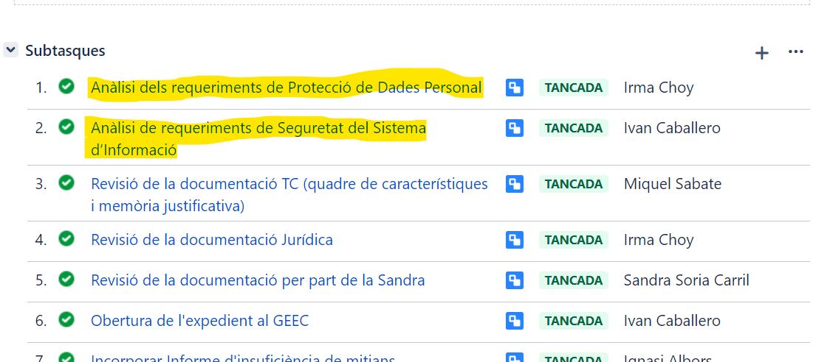

Seguretat : Procediment per a l'adquisició de nous actius i serveis  

1.  [Seguretat](index.md)
2.  [Pàgina d'inici de la Unitat de Seguretat](15368362.md)
3.  [Procediments Unitat de Seguretat](Procediments-Unitat-de-Seguretat_81856210.md)

Seguretat : Procediment per a l'adquisició de nous actius i serveis
===================================================================

Created by Rafael Carrasco, last modified by Ivan Caballero on 02 mayo 2024

/\*<!\[CDATA\[\*/ div.rbtoc1749247721152 {padding: 0px;} div.rbtoc1749247721152 ul {list-style: disc;margin-left: 0px;} div.rbtoc1749247721152 li {margin-left: 0px;padding-left: 0px;} /\*\]\]>\*/

*   [1\. Objecte i objectiu del procediment](#Procedimentperal'adquisiciódenousactiusiserveis-1.Objecteiobjectiudelprocediment)
*   [2\. Inici de l'adquisició](#Procedimentperal'adquisiciódenousactiusiserveis-2.Inicidel'adquisició)
*   [3\. Revisió de l'expedient de contractació.](#Procedimentperal'adquisiciódenousactiusiserveis-3.Revisiódel'expedientdecontractació.)
    *   [3.1 Integració del nou component a l'anàlisi de riscos.](#Procedimentperal'adquisiciódenousactiusiserveis-3.1Integraciódelnoucomponental'anàlisideriscos.)
    *   [3.2 Alineament amb l'arquitectura del sistema.](#Procedimentperal'adquisiciódenousactiusiserveis-3.2Alineamentambl'arquitecturadelsistema.)
    *   [3.3 Requeriments de seguretat.](#Procedimentperal'adquisiciódenousactiusiserveis-3.3Requerimentsdeseguretat.)
        *   [3.3.1 Requeriments addicionals per components de seguretat](#Procedimentperal'adquisiciódenousactiusiserveis-3.3.1Requerimentsaddicionalspercomponentsdeseguretat)
    *   [3.4 Incloure el component nou a l'inventari.](#Procedimentperal'adquisiciódenousactiusiserveis-3.4Incloureelcomponentnoual'inventari.)
*   [4\. Normativa de referència.](#Procedimentperal'adquisiciódenousactiusiserveis-4.Normativadereferència.)

1\. Objecte i objectiu del procediment
----------------------------------------------------------------------------------------------------------------------------------------------------------------------------------------------------------------------------------------------------------------------------------------------------------------------------------------------------------------------------------------------------------------------------------------------------------------------------------------------------------------------------------------------------------------------------------------------------------------------------------------------------------------------------------------------------------------------------------------------------------------------------------------------------------------------------------------------------------------------------------------------------------------------------------------------------------------------------------------------------------------------------------------------------------------------------------------------------------------------------------------------------------------------------------------------------------------------------------------------------------------------------------------------------------------------------------------------------------------------------------------------------------------------------------------------------------------------------------------------------------------------------

L’objecte d’aquest procediment es indicar com cal procedir en l’adquisició de nous components dels sistemes d’informació del Consorci AOC.

L’objectiu del procediment és garantir que en l’adquisició de nous components i serveis es segueixen les següents directrius:

*   L’adquisició del component o servei atendrà a les conclusions dels anàlisis de riscos i prioritzarà aquells components destinats a mitigar riscos detectats.
*   L’adquisició del component o servei estarà alineada amb l’arquitectura del sistema.
*   L’adquisició del component o servei contempla les necessitats tècniques, de formació i financiació.
*   L’adquisició del component o servei contempla les directrius de la Unitat de Seguretat i compleix amb la normativa del Consorci AOC.

2\. Inici de l'adquisició
-------------------------

Tota petició d'adquisició obligatòriament tindrà un tiquet iniciat per l'unitat promotora amb el format estàndard pels tiquets de contractació.

Les subtasques número 1 i 2 són les de revisió de requeriments de seguretat. La unitat de ciberseguretat s'assignarà i revisarà la número 2, i donarà suport en la número 1 que serà responsabilitat de la Delegada de Protecció de Dades.

Exemple de tiquet de contractació:

  

Es revisaran totes les peticions d'adquisició. Si l'objecte del contracte no inclou cap element destinat a ser un actiu dels sistemes d'informació, es tancarà el tiquet indicant que no cal revisió.

Si l'objecte del contracte té qualsevol element destinat a ser un actiu dels sistemes d’informació, caldrà assignar el tiquet a un integrant de la unitat de ciberseguretat per fer la revisió. Es consideren actius dels sistemes les següents adquisicions:

*   Adquisició de maquinari.
*   Adquisició de programari.
*   Serveis de desenvolupament (o estudis) de programari.
*   Serveis de "housing" en Centres de Procés de Dades
*   Adquisició de plataforma o serveis en modalitat Cloud (IaaS, PaaS o SaaS)

Per poder fer la revisió, el tiquet de contractació haurà de contenir el PPT i el QC de l'expedient de contractació.

3\. Revisió de l'expedient de contractació.
-------------------------------------------

*   Revisar el PPT per identificar exactament que s'està contractant i a quins serveis afecta.

### 3.1 Integració del nou component a l'anàlisi de riscos.

Si l'adquisició suposa un canvi significatiu de sistema d'informació:

*   Fer una iteració de l'anàlisi de riscos i mesurar el risc resultant incloent el nou component:
    *   Si el risc mesurat és inferior al risc residual es podrà continuar amb la contractació. No és necessari l'aprovació de l'anàlisi de riscos.
    *   Si el risc mesurat és superior al risc residual, l'anàlisi de riscos s'haurà de reportar al Comitè Operatiu per iniciar el fluxe de revisió i aprovació, i que el Comitè Executiu elevi el risc residual o aprovi altres mesures de seguretat per mitigar el nivell de risc. El Comitè Executiu podria anul·lar l'adquisició del nou component si no s'aprova el nou nivell de risc.
*   El Responsable de sistemes de seguretat decidirà si el canvi és lo suficientment substancial com per a que calgui repetir un PENTEST.

### 3.2 Alineament amb l'arquitectura del sistema.

  

Només per nous components de seguretat

L'alineament amb l'arquitectura del sistema es farà només per nous components de seguretat.

Comprovar que el component de seguretat nou encaixa dins de l'esquema de línies de defensa:

*   Comprovar que les funcions del nou component no estan redundades.
*   Comprovar com afecta als fluxos de treball.
*   Comprovar com afecta al procediments.

Actualitzar l'esquema de línies de defensa si és necessari.

Document de línies de defensa: [Esquema de línies de defensa - Seguretat - Intranet Consorci Administració Oberta de Catalunya (aoc.cat)](https://intranet.aoc.cat/pages/viewpage.action?pageId=24216216)

Pels components de seguretat, s'haurà de recórrer a components certificats. La unitat de seguretat té la següent guia per aquest punt: [Adquisició de components certificats - Seguretat - Intranet Consorci Administració Oberta de Catalunya (aoc.cat)](https://intranet.aoc.cat/pages/viewpage.action?pageId=100009886)

### 3.3 Requeriments de seguretat.

La unitat de seguretat revisarà i actualitzarà el Plec Tècnic per assegurar que estiguin inclosos tots els requeriments de seguretat. El Plec Tècnic haurà de tenir un punt de Seguretat amb la següent informació:

*   Valoració de les dades i serveis i categorització dels sistemes.
*   Requeriments de certificacions alineats amb la categorització del sistema. La licitació haurà d’exigir la declaració de conformitat o la certificació de conformitat amb l’ENS de l’empresa adjudicatària segons sigui la classificació del sistema o que l’adjudicatari es comprometi a ser auditat. 
*   Clàusula de participació en auditories del Consorci AOC. 
*   Garantir que les dades estiguin dins del territori de la EEE (Espai Econòmic Europeu). O en el seu defecte que hi hagi un marc/reglament com el Data Privacy Framework EU-US entre els estats origen i la UE.

#### 3.3.1 Requeriments addicionals per components de seguretat

Només per nous components de seguretat

Els requeriments addicionals només són necessaris per components de seguretat.

En l'adquisició de components de seguretat serà necessari posar requeriments de certificacions de seguretat addicionals.

Seguir el procediment: [Adquisició de components certificats - Seguretat - Intranet Consorci Administració Oberta de Catalunya (aoc.cat)](https://intranet.aoc.cat/pages/viewpage.action?pageId=100009886)

### 3.4 Incloure el component nou a l'inventari.

La unitat de Seguretat s'assegurarà que el component nou queda inventariat on pertoqui (mapes de xarxa, inventaris d'actius, línies de defensa, etc).

També s'haurà de documentar les dates de vigència del contractes de manteniment de maquinari, programari o serveis en l'inventari [Inventari de manteniments de maquinari i programari - Gestió de l'Àrea de Tecnologia - Intranet Consorci Administració Oberta de Catalunya (aoc.cat)](https://intranet.aoc.cat/display/GDLDT/Inventari+de+manteniments+de+maquinari+i+programari). L'objectiu és evitar que un element es quedi sense manteniment.

4\. Normativa de referència.
----------------------------

Aquesta guia desenvolupa i està alineada amb les següents normatives i procediments de seguretat:

*   Mesures de seguretat de l'Anex II del Reial Decret 311/2022, de 3 de maig, pel que es regula l'Esquema Nacional de Seguretat.
    *   Op.pl.3 Adquisició de nous components

  

  

**Unitat de Seguretat - Àrea d'Operacions**

**Consorci Administració Oberta de Catalunya - 2024**

#

#EOF

Attachments:
------------

 [image2024-3-16\_8-42-2.png](attachments/100009772/100009799.png) (image/png)  
 [image2024-3-16\_8-42-41.png](attachments/100009772/100009800.png) (image/png)  

Document generated by Confluence on 07 junio 2025 00:08

[Atlassian](http://www.atlassian.com/)