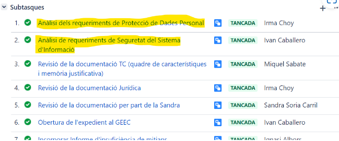

Seguretat : Adquisició de components certificats  

1.  [Seguretat](index.md)
2.  [Pàgina d'inici de la Unitat de Seguretat](15368362.md)
3.  [Procediments Unitat de Seguretat](Procediments-Unitat-de-Seguretat_81856210.md)

Seguretat : Adquisició de components certificats
================================================

Created by Ivan Caballero, last modified on 06 abril 2024

/\*<!\[CDATA\[\*/ div.rbtoc1749247710578 {padding: 0px;} div.rbtoc1749247710578 ul {list-style: disc;margin-left: 0px;} div.rbtoc1749247710578 li {margin-left: 0px;padding-left: 0px;} /\*\]\]>\*/

*   [1\. Objecte del procediment](#Adquisiciódecomponentscertificats-1.Objectedelprocediment)
*   [2\. Introducció](#Adquisiciódecomponentscertificats-2.Introducció)
    *   [2.1 Motivació del procediment](#Adquisiciódecomponentscertificats-2.1Motivaciódelprocediment)
    *   [2.2. Nivells de confiança de la ISO 15408](#Adquisiciódecomponentscertificats-2.2.NivellsdeconfiançadelaISO15408)
        *   [2.2.1 Descripció dels nivells.](#Adquisiciódecomponentscertificats-2.2.1Descripciódelsnivells.)
*   [3\. Inici del procediment](#Adquisiciódecomponentscertificats-3.Inicidelprocediment)
    *   [3.1. Casos d'ús de components certificats](#Adquisiciódecomponentscertificats-3.1.Casosd'úsdecomponentscertificats)
        *   [Catàleg de productes i serveis del CCN (file.html (cni.es))](#Adquisiciódecomponentscertificats-CatàlegdeproductesiserveisdelCCN\(file.html\(cni.es\)\))
        *   [ISO/IEC 15408](#Adquisiciódecomponentscertificats-ISO/IEC15408)
        *   [Altres certificacions](#Adquisiciódecomponentscertificats-Altrescertificacions)
*   [4\. Normativa de referència.](#Adquisiciódecomponentscertificats-4.Normativadereferència.)

1\. Objecte del procediment
-----------------------------------------------------------------------------------------------------------------------------------------------------------------------------------------------------------------------------------------------------------------------------------------------------------------------------------------------------------------------------------------------------------------------------------------------------------------------------------------------------------------------------------------------------------------------------------------------------------------------------------------------------------------------------------------------------------------------------------------------------------------------------------------------------------------------------------------------------------------------------------------------------------------------------------------------------------------------------------------------------------------------------------------------------------------------------------------------------------------------------------------------------------------------------------------------------------------------------------------------------------------------------------------------------------------------------------------------------------------------------------------------------------------------------

L’objecte d’aquest procediment es indicar els requeriments de certificats en les adquisicions de components de seguretat.

L'adquisició de components certificats és recomanable per tot tipus de components i obligatòria per components de seguretat.

2\. Introducció
---------------

### 2.1 Motivació del procediment

En la fase d’adquisició de nous components és summament important la decisió del producte que finalment passarà a formar part del nostre sistema.

*   Com podem assegurar que les funcionalitats d’aquest component estan suficientment provades pel fabricant i no estem introduint noves vulnerabilitats en el sistema?
*   Com podem assegurar que un component fa correctament allò per lo que ha sigut dissenyat?

Recórrer a components certificats redueix el risc de trobar errors de dissenys una vegada aquests han estat implantats en el sistema, fet que soscavaria la seva seguretat i seria costos reconduir-lo.

Els Criteris Comuns (ISO 15408) estableixen un conjunt comú de requisits funcionals per als components. El procés d'avaluació estableix un nivell de confiança en el grau en el qual el component satisfà la funcionalitat de seguretat d'aquests productes i ha superat les mesures d'avaluació aplicades. Els nivells de confiança van des d'EAL1 (el menor) a EAL 7 (el major)-

La guia CCN-STIC 105 dóna un catàleg de productes provats pel CCN.

### 2.2. Nivells de confiança de la ISO 15408

Els nivells de confiança en l'avaluació definits en l'ISO/IEC 15408-3 \[ISO 15408-3 2005\] van des d'EAL1 (el menor) a EAL 7 (el major) i es defineixen de manera acumulativa (verificacions de nivell n+1 impliquen realitzar les de nivell n, 1 ≤ n ≤ 7):

La normativa només requereix la consideració de productes certificats per a sistemes de categoria alta. No obstant això, cal fer les següents indicacions:

*   Un nivell EAL1 seria recomanable per a qualsevol sistema.
*   Un nivell EAL2 seria aconsellable per a sistemes de categoria MITJANA o ALTA.
*   Un nivell EAL3 seria interessant per a sistemes de categoria ALTA, concretament per a elements crítics del sistema com pot ser la frontera exterior cap a xarxes públiques.

Els Nivells per sobre d'EAL3 són sempre interessants, però probablement desproporcionats per a sistemes adscrits al ENS, excepte enfront d'amenaces extremes.

#### 2.2.1     Descripció dels nivells.

EAL1 (funcionalitat provada): és aplicable on es requereix tenir una certa confiança de l'operació correcta, i on a més, les amenaces a la seguretat no són vistes com a serioses. Una avaluació en aquest nivell ha de proporcionar evidència que les funcions de l'objecte d'avaluació són consistents amb la seva documentació, i que proporcionen protecció útil contra amenaces identificades.

EAL2 (estructuralment provat): requereix la cooperació del desenvolupador en termes de la distribució de la informació del disseny, i els resultats de les proves i proporciona confiança a través d'una anàlisi de les funcions de seguretat, usant una especificació funcional i d'interfície, manuals i disseny d'alt nivell del producte per a entendre el comportament de seguretat. A més, en aquest nivell es verifica que el desenvolupador va realitzar una anàlisi de vulnerabilitats a través de l'execució de proves de caixa negra (black-box).

EAL3 (provat i verificat metòdicament): permet a un desenvolupador aconseguir una màxima garantia d'enginyeria de seguretat positiva en l'estat de disseny sense l'alteració substancial de pràctiques de desenvolupament vàlides existents. L'anàlisi en aquest nivell es recolza en les proves de caixa grisa (ramat box), la confirmació selectiva independent dels resultats de les proves del desenvolupador, i l'evidència de cerca de vulnerabilitats òbvies del desenvolupador. A més, es realitzen controls de l'entorn de desenvolupament i de gestió de configuració del producte.

EAL4 (dissenyat, provat i revisat metòdicament): aquest nivell li permet a un desenvolupador aconseguir màxima garantia d'enginyeria de seguretat positiva basada en bones pràctiques de desenvolupament comercial, les quals, encara que rigoroses, no requereixen del coneixement especialitzat substancial, destresa, ni altres recursos. En aquest cas, l'anàlisi es recolza en el disseny de baix nivell dels mòduls del producte i es realitza cerca de vulnerabilitats independent de les proves realitzades pel desenvolupador. Els controls de desenvolupament es recolzen en un model de cicle de vida de desenvolupament, identificació de les eines utilitzades i gestió de configuració automatitzada.

EAL5 (dissenyat i provat semiformalmente): permet a un desenvolupador aconseguir màxima garantia d'enginyeria de seguretat positiva mitjançant l'aplicació moderada de tècniques d'enginyeria de seguretat. La confiança es recolza, en aquest cas, en un model formal i una presentació semiformal de l'especificació funcional i el disseny d'alt nivell. La cerca de vulnerabilitats ha d'assegurar la resistència relativa als atacs de penetració.

EAL6 (disseny verificat i provat semiformalmente): permet als desenvolupadors aconseguir una alta garantia en l'aplicació de tècniques d'enginyeria de seguretat per a un entorn de desenvolupament rigorós i on l'objecte d'avaluació és considerat de gran valor per a la protecció de l'alt cost o estimació d'aquests béns contra riscos significatius. A més, és aplicable per al desenvolupament d'objectes d'avaluació, destinats a salvaguardar la seguretat informàtica en situacions d'alt risc on el valor dels béns protegits justifica els costos addicionals. L'anàlisi en aquest nivell es recolza en un disseny modular i en una presentació estructurada de la implementació del producte. La cerca de vulnerabilitats ha de mostrar una alta resistència als atacs de penetració.

EAL7 (disseny verificat i provat formalment): és aplicable al desenvolupament d'objectes d'avaluació de seguretat, per a la seva aplicació en situacions de molt alt risc o on l'alt valor dels béns justifica els més alts costos. L'aplicació pràctica del nivell EAL7 està limitada actualment a objectes d'avaluació amb seguretat estretament enfocada a la funcionalitat, i que és sensible a l'anàlisi formal i extensa. Aquest EAL representa un increment significatiu respecte a la garantia de nivell EAL6 a través del requisit d'anàlisi de gran amplitud, mitjançant representacions formals i correspondència formal i proves de gran amplitud. A més, l'avaluador confirmarà de manera independent i completa els resultats de les proves de caixa blanca (White-box) realitzades pel desenvolupador.

3\. Inici del procediment
-------------------------

Tota petició d'adquisició obligatòriament tindrà un tiquet iniciat per l'unitat promotora amb el format estàndard pels tiquets de contractació.

Les subtasques número 1 i 2 són les de revisió de requeriments de seguretat. La unitat de ciberseguretat s'assignarà i revisarà la número 2, i donarà suport en la número 1 que serà responsabilitat de la Delegada de Protecció de Dades.

Exemple de tiquet de contractació:

Aquest procediment s'aplicarà obligatòriament en les adquisicions de components de seguretat, encara que també és recomanable en altres tipus de components.

La unitat de Seguretat inclourà en el plec de prescripcions tècniques, els requeriments en matèria de certificació dels components. Es farà per sistemes de qualsevol categoria.

En cas de que no es pugui fer servir un producte certificat, s'haurà de documentar la justificació en el tiquet de contractació. La justificació haurà d'evidenciar que el component és robust i que el fabricant té en compte la seguretat. Per exemple, que publica de forma periòdica actualitzacions de seguretat. Es podrà evidenciar amb quadrants Gartner o publicacions especialitzades en Tecnologia o Seguretat.

### 3.1. Casos d'ús de components certificats

La certificació podrà ser qualsevol que tingui consideració de normes europees o internacionals, ISO/IEC 15408 o altres de naturalesa i qualitat anàlogues.

#### Catàleg de productes i serveis del CCN ([file.html (cni.es)](https://www.ccn-cert.cni.es/es/series-ccn-stic/guias/series-ccn-stic/guias-de-acceso-publico-ccn-stic/2536-ccn-stic-105-catalogo-de-productos-de-seguridad-de-las-tecnologias-de-la-informacion-y-la-comunicacion/file.html))

Es podrà requerir que el nou component estigui dins del catàleg CCN STIC 105.

En el requeriment s'haurà de tenir en compte si el component és adequat per la categoria del sistema (indicat en el catàleg).

#### ISO/IEC 15408

Per sistemes de nivell alt, s'utilitzaran preferentment sistemes, productes o equips les funcionalitats de seguretat dels quals i el seu nivell hagin estat avaluats conforme a normes europees o internacionals i els certificats de les quals estiguin reconeguts per l'Esquema Nacional d'Avaluació i Certificació de la Seguretat de les Tecnologies de la Informació.

Aquest és el criteri general, però depenent de la mesura de seguretat, la certificació serà d’aplicació en sistemes de nivell mig, i en altres casos en el nivell alt serà obligatòria. Per tant s'haurà d'aplicar quan s'implementin les següents funcionalitats i mecanismes de seguretat:

*   Mecanisme d'autenticació: s’utilitzaran preferentment components certificats en sistemes de nivell alt.
*   Protecció de claus criptogràfiques: s’utilitzaran programes avaluats o dispositius criptogràfics certificats.
*   Protecció de la confidencialitat: s’utilitzaran preferentment components certificats en sistemes de nivell alt.
*   Protecció de l'autenticitat i integritat: s’utilitzaran preferentment components certificats en sistemes de nivell alt.
*   Criptografia: s’utilitzaran preferentment components certificats en sistemes de nivell alt.
*   Supressió i destrucció: s’utilitzaran preferentment components certificats en sistemes de nivell mig.
*   Signatura electrònica: s’utilitzaran components certificats en sistemes de nivell alt.
*   Segell de temps: s’utilitzaran components certificats en sistemes de nivell alt.

#### Altres certificacions

Es podran fer servir altres certificacions europees o internacionals de naturalesa i qualitat anàlogues.

4\. Normativa de referència.
----------------------------

Aquesta guia desenvolupa i està alineada amb les següents normatives i procediments de seguretat:

*   Mesures de seguretat de l'Anex II del Reial Decret 311/2022, de 3 de maig, pel que es regula l'Esquema Nacional de Seguretat.  
    *   [Op.pl](http://Op.pl).5 Components Certificats
*   Guia d'adquisició de nous components: [Procediment per a l'adquisició de nous actius - Seguretat - Intranet Consorci Administració Oberta de Catalunya (aoc.cat)](https://intranet.aoc.cat/pages/viewpage.action?pageId=100009772)
*   813-Componentes\_Certificados\_en\_el\_ENS.pdf
    
    [https://www.ccn-cert.cni.es/pdf/guias/series-ccn-stic/guias-de-acceso-publico-ccn-stic/2536-ccn-stic-105-catalogo-de-productos-de-seguridad-de-las-tecnologias-de-la-informacion-y-la-comunicacion/file.html](https://www.ccn-cert.cni.es/pdf/guias/series-ccn-stic/guias-de-acceso-publico-ccn-stic/2536-ccn-stic-105-catalogo-de-productos-de-seguridad-de-las-tecnologias-de-la-informacion-y-la-comunicacion/file.html)
    

Attachments:
------------

 [image2024-3-22\_12-49-50.png](attachments/100009886/100009890.png) (image/png)  

Document generated by Confluence on 07 junio 2025 00:08

[Atlassian](http://www.atlassian.com/)