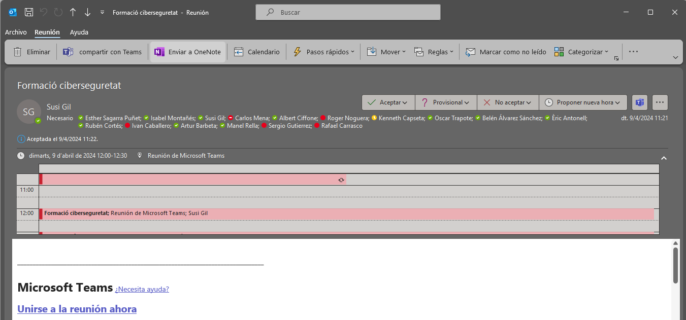

Seguretat : Convocatòria del 09-04-2024  

1.  [Seguretat](index.md)
2.  [Pàgina d'inici de la Unitat de Seguretat](15368362.md)
3.  [Procediments Unitat de Seguretat](Procediments-Unitat-de-Seguretat_81856210.md)
4.  [Guia de Formació i conscienciació a usuaris](100010018.md)
5.  [3\. Procediment de contingència de formació i conscienciació](100010020.md)

Seguretat : Convocatòria del 09-04-2024
=======================================

Created by Rafael Carrasco, last modified on 12 abril 2024

/\*<!\[CDATA\[\*/ div.rbtoc1749247713133 {padding: 0px;} div.rbtoc1749247713133 ul {list-style: disc;margin-left: 0px;} div.rbtoc1749247713133 li {margin-left: 0px;padding-left: 0px;} /\*\]\]>\*/

*   [Materials i continguts de la sessió de formació i conscienciació](#Convocatòriadel09042024-Materialsicontingutsdelasessiódeformacióiconscienciació)
    *   [Algunes adequacions importants per al nostre entorn:](#Convocatòriadel09042024-Algunesadequacionsimportantsperalnostreentorn:)
*   [Evidències de la convocatòria](#Convocatòriadel09042024-Evidènciesdelaconvocatòria)
*   [Assistents](#Convocatòriadel09042024-Assistents)
*   [Acta de la sessió](#Convocatòriadel09042024-Actadelasessió)

Materials i continguts de la sessió de formació i conscienciació
----------------------------------------------------------------

Els materials estàn basats als continguts del curs de INCIBE (Instituto Nacional de Ciberseguridad) [https://www.incibe.es/](https://www.incibe.es/)

Forma part del "Itinerario interactivo" per a "Servicios Profesionales", és el següent → [https://itinerarios.incibe.es/](https://itinerarios.incibe.es/)

1.  **¿Fuera de la oficina?**
2.  **E-mail sospechosos**
3.  **Cultura de seguridad**
4.  **Tu trabajo en el móvil**
5.  **Trabajando desde casa**

### Algunes adequacions importants per al nostre entorn:

*   Unitat de Seguretat: membres de la Unitat i contacte de suport → [seguretat@aoc.cat](mailto:seguretat@aoc.cat)
*   \[mp.per.3.1\] Normatives específiques d'obligat compliment: ús de recursos, correu, etc... → [Normativa de seguretat](https://confluence.aoc.cat/display/EDL/Normativa+de+seguretat)
*   \[mp.per.3.2\] Informar sobre el botó d'avís de Phising al correu electrònic corporatiu.
*   \[mp.per.3.3\] El procediment per informar sobre incidents de seguretat, siguin reals o falses alarmes: principalment obrir cas a l'eina de tiquets al projecte de Seguretat, o adreçar-vos a la bústia [seguretat@aoc.cat](mailto:seguretat@aoc.cat).
*   Protecció d'eines corporatives: VPN, Correu electrònic, Intranet i eina de tiquets, amb mecanisme de doble factor d'autenticació (MFA/2FA) per als serveis corporatius basat en el gestor d'identitats AzureAD.
*   Projecte Endreça: digitalització del lloc de treball per les implicacions que té sobre l'informació en format paper al lloc de treball.
*   Com instal·lar software: mitjançant el Portal de Empresa o via tiquet al equip de Manteniment Intern.

Evidències de la convocatòria
-----------------------------

Assistents
----------

*   Esther Sagarra Puñet
*   Isabel Montañés
*   Susi Gil
*   Carlos Mena
*   Albert Ciffone
*   Roger Noguera
*   Kenneth Capseta
*   Oscar Trapote
*   Belén Álvarez Sánchez
*   Èric Antonell
*   Rubén Cortés
*   Ivan Caballero
*   Artur Barbeta
*   Manel Rella
*   Sergio Gutierrez
*   Rafael Carrasco

Acta de la sessió
-----------------

Evidència generada automàticament per Microsoft Teams

[Formació ciberseguretat - Informe d'assistència 4-09-24.csv](/download/attachments/100010053/Formaci%C3%B3%20ciberseguretat%20-%20Informe%20d%27assist%C3%A8ncia%204-09-24.csv?version=1&modificationDate=1712735518238&api=v2)

Attachments:
------------

 [image2024-4-9\_13-19-19.png](attachments/100010053/100010054.png) (image/png)  
 [Formació ciberseguretat - Informe d'assistència 4-09-24.csv](attachments/100010053/100010069.csv) (text/csv)  

Document generated by Confluence on 07 junio 2025 00:08

[Atlassian](http://www.atlassian.com/)