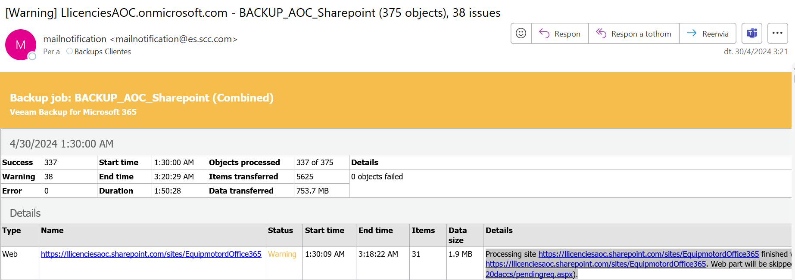

Seguretat : Gestió de còpies de seguretat d'Office 365  

1.  [Seguretat](index.md)
2.  [Pàgina d'inici de la Unitat de Seguretat](15368362.md)
3.  [Procediments Unitat de Seguretat](Procediments-Unitat-de-Seguretat_81856210.md)

Seguretat : Gestió de còpies de seguretat d'Office 365
======================================================

Created by Ivan Caballero, last modified on 14 mayo 2024

Introducció.
------------

Els recursos de Microsoft 365 fan un backup extern.

L'empresa SSC ens fa actualment el backup en les seves infraestructures. Les còpies es fan amb el programari Veam BK.

Les còpies es fan amb usuari BackupOffice365: [Secret Details - Secret Server (aoc.cat)](https://pam.aoc.cat/SecretServer/app/#/secrets/490/general)

Dades de contacte
-----------------

Suport tècnic: [admins@mss.scc.com](mailto:admins@mss.scc.com)

Responsable tècnic: [victoriano.cruces@es.scc.com](mailto:victoriano.cruces@es.scc.com) i [eduardo.sanchez@es.scc.com](mailto:eduardo.sanchez@es.scc.com)

Responsable del contracte: Daniel Reboiro <daniel.reboiro@[es.scc.com](http://es.scc.com)\>

Auditoria de les còpies de seguretat
------------------------------------

El sistema envia diàriament un report amb els errors en les còpies de seguretat. S'envia a la bústia de seguretat amb aquest format:

  

En cas d'incident, enviar correu a la bústia [admins@mss.scc.com](mailto:admins@mss.scc.com).

Alta i baixa d'usuaris
----------------------

Els usuaris s'agafan del grup: BackupOffice365

  

Attachments:
------------

 [image2024-4-30\_7-0-41.png](attachments/100010310/100010312.png) (image/png)  

Document generated by Confluence on 07 junio 2025 00:08

[Atlassian](http://www.atlassian.com/)