Seguretat : Inscripció de telèfon mòbil en postura COBO  

1.  [Seguretat](index.md)
2.  [Pàgina d'inici de la Unitat de Seguretat](15368362.md)
3.  [Procediments Unitat de Seguretat](Procediments-Unitat-de-Seguretat_81856210.md)

Seguretat : Inscripció de telèfon mòbil en postura COBO
=======================================================

Created by Ivan Caballero, last modified on 03 junio 2024

/\*<!\[CDATA\[\*/ div.rbtoc1749247714416 {padding: 0px;} div.rbtoc1749247714416 ul {list-style: disc;margin-left: 0px;} div.rbtoc1749247714416 li {margin-left: 0px;padding-left: 0px;} /\*\]\]>\*/

*   
*   [Inscripció manual del dispositiu](#InscripciódetelèfonmòbilenposturaCOBO-Inscripciómanualdeldispositiu)
    *   [Activació de Windows Defender](#InscripciódetelèfonmòbilenposturaCOBO-ActivaciódeWindowsDefender)
*   [Configuració de la inscripció.](#InscripciódetelèfonmòbilenposturaCOBO-Configuraciódelainscripció.)
*   [Android - Directiva de cumplimiento:](#InscripciódetelèfonmòbilenposturaCOBO-Android-Directivadecumplimiento:)
*   [Perfiles de configuración.](#InscripciódetelèfonmòbilenposturaCOBO-Perfilesdeconfiguración.)

---------------------------------------------------------------------------------------------------------------------------------------------------------------------------------------------------------------------------------------------------------------------------------------------------------------------------------------------------------------------------------------------------------------------------------------------------------------------------------------------------------------------------------------------------------------------------------------------------------------------------------------------------------------------------------------------------------------------------------------------------------------------------------------------------------------

Inscripció manual del dispositiu
--------------------------------

La inscripció s'ha de fer amb el telèfon de fàbrica, en la pàgina de benvinguda (abans de l'idioma).

Polsar 7 vegades a la pantalla de benvinguda per a que surti lector de QR. Fer la lectura del QR del perfil COBO. El codi d'inscripció està indicat en el punt "toquen que permet l'inscripció".

Demana posar idioma.

Demana posar la WIFI.

Comença a fer la inscripció:

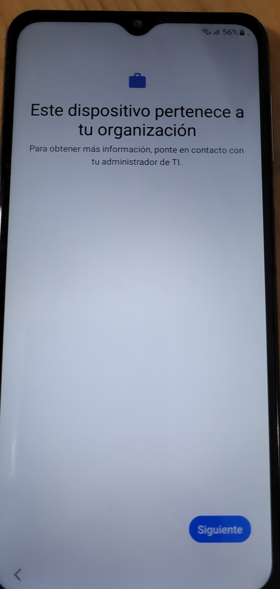

  

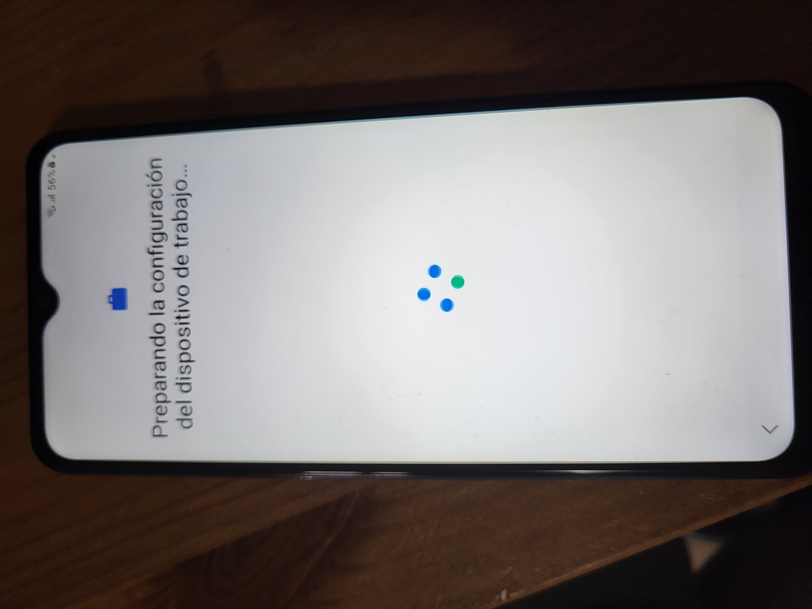

  

El telèfon avisa de que el dispositiu està supervisat:

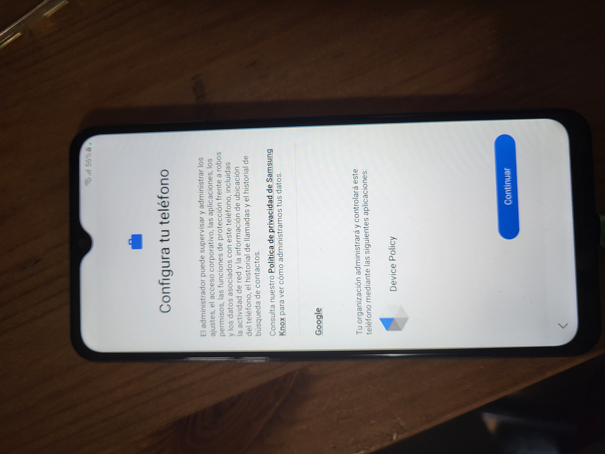

  

  

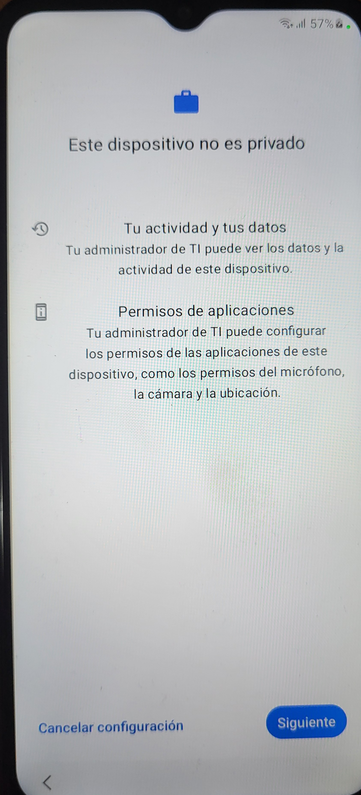

Demana iniciar sessió de Microsoft:

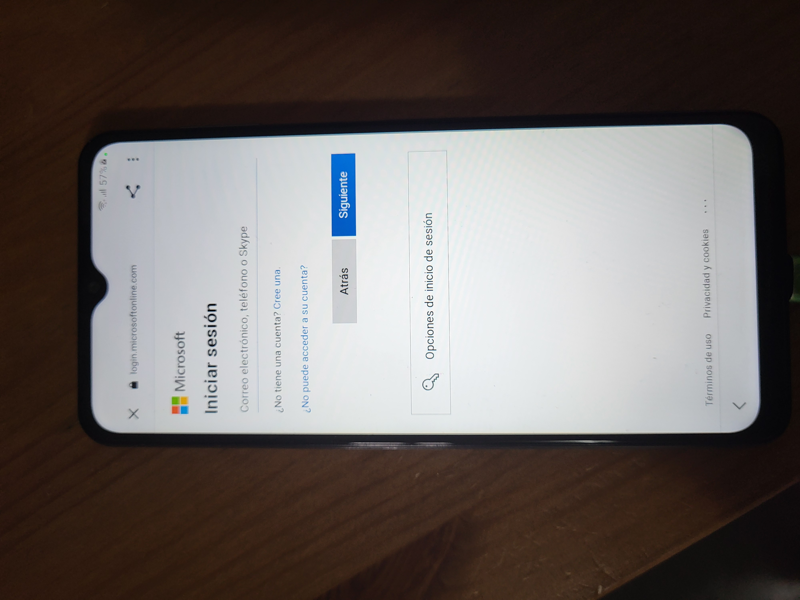

  

Demana instal·lar les aplicacions inicials:

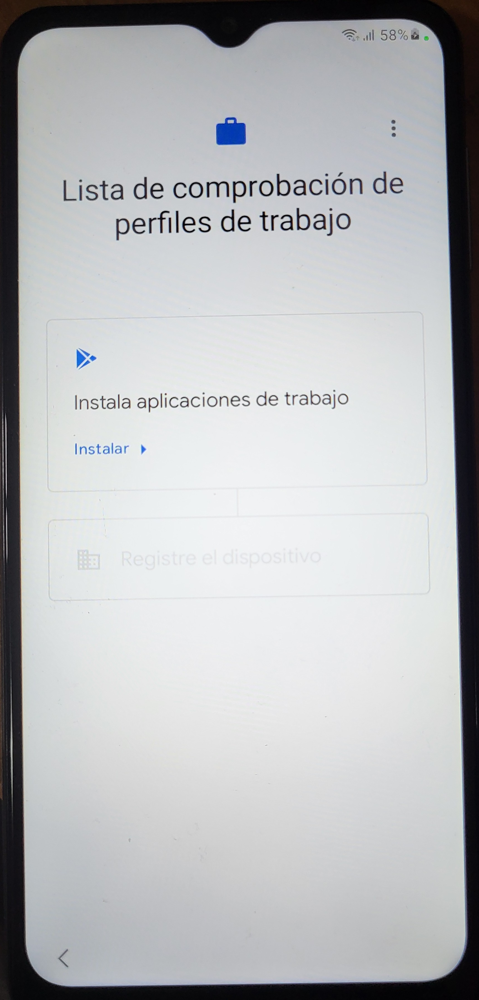

  

Demana registrar el dispositiu:

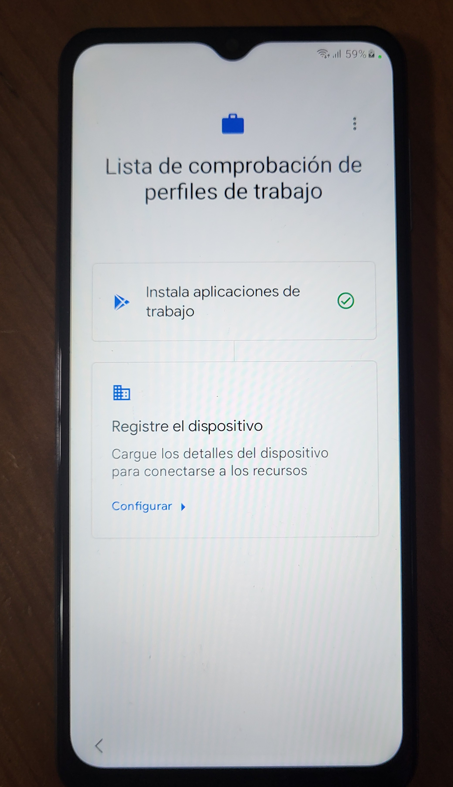

  

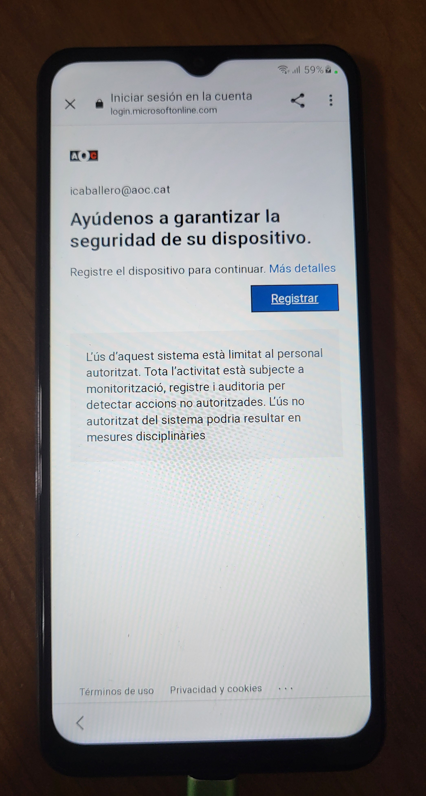

  

Demana activar la VPN:

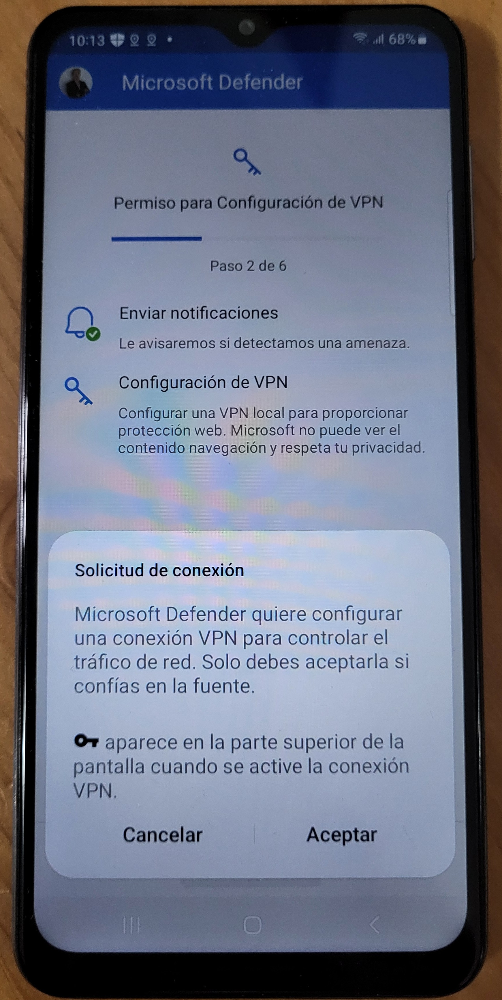

### Activació de Windows Defender

L'aplicació de Windows Defender s'ha d'activar manualment perque s'han de donar permisos i no es pot fer de forma remota.

Iniciar Windows Defender els donar els permisos que sol·liciti.

Configuració de la inscripció.
------------------------------

La configuració del perfil COBO és configura en l'opció "Dispositivos de usuario totalmente administrados de propiedad corporativa"

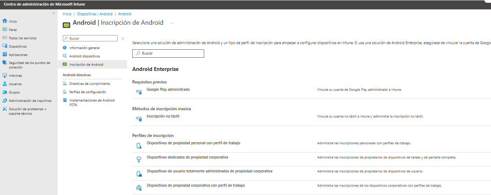

Dins d'aquest perfil està el toquen que permet l'inscripció:

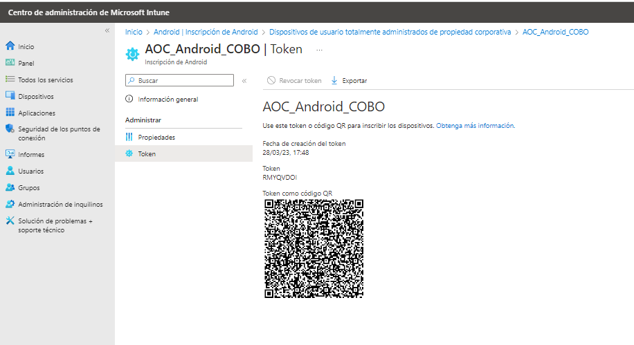

  

En el grup "AOC\_Android\_COBO" s'agreguen els usuaris automàticament.

El dispositiu es veurà com propiedad = Organización.

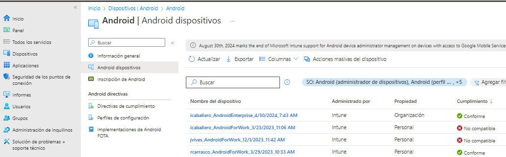

  

Android - Directiva de cumplimiento:
------------------------------------

Les directives de compliment marquen la lina base que es considera que el dispositiu està conforme:

[https://intune.microsoft.com/#view/Microsoft\_Intune\_DeviceSettings/DevicesAndroidMenu/~/compliancePolicies](https://intune.microsoft.com/#view/Microsoft_Intune_DeviceSettings/DevicesAndroidMenu/~/compliancePolicies)

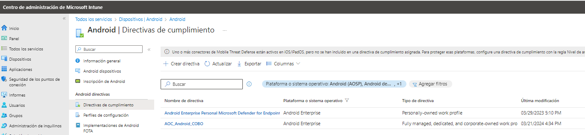

  

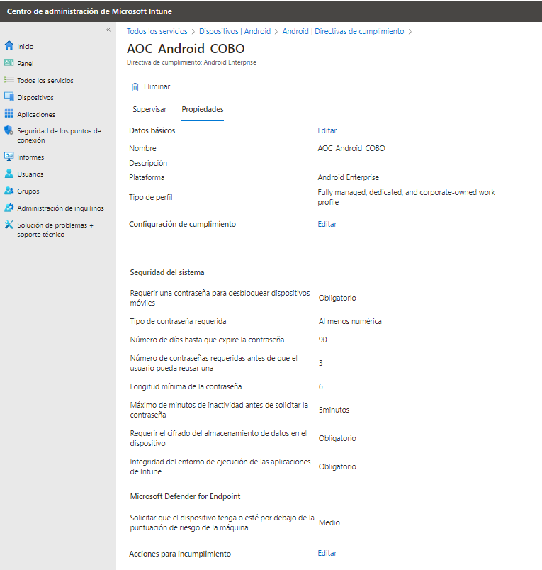

  

Perfiles de configuración.
--------------------------

A les directives de configuració hi ha paràmetres importants de configuració.

[https://intune.microsoft.com/#view/Microsoft\_Intune\_DeviceSettings/DevicesAndroidMenu/~/configProfiles](https://intune.microsoft.com/#view/Microsoft_Intune_DeviceSettings/DevicesAndroidMenu/~/configProfiles)

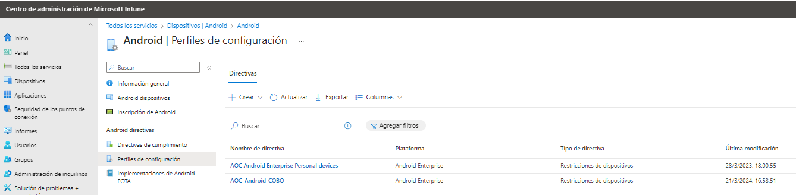

  

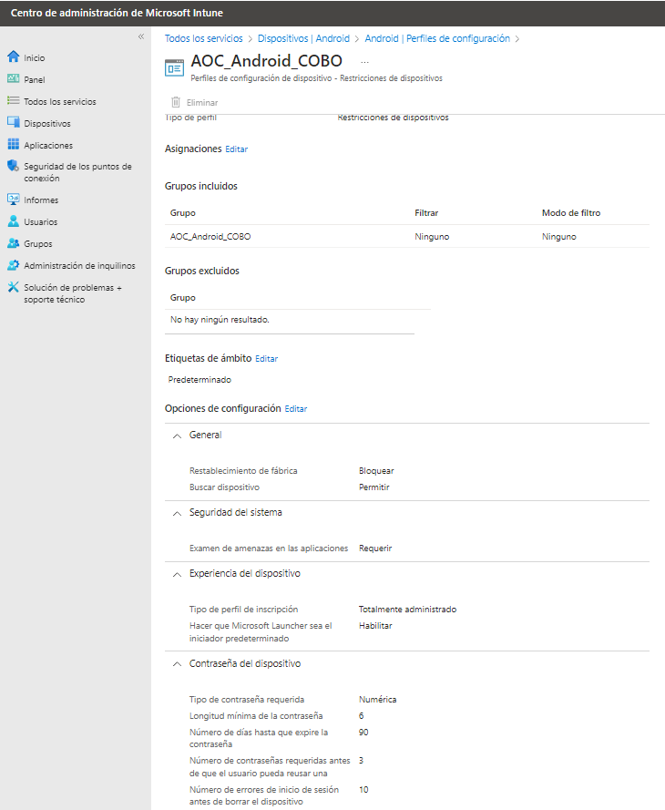

  

  

  

  

  

  

  

  

  

  

  

  

  

  

  

  

  

  

  

  

  

  

Attachments:
------------

 [image2024-4-30\_17-36-27.png](attachments/100010346/100010347.png) (image/png)  
 [image2024-4-30\_17-36-45.png](attachments/100010346/100010348.png) (image/png)  
 [image2024-4-30\_17-37-4.png](attachments/100010346/100010349.png) (image/png)  
 [image2024-4-30\_17-37-23.png](attachments/100010346/100010350.png) (image/png)  
 [image2024-4-30\_17-37-32.png](attachments/100010346/100010351.png) (image/png)  
 [image2024-4-30\_17-37-48.png](attachments/100010346/100010352.png) (image/png)  
 [image2024-4-30\_17-37-57.png](attachments/100010346/100010353.png) (image/png)  
 [20240430\_093822.jpg](attachments/100010346/100010355.jpg) (image/jpeg)  
 [20240430\_093835.jpg](attachments/100010346/100010356.jpg) (image/jpeg)  
 [20240430\_093847.jpg](attachments/100010346/100010357.jpg) (image/jpeg)  
 [20240430\_093924.jpg](attachments/100010346/100010358.jpg) (image/jpeg)  
 [20240430\_094034.jpg](attachments/100010346/100010359.jpg) (image/jpeg)  
 [20240430\_094332.jpg](attachments/100010346/100010360.jpg) (image/jpeg)  
 [20240430\_094429.jpg](attachments/100010346/100010361.jpg) (image/jpeg)  
 [20240430\_094513.jpg](attachments/100010346/100010362.jpg) (image/jpeg)  
 [20240430\_101302.jpg](attachments/100010346/100010363.jpg) (image/jpeg)  

Document generated by Confluence on 07 junio 2025 00:08

[Atlassian](http://www.atlassian.com/)