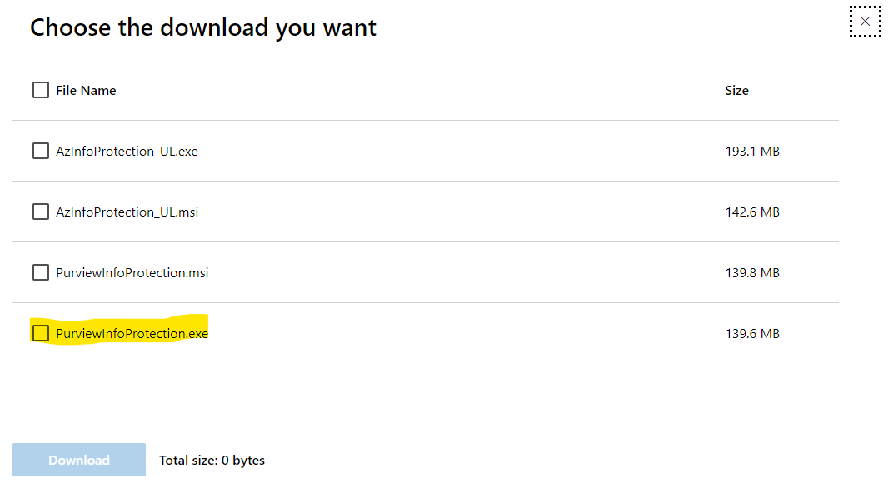

Seguretat : Classificació de la informació en M365 - etiquetes en document i purview  

1.  [Seguretat](index.md)
2.  [Pàgina d'inici de la Unitat de Seguretat](15368362.md)
3.  [Procediments Unitat de Seguretat](Procediments-Unitat-de-Seguretat_81856210.md)

Seguretat : Classificació de la informació en M365 - etiquetes en document i purview
====================================================================================

Created by Ivan Caballero, last modified on 14 mayo 2024

ESBORRANY

  

Per poder classificar la informació des de les utilitat de M365, cal instal·lar en la estació de treball el client Microsoft Purview Information Protection client: [Download Microsoft Purview Information Protection client from Official Microsoft Download Center](https://www.microsoft.com/en-us/download/details.aspx?id=53018)

  

  

  

Aquí tens la info:

[https://learn.microsoft.com/es-es/azure/information-protection/what-is-information-protection](https://learn.microsoft.com/es-es/azure/information-protection/what-is-information-protection)

  

  

  

Material ajuda a usuaris: [https://learn.microsoft.com/es-es/purview/get-started-with-sensitivity-labels#end-user-documentation-for-sensitivity-labels](https://learn.microsoft.com/es-es/purview/get-started-with-sensitivity-labels#end-user-documentation-for-sensitivity-labels)

  

Per configurar les etiquetes i les directives:

[https://compliance.microsoft.com/informationprotection/overview?tid=37a8a0b9-1874-4e5d-b1f5-11040c1c07fc](https://compliance.microsoft.com/informationprotection/overview?tid=37a8a0b9-1874-4e5d-b1f5-11040c1c07fc)

  

Per la publicació de les etiquetes fa falta crear una directiva. En aquest es diu qui pot veure les etiquetes, la pàgina d'ajuda a usuaris, etc.

Attachments:
------------

 [image2024-5-10\_10-24-58.png](attachments/100010423/100010426.png) (image/png)  
 [image2024-5-13\_12-44-46.png](attachments/100010423/100010443.png) (image/png)  

Document generated by Confluence on 07 junio 2025 00:08

[Atlassian](http://www.atlassian.com/)