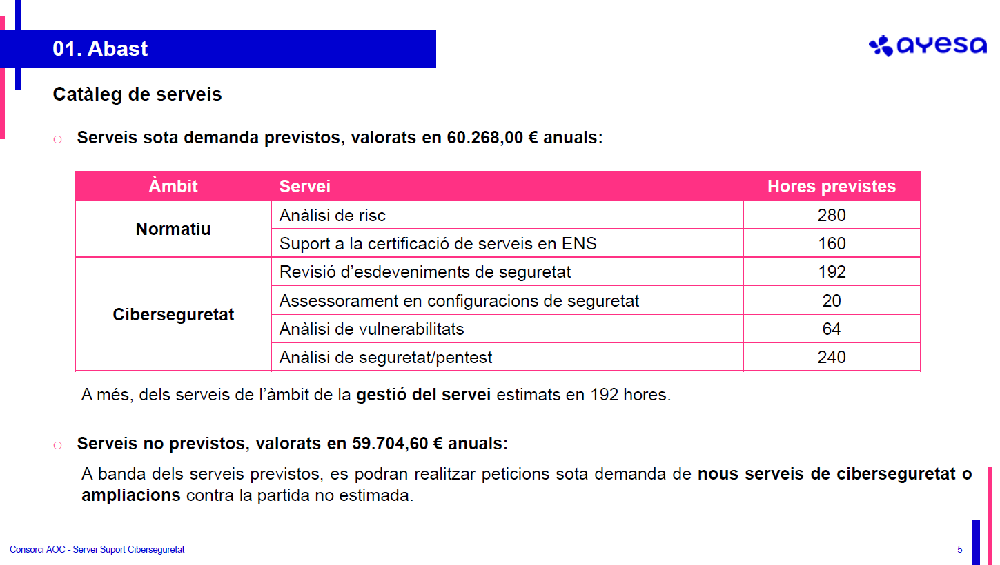
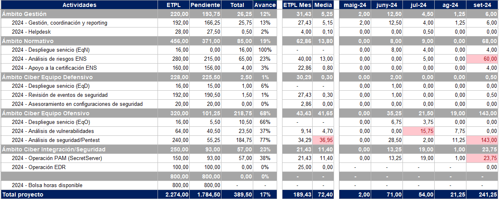

Seguretat : Oficina Tècnica de Seguretat  

1.  [Seguretat](index.md)
2.  [Pàgina d'inici de la Unitat de Seguretat](15368362.md)
3.  [Projectes Unitat de Seguretat](Projectes-Unitat-de-Seguretat_41517821.md)

Seguretat : Oficina Tècnica de Seguretat
========================================

Created by Rafael Carrasco, last modified by Ivan Caballero on 14 abril 2025

**Índex**

/\*<!\[CDATA\[\*/ div.rbtoc1749247729564 {padding: 0px;} div.rbtoc1749247729564 ul {list-style: disc;margin-left: 0px;} div.rbtoc1749247729564 li {margin-left: 0px;padding-left: 0px;} /\*\]\]>\*/

*   [Àmbits d'actuació](#OficinaTècnicadeSeguretat-Àmbitsd'actuació)
*   [Responsable de cada àmbit:](#OficinaTècnicadeSeguretat-Responsabledecadaàmbit:)
*   [Contactes](#OficinaTècnicadeSeguretat-Contactes)
*   [Gestió del servei](#OficinaTècnicadeSeguretat-Gestiódelservei)
*   [Manteniment del servei PAM](#OficinaTècnicadeSeguretat-MantenimentdelserveiPAM)
*   [Revisió de logs](#OficinaTècnicadeSeguretat-Revisiódelogs)

**Procediments específics per l'Oficina Tècnica**

*   [Gestión de vulnerabilidades](113311834.md)
*   [Revisión de eventos de seguridad](113311957.md)
*   [Tipologies de test d'intrusió](124911717.md)

  

Contracte adjudicat a Ibermàtica, ara Ayesa

  

Àmbits d'actuació
-----------------

**Equip**

**Funcions**

Gestió

Direcció i coordinació del servei

Normatiu

Suport ENS, Anàlisi de risc, BIA, PCN

Ciber defensiu

Revisió logs, suport SIEM, assessorament configuracions

Ciber ofensiu

Gestió vulnerabilitats, Anàlisi seguretat/Pentest

  

Responsable de cada àmbit:
--------------------------

**Àmbit**

**Rol**

**Nom i cognoms**

**Contacte**

Gestió

Responsable del Servei

Lluís Cuscó Sureda

[llcusco@ayesa.com](mailto:llcusco@ayesa.com%20%20)  

Normatiu

Referent compliment normatiu

Ruben Lacruz Sanz

[rlacruz@ayesa.com](mailto:rlacruz@ayesa.com)

Ciber

Referent ciber equip defensiu

Jorge Diaz Navarro

[jdiazn@ayesa.com](mailto:jdiazn@ayesa.com)

Ciber

Referent ciber equip ofensiu

Eder Perez Ignacio

[eperezi@ayesa.com](mailto:eperezi@ayesa.com)

Ciber

Referent a revisió de logs

Mikel Esparza

[mesparza@ayesa.com](mailto:mesparza@ayesa.com)

PAM

Referent ciber equip PAM

Ion Rodríguez Saldías

[irodriguezs@ayesa.com](mailto:irodriguezs@ayesa.com)

  

  

  

  

  

Contactes
---------

Helpdesk: [helpdeskits@ayesa.com](mailto:helpdeskits@ayesa.com)

**Àmbit**

**Rol**

**Nom i cognoms**

**Contacte**

**Credencials**         

**Estat**

Gestió

Responsable del Servei

Lluís Cuscó Sureda

[llcusco@ayesa.com](mailto:llcusco@ayesa.com)

VPN

  

Normatiu

Referent compliment normatiu

Ruben Lacruz Sanz

[rlacruz@ayesa.com](mailto:rlacruz@ayesa.com)

VPN

  

Ciber

Referent ciber equip defensiu

Jorge Diaz Navarro

[jdiazn@ayesa.com](mailto:jdiazn@ayesa.com)

VPN

  

Ciber

Tècnic ciber equip defensiu

Mikel Santamaria Hernandez

[msantamariah@ayesa.com](mailto:msantamariah@ayesa.com)

VPN

  

Ciber

Ciber Part-time

Xavier Dobon Ortega

[xdobon@ayesa.com](mailto:xdobon@ayesa.com)

VPN

  

Ciber

Ciber Part-time

Juan Antonio Romana Salvador

[jaromana@ayesa.com](mailto:jaromana@ayesa.com)

VPN, rol de seguretat en O365,

  

Ciber

Referent ciber equip ofensiu

Eder Perez Ignacio

[eperezi@ayesa.com](mailto:eperezi@ayesa.com)

VPN

  

Ciber

Tècnic ciber equip ofensiu

Agustin Domenech Belda

[adomenechb@ayesa.com](mailto:adomenechb@ayesa.com)

VPN

  

VMSaaS

Gestió de vulnerabilitats

Jorge Vega Prieto

[jvegap@ayesa.com](mailto:jvegap@ayesa.com)

VPN, rol de seguretat en O365, Nessus, AWS, AZURE

  

VMSaaS

Gestió de vulnerabilitats

Ainhoa Artetxe Florido

[aartetxe@ayesa.com](mailto:aartetxe@ayesa.com)

Sí, rol de seguretat en O365, Nessus, AWS, AZURE

  

Ciber

Revisió de logs

Pablo Javier Grandoso

[pjgrandoso@ayesa.com](mailto:pjgrandoso@ayesa.com "Seguir enllaç")

Sí, rol de seguretat en O365, Nessus, AWS, AZURE

Inhabilitat

Ciber

Revisió de logs

Unai Combarro

[ucombarro@ayesa.com](mailto:ucombarro@ayesa.com "Seguir enllaç")

Sí, rol de seguretat en O365, AWS, AZURE

Inhabilitat

Ciber

Revisió de logs

Mikel Esparza

[mesparza@ayesa.com](mailto:mesparza@ayesa.com)

Sí, rol de seguretat en O365, AWS, AZURE

Inhabilitat

PAM

Admininstrador de PAM

Ion Rodríguez Saldías

[irodriguezs@ayesa.com](mailto:irodriguezs@ayesa.com)

VPN, Admin. PAM

  

PAM

Admininstrador de PAM

Ruben Garcia Rodriguez

[rgarciaro@ayesa.com](mailto:rgarciaro@ayesa.com)

VPN, Admin. PAM

  

PAM

Admininstrador de PAM

Jokin Lete Aizpitarte

[jlete@ayesa.com](mailto:jlete@ayesa.com)

VPN, Admin. PAM

  

PAM

Admininstrador de PAM

Iker Lopez Borrallo

[ilopezb@ayesa.com](mailto:ilopezb@ayesa.com)

VPN, Admin. PAM

  

PAM

Admininstrador de PAM

Urko Cañibano Arrasate

[ucanibano@ayesa.com](mailto:ucanibano@ayesa.com)

VPN, Admin. PAM, rol de seguretat en O365

Inhabilitat

  

  

  

  

  

  

  

  

  

  

  

  

Gestió del servei
-----------------

Mensualment es farà el control d'hores consumides i la distribució de les mateixes.

Repositori:  [Control horari OT SEG](https://llicenciesaoc.sharepoint.com/:f:/r/sites/CiberseguretatAOC/Documents%20compartits/General/SEGUIMENT/Control%20horari%20OT%20SEG?csf=1&web=1&e=p9kVaR)

Manteniment del servei PAM
--------------------------

AYESA es farà càrrec del servei PAM amb una bossa de 150 hores anuals que es facturaran dins dels "serveis no previstos". Les 150 hores no són fixes i es podran consumir de més o de menys.

Revisió de logs
---------------

L'equip de revisió de logs, farà una revisió manual diària de logs. En principi està acotada al FortiEDR i Windows Defender, amb una estimació de 8 hores setmanals.

  

Attachments:
------------

 [image2024-6-11\_11-21-19.png](attachments/100010644/100010645.png) (image/png)  
 [image2024-10-5\_13-41-10.png](attachments/100010644/113311995.png) (image/png)  

Document generated by Confluence on 07 junio 2025 00:08

[Atlassian](http://www.atlassian.com/)