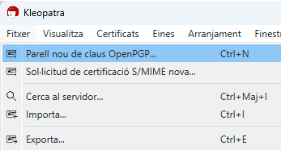
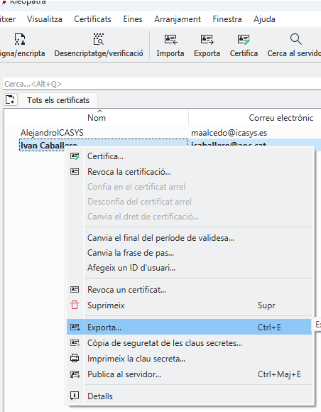
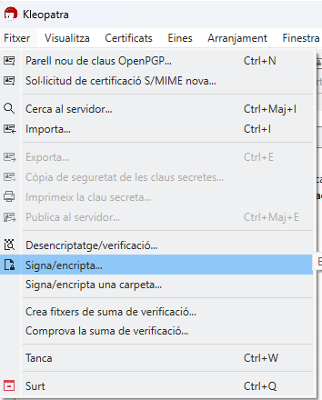
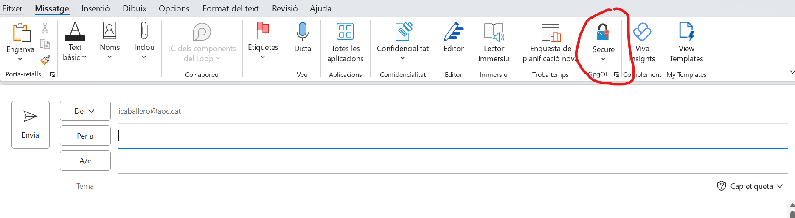
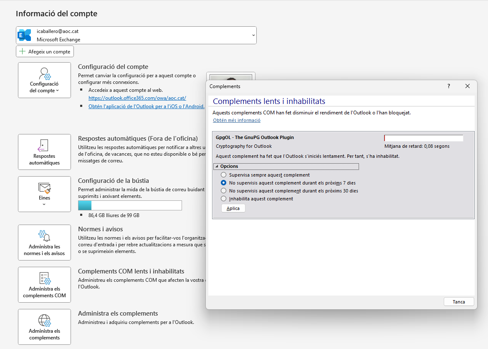
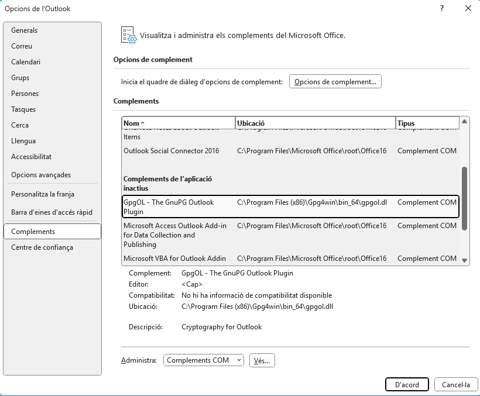
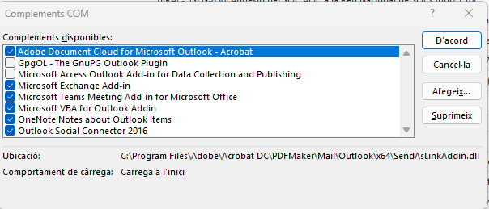

Seguretat : Instal·lació de Kleopatra i GpgOL per enviament de documents i missatges signats i xifrats  

1.  [Seguretat](index.md)
2.  [Pàgina d'inici de la Unitat de Seguretat](15368362.md)
3.  [Procediments Unitat de Seguretat](Procediments-Unitat-de-Seguretat_81856210.md)

Seguretat : Instal·lació de Kleopatra i GpgOL per enviament de documents i missatges signats i xifrats
======================================================================================================

Created by Ivan Caballero, last modified on 08 mayo 2025

Motivació del procediment

L'enviament de missatges xifrats amb GPG és necessari per l'intercanvi d'informació amb el CCN-Cert.

Instal·lació de programari.
---------------------------

Instal·lar con permisos de administrador el programa Gpg4win: [Gpg4win - Download Gpg4win](https://www.gpg4win.org/download.html)

Generar un par de claus noves:

Exportar la clau pública del certificat:

Intercanviar las claves publiques amb altres usuaris.

Para xifrar un documento:

Es pot afegir una icona en Outlook per poder xifrar i signar els missatges:

  

Anar a Fitxer - Administra els complements COM.

Si està deshabilitat, indicar no supervisat.

  

  

Anar a "Personalitzar la franja" - Complementos

  

Localitzar el complement GpgOL i clicar en "Ves..."

  

Activar.

Es veurà aquest icone 

  

  

  

  

Attachments:
------------

 [image2024-7-2\_16-55-59.png](attachments/113311775/113311776.png) (image/png)  
 [image2024-7-2\_16-56-37.png](attachments/113311775/113311777.png) (image/png)  
 [image2024-7-2\_16-57-47.png](attachments/113311775/113311779.png) (image/png)  
 [image2024-7-2\_16-58-17.png](attachments/113311775/113311781.png) (image/png)  
 [image2024-7-2\_16-58-31.png](attachments/113311775/113311782.png) (image/png)  
 [image2025-5-8\_22-55-13.png](attachments/113311775/128647592.png) (image/png)  
 [image2025-5-8\_22-58-20.png](attachments/113311775/128647593.png) (image/png)  
 [image2025-5-8\_22-59-6.png](attachments/113311775/128647594.png) (image/png)  
 [image2025-5-8\_23-2-23.png](attachments/113311775/128647595.png) (image/png)  

Document generated by Confluence on 07 junio 2025 00:08

[Atlassian](http://www.atlassian.com/)