Seguretat : Revisión de eventos de seguridad  

1.  [Seguretat](index.md)
2.  [Pàgina d'inici de la Unitat de Seguretat](15368362.md)
3.  [Projectes Unitat de Seguretat](Projectes-Unitat-de-Seguretat_41517821.md)
4.  [Oficina Tècnica de Seguretat](100010644.md)

Seguretat : Revisión de eventos de seguridad
============================================

Created by Ivan Caballero, last modified by Rafael Carrasco on 30 septiembre 2024

/\*<!\[CDATA\[\*/ div.rbtoc1749247729962 {padding: 0px;} div.rbtoc1749247729962 ul {list-style: disc;margin-left: 0px;} div.rbtoc1749247729962 li {margin-left: 0px;padding-left: 0px;} /\*\]\]>\*/

*   [Alcance.](#Revisióndeeventosdeseguridad-Alcance.)
*   [Herramientas:](#Revisióndeeventosdeseguridad-Herramientas:)
*   [Windows Defender](#Revisióndeeventosdeseguridad-WindowsDefender)
    *   [Revisión de incidentes de seguridad:](#Revisióndeeventosdeseguridad-Revisióndeincidentesdeseguridad:)
    *   [Revisión de exposición:](#Revisióndeeventosdeseguridad-Revisióndeexposición:)
    *   [Revisió de vulnerabilitats:](#Revisióndeeventosdeseguridad-Revisiódevulnerabilitats:)
*   [FortiEDR Fortinet Enpoint Detection and Response](#Revisióndeeventosdeseguridad-FortiEDRFortinetEnpointDetectionandResponse)

Alcance.
--------

Revisar manualmente y de forma diaria los eventos de las herramientas de seguridad mas críticas. Actualmente, se revisar los eventos de las soluciones antivirus, FortiEDR y Windows Defender.

Herramientas:
-------------

Herramienta de gestión de peticiones: [https://contacte.aoc.cat/secure/Dashboard.jspa](https://contacte.aoc.cat/secure/Dashboard.jspa)

Intranet: [Pàgina d'inici de la Unitat de Seguretat](15368362.md)

Windows Defender
----------------

Para todos los eventos significativos que se deban tratar, se deberá abrir un tiquet en la herramienta de de gestión de peticiones: [https://contacte.aoc.cat/secure/Dashboard.jspa](https://contacte.aoc.cat/secure/Dashboard.jspa)

Abrir la petición en el proyecto de Seguridad (SEG):

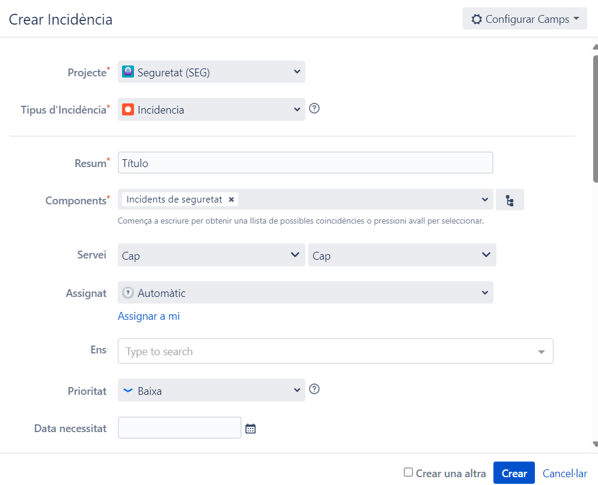

  

  

  

  

  

  

  

  

  

  

  

  

  

  

### Revisión de incidentes de seguridad:

[https://security.microsoft.com/incidents?tid=37a8a0b9-1874-4e5d-b1f5-11040c1c07fc](https://security.microsoft.com/incidents?tid=37a8a0b9-1874-4e5d-b1f5-11040c1c07fc)

*   Tratar los incidentes. 
*   En el caso de se detecte malware en un equipo, seguir el procedimiento: [Tractament de malware](Tractament-de-malware_100009548.md)

### Revisión de exposición:

[https://security.microsoft.com/exposure-overview?tid=37a8a0b9-1874-4e5d-b1f5-11040c1c07fc](https://security.microsoft.com/exposure-overview?tid=37a8a0b9-1874-4e5d-b1f5-11040c1c07fc)

### Revisió de vulnerabilitats:

[https://security.microsoft.com/tvm\_dashboard?tid=37a8a0b9-1874-4e5d-b1f5-11040c1c07fc](https://security.microsoft.com/tvm_dashboard?tid=37a8a0b9-1874-4e5d-b1f5-11040c1c07fc)

Revisar si han aparecido vulnerabilidades de impacto alto.

  

FortiEDR Fortinet Enpoint Detection and Response
------------------------------------------------

Para todos los eventos significativos que se deban tratar, se deberá abrir un tiquet en la herramienta de de gestión de peticiones: [https://contacte.aoc.cat/secure/Dashboard.jspa](https://contacte.aoc.cat/secure/Dashboard.jspa)

Abrir la petición en el proyecto de Seguridad (SEG), en cada caso como Incidentes de seguridad (Incidents de seguretat) o sino es el caso como Herramientas de seguridad (Eines de seguretat):

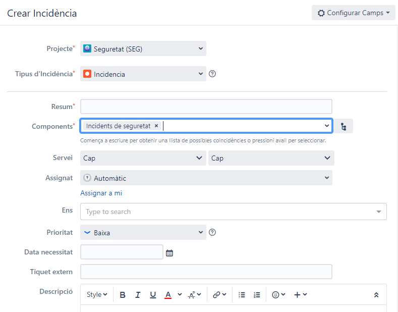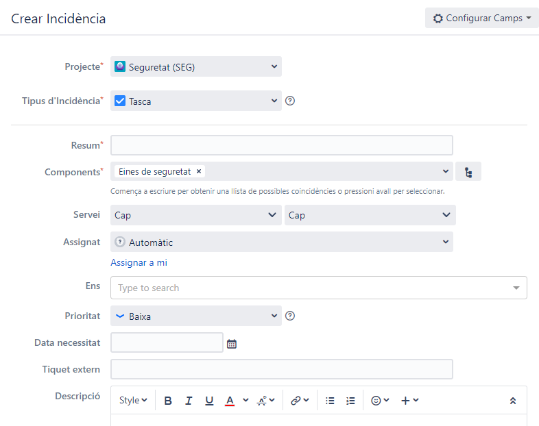

  

El login en el Dashboard del FortiEDR es el siguiente:

[https://forticonnectemea13.fortiedr.com/saml2/caoc](https://forticonnectemea13.fortiedr.com/saml2/caoc)

  

Los eventos se pueden ver desde la vista DEVICE o PROCESS (iconos de equipo y proceso en la part de arriba en el medio con un selector) y ordenar por su clasificación inicial por la herramienta (se podrá modificar), y serían los eventos a revisar, aquí aparecen ordenador por criticidad:

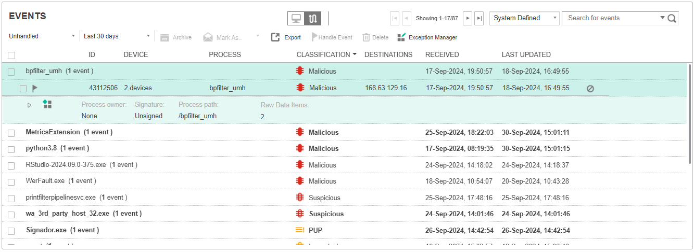

El mejor filtro de eventos para tratar los no gestionados es Unhandled + Last 30 days:

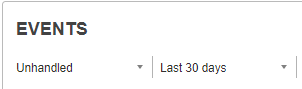

  

En Advanced Data hay una primera vista con información del proceso, parent process, acción, IP destino si la hay, ... etc:

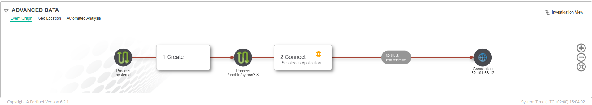

Y a la derecha de ésta ventana podemos abrir la vista de Forensics desde la opción Investigation View:

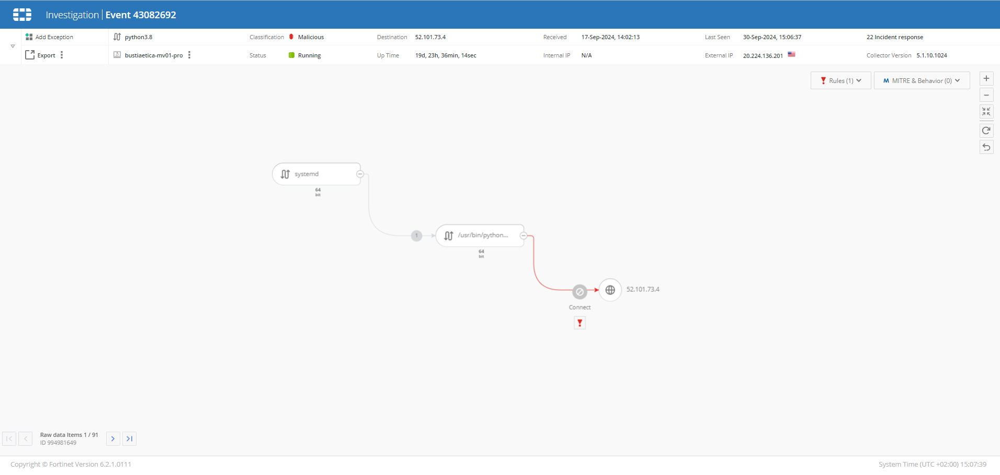

Para excepcionar, en en listado de eventos se puede añadir la excepción:

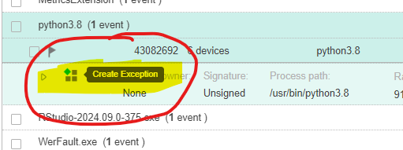

  

Y éste es el asistente:

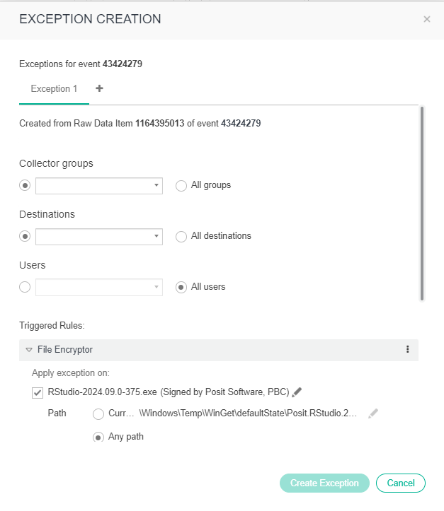

  

Las recomendaciones son:

*   excepcionar a ser posible ajustando la execpción exclusivamente al grupo de collectores del que es miembro el equipo.
*   limitar los destinos en cuanto a las comunicaciones destino.
*   para usuarios, la recomendación de entrada dejarlo para todos los usuarios, se podría limitar al usuario específico del evento.
*   limitar la ejecución al binario (a ser posible firmado digitalmente) a un Path concreto, se pueden emplear asteriscos para rutas relativas en las que aparezca una carpeta de usuario.
*   añadir el tag de: Unitat de Seguretat baseline

Quedaría así:

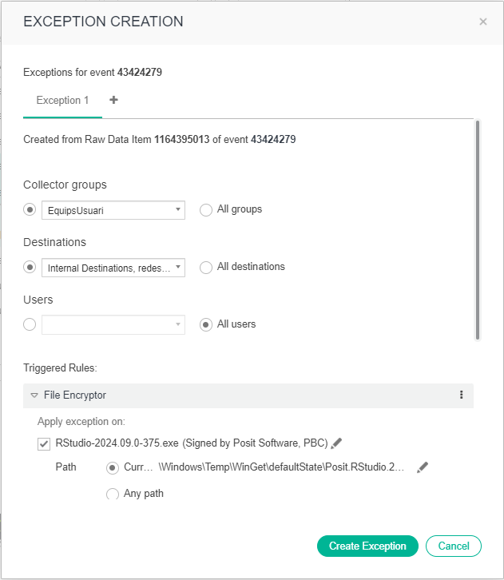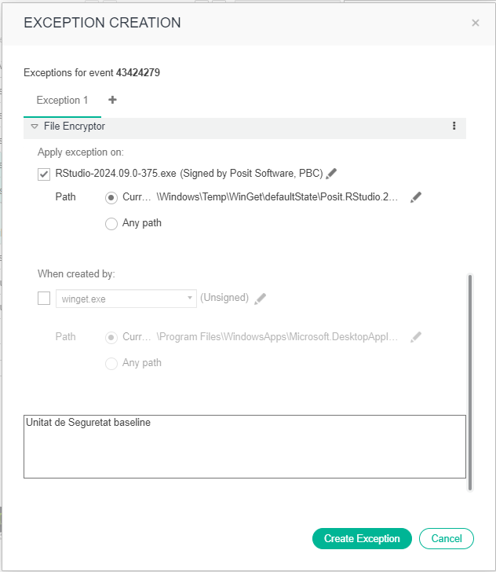

  

Por último para archivar el evento, seleccionarlo y escoger la opción Handle Event, y dejarlo en Safe y añadir el tag de: Unitat de Seguretat baseline y marcar la opción de Archive When Handled y Save.

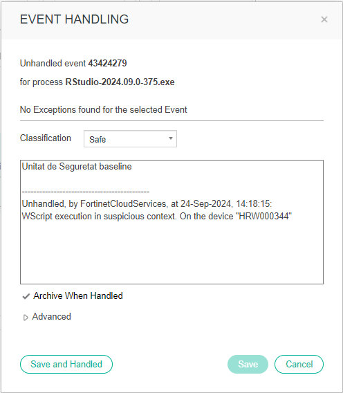

  

  

  

  

Attachments:
------------

 [image2024-9-26\_16-4-56.png](attachments/113311957/113311958.png) (image/png)  
 [image2024-9-30\_14-59-46.png](attachments/113311957/113311965.png) (image/png)  
 [image2024-9-30\_15-0-34.png](attachments/113311957/113311966.png) (image/png)  
 [image2024-9-30\_15-3-15.png](attachments/113311957/113311967.png) (image/png)  
 [image2024-9-30\_15-6-24.png](attachments/113311957/113311968.png) (image/png)  
 [image2024-9-30\_15-7-49.png](attachments/113311957/113311969.png) (image/png)  
 [image2024-9-30\_15-9-46.png](attachments/113311957/113311970.png) (image/png)  
 [image2024-9-30\_15-10-45.png](attachments/113311957/113311971.png) (image/png)  
 [image2024-9-30\_15-11-35.png](attachments/113311957/113311972.png) (image/png)  
 [image2024-9-30\_15-15-17.png](attachments/113311957/113311973.png) (image/png)  
 [image2024-9-30\_15-16-11.png](attachments/113311957/113311974.png) (image/png)  
 [image2024-9-30\_15-18-21.png](attachments/113311957/113311975.png) (image/png)  

Document generated by Confluence on 07 junio 2025 00:08

[Atlassian](http://www.atlassian.com/)