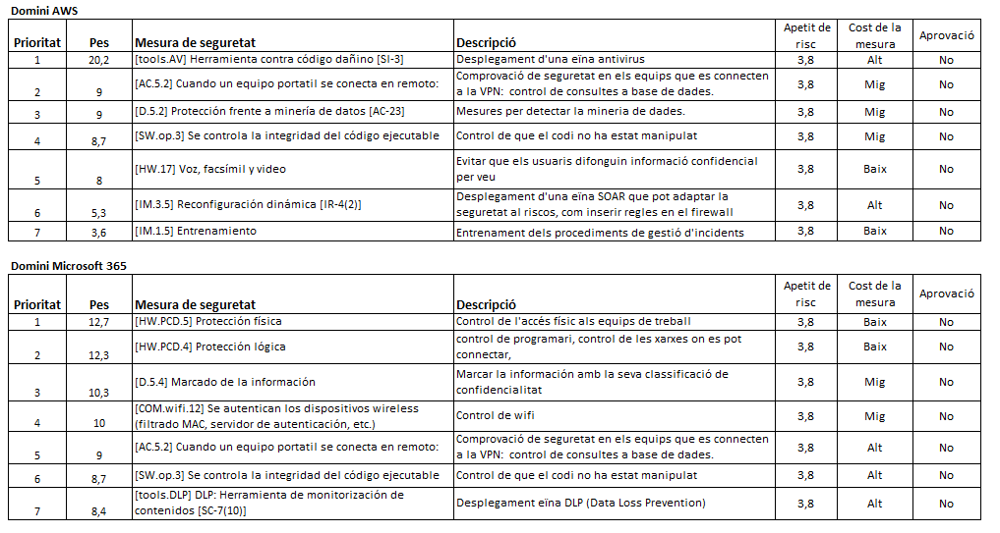

Seguretat : 2024-10-16 Comitè Operatiu de Seguretat  

1.  [Seguretat](index.md)
2.  [Pàgina d'inici de la Unitat de Seguretat](15368362.md)
3.  [Actes de reunió](26317880.md)
4.  [Comitè Operatiu de Seguretat](81855047.md)
5.  [2024](2024_100010192.md)

Seguretat : 2024-10-16 Comitè Operatiu de Seguretat
===================================================

Created by Ivan Caballero, last modified on 16 octubre 2024

Data

16-oct-2024 

Assistents
----------

*   [Rubén Cortés](https://confluence.aoc.cat/display/~rcortes)
*   [Ivan Caballero](https://confluence.aoc.cat/display/~icaballero)

Absències
---------

*   [Irma Choy](https://confluence.aoc.cat/display/~ichoy)

Ordre del dia
-------------

*   Revisió de l'anàlisi de riscos dels serveis ubicats a AWS (Desa'l i PSIS)
*   Ubicació de l'AARR: [PSIS](https://llicenciesaoc.sharepoint.com/:f:/r/sites/CiberseguretatAOC/Documents%20compartits/General/CONFIDENCIAL/AARR/PSIS?csf=1&web=1&e=diBKQv)

Acta
----

Punt

Ponent

Títol

Notes

1

[Ivan Caballero](https://confluence.aoc.cat/display/~icaballero)

Presentació de l'anàlisi de riscos de servei en AWS

*   S'ha fet un nou format d'AARR. Ja no es farà servei a servei, si no que s'agruparan els serveis similars. En aquest cas, s'han agrupat els serveis ubicats a AWS: Desa'l i PSIS.
*   El risc actual dels serveis són:
    *   DESA'L: 3,8 (nivell Alt)
    *   PSIS: 3,8 (nivell ALT)
*   Els nivells són alts perque els serveis són de nivell alt i per tant partim de riscos potencials molt alts. El nivell que l'eina PILAR dona com acceptable és 4,2.
*   Es presenta el Pla de Tractament de Risc amb les propostes de mesures de seguretat addicionals per mitigar el risc i l'estratègia a seguir per implementar-les:

*   El Comitè Executiu de Seguretat, tenint en compte el cost de les mesures proposades, haurà de decidir es risc residual.

2

[Ivan Caballero](https://confluence.aoc.cat/display/~icaballero)

Aspectes de millora de l'anàlisi de riscos

*   S'ha fet una presentació per presentar l'anàlisi de riscos al Comitè Executiu.
*   Al final de l'AARR s'ha annexat la matriu de riscos, on documentem el riscos sobrevinguts per situacions temporals on hi ha actius fora de normativa.

3

  

Elevació a Comitè Executiu

El Comitè Operatiu elevarà al Comitè Executiu l'anàlisi de riscos.

Tasques
-------

Attachments:
------------

 [image2024-10-16\_9-39-58.png](attachments/118554653/118554654.png) (image/png)  

Document generated by Confluence on 07 junio 2025 00:08

[Atlassian](http://www.atlassian.com/)