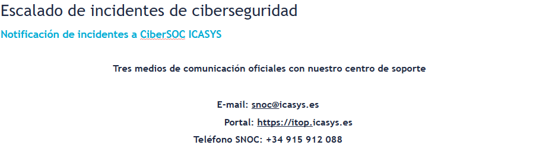

Seguretat : Procediment revisió d'events 24x7 - Claranet - FortiEDR  

1.  [Seguretat](index.md)
2.  [Pàgina d'inici de la Unitat de Seguretat](15368362.md)
3.  [Procediments Unitat de Seguretat](Procediments-Unitat-de-Seguretat_81856210.md)
4.  [24x7 Procediments](24x7-Procediments_124911681.md)

Seguretat : Procediment revisió d'events 24x7 - Claranet - FortiEDR
===================================================================

Created by Rafael Carrasco, last modified on 21 mayo 2025

/\*<!\[CDATA\[\*/ div.rbtoc1749247710137 {padding: 0px;} div.rbtoc1749247710137 ul {list-style: disc;margin-left: 0px;} div.rbtoc1749247710137 li {margin-left: 0px;padding-left: 0px;} /\*\]\]>\*/

*   [URL d'accés](#Procedimentrevisiód'events24x7ClaranetFortiEDR-URLd'accés)
*   [Dashboard d'inici](#Procedimentrevisiód'events24x7ClaranetFortiEDR-Dashboardd'inici)
*   [Event Viewer](#Procedimentrevisiód'events24x7ClaranetFortiEDR-EventViewer)
*   [Escalats 24x7](#Procedimentrevisiód'events24x7ClaranetFortiEDR-Escalats24x7)

URL d'accés
-----------

El login a l'eina FortiEDR està disponible al tenant de Fortinet és el següent:

[https://forticonnectemea13.fortiedr.com/saml2/caoc](https://forticonnectemea13.fortiedr.com/saml2/caoc)

Dashboard d'inici
-----------------

  

D'aquesta plana del Dashboard els 2 widgets/items més importants són els de:

*   Security Events: aquí tal i com posa sota Security Events està pre-filtrat amb els events Unhandled Processes i podem tenir la vista per dispostiu o processos mitjançant l'icona d'equip i procés. Cal parar atenció per severitat i per aquest ordre als Malicious, Suspicious, PUP (Potentially Unwanted Program), Inconclusive, Likely Safe, i Safe.
*   Most targeted: aquí podem veure quin dipositius o processos tenen més events a gestionar i revisar, també amb les categories per severitat anteriors.

Event Viewer
------------

Els esdeveniments es poden veure des de la vista DEVICE o PROCESS (icones d'equip i procés a la part de dalt al mig amb un selector) i ordenar per la seva classificació inicial per l'eina (es podrà modificar), i serien els esdeveniments a revisar, aquí apareixen ordenatss per criticitat:

El millor filtre d'esdeveniments per tractar els no gestionats és Unhandled + Last 30 days:

  

A Advanced Data (a abaix de tot) hi ha una primera vista amb informació del procés, parent process, acció, IP destinació si n'hi ha, ... etc:

En aquest cas anterior al final de la cadena de processos hi ha un bombolla gris de Fortinet amb block, que no està finalment blocat per que està sense la protecció del mode Prevention, només en Simulation.

Però per exemple a la següent captura teniu informació d'un event que té el símbol de block en vermell a la dreta del tot i a la cadena de processos tenim el block del event amb la bombolla en vermell:

En aquest cas podem determinar que:

*   l'execució del procés ha sigut bloquejada per que no hi ha una excepció prèvia que estigui a la baseline de seguretat.
*   ha pogut tenir afectació a la tasca que estava fent l'usuari o servidor en cada cas.
*   si ha hagut impacte a negoci caldrà escalar-ho per revisar l'execució del event en el seu contexte i si s'escau afegir una nova excepció a la baseline per a que per futures execucions estiguin permeses.

  

Per tenir una manera més eficient en la cerca d'events de hosts de plataforma, es poden fer cerques avançades mitjançant el butó d'ampliació de cerca i afegint els grups de collector que ens interessin:

  

Configurant així la cerca es poden filtrar els events que impacten directament a tots els hosts que estiguin en els grups de collectors seleccionats, i per exemple no s'inclouen els equips d'usuari, resultat:

Escalats 24x7
-------------

Taula d'escalats validada amb Emma Riera de Claranet i Asunción Gallego de Grupo ICASys:

CONTACTE

CORREU

TELÈFON

CiberSOC Centro de Operaciones de Ciberseguridad

[socicasys@icasys.es](mailto:socicasys@icasys.es)

+34 91 591 20 88

Centro de Operaciones SNOC

[snoc@icasys.es](mailto:snoc@icasys.es)

91 591 20 88

Seguretat AOC

[seguretat@aoc.cat](mailto:seguretat@aoc.cat)

\-

CSS Claranet

[css@claranet.es](mailto:css@claranet.es)

\-

  

  

  

  

 Al fluxe la comunicació es farà al nostre SOC AOC i ells tindran més contexte per que podràn correlar si cal el event de seguretat al SIEM amb la resta d'eines i fonts integrades.

En tot cas, el SOC AOC amb la informació aportada per Claranet també valoraran si el procés i el seu contexte, es pot arribar a considerar un incident de seguretat per les derivades que comporten (registre, comunicació interna i externa, escalats, ...).

Cal valorar pel SOC AOC si el procés bloquejat NO és un incident de seguretat i es pot valorar afegir l'excepció a la baseline, amb lo que serà el SOC AOC qui faci la petició al equip MDR (Managed Detection & Response) de Fortinet.

 Falta definir aquest darrer pas del fluxe, temporalment això ho asumirà la Unitat de Seguretat AOC, i si l'escalat es fa en horari 24x7 fora d'horari d'oficines, l'escalat i la trucada ha de ser mitjançant el contacte del responsable de Seguretat AOC, Rubén Cortés.

Attachments:
------------

 [image2024-9-30\_15-18-21.png](attachments/124911683/124911684.png) (image/png)  
 [image2024-9-30\_15-16-11.png](attachments/124911683/124911685.png) (image/png)  
 [image2024-9-30\_15-15-17.png](attachments/124911683/124911686.png) (image/png)  
 [image2024-9-30\_15-11-35.png](attachments/124911683/124911687.png) (image/png)  
 [image2024-9-30\_15-10-45.png](attachments/124911683/124911688.png) (image/png)  
 [image2024-9-30\_15-9-46.png](attachments/124911683/124911689.png) (image/png)  
 [image2024-9-30\_15-7-49.png](attachments/124911683/124911690.png) (image/png)  
 [image2024-9-30\_15-6-24.png](attachments/124911683/124911691.png) (image/png)  
 [image2024-9-30\_15-3-15.png](attachments/124911683/124911692.png) (image/png)  
 [image2024-9-30\_15-0-34.png](attachments/124911683/124911693.png) (image/png)  
 [image2024-9-30\_14-59-46.png](attachments/124911683/124911694.png) (image/png)  
 [image2024-9-26\_16-4-56.png](attachments/124911683/124911695.png) (image/png)  
 [image2025-2-20\_18-52-5.png](attachments/124911683/124911699.png) (image/png)  
 [image2025-2-20\_19-17-0.png](attachments/124911683/124911700.png) (image/png)  
 [image2025-2-20\_19-24-48.png](attachments/124911683/124911701.png) (image/png)  
 [image2025-2-20\_19-27-24.png](attachments/124911683/124911702.png) (image/png)  
 [image2025-2-20\_19-29-22.png](attachments/124911683/124911703.png) (image/png)  
 [image2025-2-20\_19-30-1.png](attachments/124911683/124911704.png) (image/png)  
 [FortiEDR dashboard.jpg](attachments/124911683/124912159.jpg) (image/jpeg)  
 [image2025-3-4\_12-44-49.png](attachments/124911683/124912162.png) (image/png)  
 [image2025-3-4\_12-45-33.png](attachments/124911683/124912163.png) (image/png)  

Document generated by Confluence on 07 junio 2025 00:08

[Atlassian](http://www.atlassian.com/)