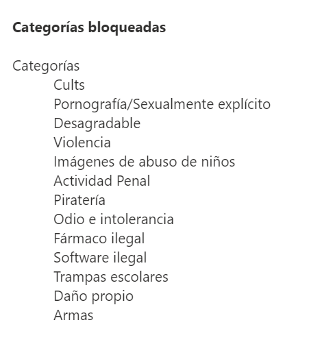

Seguretat : 2023-10-24 Seguiment Unitat de Seguretat  

1.  [Seguretat](index.md)
2.  [Pàgina d'inici de la Unitat de Seguretat](15368362.md)
3.  [Actes de reunió](26317880.md)
4.  [Seguiment Unitat de Seguretat](Seguiment-Unitat-de-Seguretat_93357392.md)
5.  [2023 Seguiment Unitat de Seguretat](2023-Seguiment-Unitat-de-Seguretat_100009470.md)

Seguretat : 2023-10-24 Seguiment Unitat de Seguretat
====================================================

Created by Ivan Caballero, last modified on 24 octubre 2023

Data

24-oct-2023

Assistents
----------

*   [Ivan Caballero](https://confluence.aoc.cat/display/~icaballero)
*   [Rafael Carrasco](https://confluence.aoc.cat/display/~rcarrasco)
*   [Rubén Cortés](https://confluence.aoc.cat/display/~rcortes)

Ordre del dia
-------------

*   Anàlisi de resultats de PILAR: sistemes de nivell alt amb riscos de nivell alt: [https://llicenciesaoc.sharepoint.com/:f:/s/CiberseguretatAOC/ErsjvzBqpspGrBoHM9NR4aIBffRGaHvZhHCKybfbmbeOXg?e=AYgA8x](https://llicenciesaoc.sharepoint.com/:f:/s/CiberseguretatAOC/ErsjvzBqpspGrBoHM9NR4aIBffRGaHvZhHCKybfbmbeOXg?e=AYgA8x)
*   Revisió d'AARR de Desa'l: [https://llicenciesaoc.sharepoint.com/:f:/s/CiberseguretatAOC/Enjfmc77oj1Ms-deZT47ZjABC04QGI\_bb6B9CkhuA9IrIw?e=MCvIbz](https://llicenciesaoc.sharepoint.com/:f:/s/CiberseguretatAOC/Enjfmc77oj1Ms-deZT47ZjABC04QGI_bb6B9CkhuA9IrIw?e=MCvIbz)

Acta
----

**AARR de Desa'l**

Es revisa l'AARR de Desa'l i el motiu pel qual el nivell de risc surt alt. S'ha fet un anàlisi dels resultats que dona PILAR pels sistemes de nivell ALT i es deduix que per aquests sistemes, PILAR sempre dóna nivell alts. S'ha demanat suport al CCN i ens han confirmat que és així, i que hi ha un camp anomenat ENS que és la recomanació que PILAR creu raonable per aquell sistema.

Els resultats de l'anàlisi: [https://llicenciesaoc.sharepoint.com/:f:/s/CiberseguretatAOC/ErsjvzBqpspGrBoHM9NR4aIBffRGaHvZhHCKybfbmbeOXg?e=AYgA8x](https://llicenciesaoc.sharepoint.com/:f:/s/CiberseguretatAOC/ErsjvzBqpspGrBoHM9NR4aIBffRGaHvZhHCKybfbmbeOXg?e=AYgA8x)

El resultat de l'AARR de Desa'l dóna una risc de 3,6 i la recopamanació de PILAR és 3,9, per tant es recomanarà al Cimotè Executiu que accepti el risc tal i com està. No obstant s'ha preparat un pla de tractament que baixa el risc a 3,5 per si el Comitè el vol aplicar.

[Rubén Cortés](https://confluence.aoc.cat/display/~rcortes)portarà l'AARR al Comitè Operatiu.

  

**URL Filtering**

[Rubén Cortés](https://confluence.aoc.cat/display/~rcortes) portarà a la reunió de Direcció que activarem el bloqueig de URLs amb el Windows Defender per limitar la navegació a internet de les estacions de treball.

La política de bloqueig actual bloca les categories més evidents. És una configuració de mínims que no genera bloqueixos en la navegació normal.

La traça que deixa Windows Defender és quan un equip intenta accedir a una categoria no permesa. La nevegació permesa no es traça.

**Prova pilot de Windows Defender en MAC.**

Manteniment Intern està fent una prova per posar Windows Defender en els equips MAC.

  

[Rubén Cortés](https://confluence.aoc.cat/display/~rcortes) demana actualitzar el mapa d'eines de seguretat per la propera reunió.

Attachments:
------------

 [image2023-10-24\_11-25-48.png](attachments/81855943/100008199.png) (image/png)  

Document generated by Confluence on 07 junio 2025 00:08

[Atlassian](http://www.atlassian.com/)