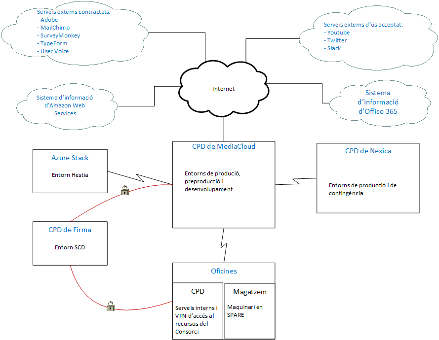

Seguretat : Instal·lacions dels Sistemes d'Informació  

1.  [Seguretat](index.md)
2.  [Pàgina d'inici de la Unitat de Seguretat](15368362.md)
3.  [Arquitectura de Seguretat](Arquitectura-de-Seguretat_24216213.md)

Seguretat : Instal·lacions dels Sistemes d'Informació
=====================================================

Created by Ivan Caballero, last modified on 23 julio 2019

  

Descripció del document

Aquesta pàgina descriu les instal·lacions del Consoci AOC on:

*   es tracten dades del Consorci AOC
*   s'ubiquen actius del Consorci AOC

  
  

_Font de la imatge: \\\\endreca\\seguretat\\PLA DIRECTOR DE SEGURETAT\\ENS\\\[OP.PL.2\] ARQUITECTURA DE SEGURIDAD\\Diagrama arquitectura seguretat.vsdx_

Attachments:
------------

 [image2019-7-23\_11-30-46.png](attachments/24216246/24216247.png) (image/png)  

Document generated by Confluence on 07 junio 2025 00:08

[Atlassian](http://www.atlassian.com/)