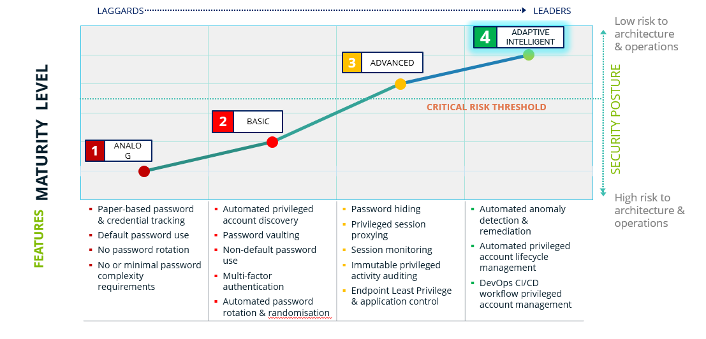
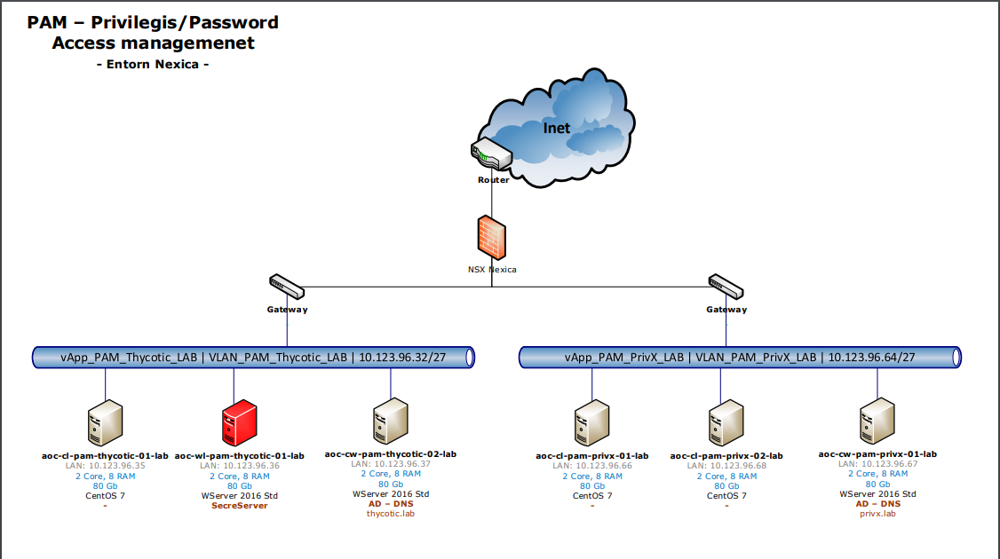

Seguretat : Avaluació eines PAM (Privileged Access Management)  

1.  [Seguretat](index.md)
2.  [Pàgina d'inici de la Unitat de Seguretat](15368362.md)
3.  [Projectes Unitat de Seguretat](Projectes-Unitat-de-Seguretat_41517821.md)
4.  [Desplegament de PAM](Desplegament-de-PAM_41517823.md)

Seguretat : Avaluació eines PAM (Privileged Access Management)
==============================================================

Created by Ivan Caballero, last modified on 12 mayo 2020

  

  

  

  

Estado

INICIAT

Partes interesadas

[Rubén Cortés](https://confluence.aoc.cat/display/~rcortes) [Andreu Martinez](https://confluence.aoc.cat/display/~amartinez)[Ivan Caballero](https://confluence.aoc.cat/display/~icaballero)

Resultado

Fecha de vencimiento

31-dic-2019

Responsable

[Rubén Cortés](https://confluence.aoc.cat/display/~rcortes)

Tiquet al JIRA

[SEG-106](https://contacte.aoc.cat/browse/SEG-106?src=confmacro) - Los datos no se pueden recuperar debido a un error inesperado.

Índex
-----

/\*<!\[CDATA\[\*/ div.rbtoc1749247726968 {padding: 0px;} div.rbtoc1749247726968 ul {list-style: disc;margin-left: 0px;} div.rbtoc1749247726968 li {margin-left: 0px;padding-left: 0px;} /\*\]\]>\*/

*   [Índex](#AvaluacióeinesPAM\(PrivilegedAccessManagement\)-Índex)
*   [Decisions](#AvaluacióeinesPAM\(PrivilegedAccessManagement\)-Decisions)
*   [Requeriments de seguretat](#AvaluacióeinesPAM\(PrivilegedAccessManagement\)-Requerimentsdeseguretat)
    *   [Nivell de risc](#AvaluacióeinesPAM\(PrivilegedAccessManagement\)-Nivellderisc)
*   [Eines avaluades pel control d'accés privilegiat](#AvaluacióeinesPAM\(PrivilegedAccessManagement\)-Einesavaluadespelcontrold'accésprivilegiat)
*   [Abast de la instal·lació:](#AvaluacióeinesPAM\(PrivilegedAccessManagement\)-Abastdelainstal·lació:)
*   [Comparativa de característiques:](#AvaluacióeinesPAM\(PrivilegedAccessManagement\)-Comparativadecaracterístiques:)
*   [Amortització a 5 anys](#AvaluacióeinesPAM\(PrivilegedAccessManagement\)-Amortitzacióa5anys)
*   [Laboratoris:](#AvaluacióeinesPAM\(PrivilegedAccessManagement\)-Laboratoris:)
    *   [Laboratori PrivX](#AvaluacióeinesPAM\(PrivilegedAccessManagement\)-LaboratoriPrivX)
    *   [Laboratori Thycotic](#AvaluacióeinesPAM\(PrivilegedAccessManagement\)-LaboratoriThycotic)
    *   [Resultat de la PoC de PrivX:](#AvaluacióeinesPAM\(PrivilegedAccessManagement\)-ResultatdelaPoCdePrivX:)
    *   [Resultat de la PoC de Thycotic:](#AvaluacióeinesPAM\(PrivilegedAccessManagement\)-ResultatdelaPoCdeThycotic:)
*   [Elements d'acción](#AvaluacióeinesPAM\(PrivilegedAccessManagement\)-Elementsd'acción)

  

Decisions
---------

Cal una eina PAM?

Quina eina PAM és la més apropiada per l'AOC?

*   Requeriments tècnics
*   Model de llicenciament
*   Preu

Requeriments de seguretat
-------------------------

Les necessitats provenen de la revisió del sistemes per adaptar-se als requeriments de l'ENS. Concretament, no estem complint amb les mesures de seguretat d'identificació i accés als sistemes d'informació, ja que l'accés al actius (servidors, switchos, etc.) es fa amb usuaris genèrics i contrasenyes sense control de qualitat (caducitat i complexitat).

Actualment no es compleixen les següents mesures:

Identificació: [https://www.ccn-cert.cni.es/publico/ens/ens/index.html#!1087](https://www.ccn-cert.cni.es/publico/ens/ens/index.html#!1087)

Mecanismes d'autenticació: [https://www.ccn-cert.cni.es/publico/ens/ens/index.html#!1091](https://www.ccn-cert.cni.es/publico/ens/ens/index.html#!1091)

Accés local: [https://www.ccn-cert.cni.es/publico/ens/ens/index.html#!1092](https://www.ccn-cert.cni.es/publico/ens/ens/index.html#!1092)

Aquestes mancances han sortit reflectides a les avaluacions de seguretat que s'han fet d'Hestia i eNotum.

### Nivell de risc

El nivell de risc actual es considera alt, ja que no hi ha una gestió de la vida de les contrasenyes.

Segons el següent gràfic, el nivell de risc estaria entre el punt 1 i el 2:

  

Eines avaluades pel control d'accés privilegiat
-----------------------------------------------

  

PrivX

Thycotic

URL

[https://www.ssh.com/products/privx/](https://www.ssh.com/products/privx/)

[https://thycotic.com/](https://thycotic.com/)

Llicenciament / cost

El llicenciament es fa per actiu administrat:

*   5,5 euros host / mes soport 8x5
*   7,7 euros host / mes soport 24x7

**35.000 euros anuals** (contant 400 actius).

El llicenciament es fa per blocs d'usuaris. Hi ha diferents modalitats d'usuaris i llicenciament perpetual o per subscripció.

  

Llicència perpetua

30 Platinium admin

50 bussiness users

Subscripció anual

30 Platinium admin

50 bussiness users

Preu inicial

27.000

12.200

Implantació

2.800

2.800

Manteniment anual

6.000

\-

Servei explotació

?

?

[Descripció dels Business users](attachments/28704803/36340540.pdf)

  

Funcionalitats

PrivX features:  [SSH\_PrivX\_data\_sheet\_2019\_June](https://info.ssh.com/hubfs/SSH_PrivX_data_sheet_2019_June.pdf)

Thycotic features: [secret-server features](https://thycotic.com/products/secret-server/features/)

Punts destacats

Els accessos estan basats en certificats efímers, Els usuaris mai tenen accés a les credencials reals dels actius. No es poden robar contrasenyes.

[SSH\_ephemeral\_cerfiticates\_white\_paper](https://info.ssh.com/hubfs/2019_landing_pages/ephemeral_certificates_white_paper/SSH_COM_ephemeral_cerfiticates_white_paper.pdf?hsCtaTracking=e87757c2-f404-4c33-9305-b44b5745c665%7C89c89ae0-eb00-42b9-ab81-1df695b1e781)

L'eina és intuïtiva i fàcil d'usar, com administrador i com a usuari final.

Permet fer canvis de contrasenyes programats, sota demanada o en el moment de logout. Les contrasenyes es poden exportar.

Visualització de sessions en temps real.

  

  

Abast de la instal·lació:
-------------------------

Inicialment no caldria instal·lar-ho en totes les plataformes. Es pot fer de manera gradual segons ens anem acostumant a l'eina.

La instal·lació hauria de ser per plataformes, per qualsevol client que pugui fer servir accessos privilegiats: Putty, RDP, HTTPS, Toad, SQL Developer, Filezilla, etc.

S'haurien de prioritzar les plataformes subjectes a auditories de seguretat, per exemple EACAT, i MUX (eidas).

Comparativa de característiques:
--------------------------------

  

 

**PrivX**

**Thycotic**

Accés amb doble factor d'autenticació

Si

Si

Infraestructura en HA.

Si

Si

Versatilitat (clients suportats)

Només estan suportats accessos via HTTPS, RDP i SSH

Està suportat qualsevol client al que puguis enviar usuari i contrasenya per paràmetre

Flux d'aprovació de credencials

Si

Si

Credencials de comptes de servei

Si, està previst en la propera actualització.

Si

[ALM Slide Deck.pdf](attachments/28704803/36341071.pdf)

Consulta i recuperació de contrasenyes

No

Mitjançant API es poden recuperar contrasenyes de la base de dades

Homologacions ENS

No

Si

Gravació de sessions

Si

Si

  

  

  

  

Amortització a 5 anys
---------------------

   

 

**1 any**

**2 any**

**3 any**

**4 any**

**5 any**

**Total**

**PrivX**

  12.200,00 €

  20.000,00 €

  30.000,00 €

  30.000,00 €

  30.000,00 €

  **122.200,00 €**

**Thycotic**

  12.200,00 €

  12.200,00 €

  12.200,00 €

  12.200,00 €

  12.200,00 €

    **61.000,00 €**

*   Els preus no inclouen serveis d'instal·lació ni manteniment

  

Laboratoris:
------------

S'ha creat un entorn de proves per cada eina:

  

  

### Laboratori PrivX

[https://10.123.96.66/auth/login](https://10.123.96.66/auth/login)

  

PrivX Superuser Login:

              Username: privxadmin

              Password: ChangeThis234

PrivX Database credentials:

              DB Name: privxdb

              Username: privx

              Password: ChangeThis123

2 Servers added to PrivX:

CentOS server - Session Recording enabled - 10.123.96.68 - root, oracle users/roles configured

Windows AD DNS server - Session Recording enabled -10.123.96.67 - Administrator user/role configured

  

### Laboratori  Thycotic

[https://10.123.96.35/SecretServer](https://10.123.96.35/SecretServer)

[https://aocwlpamthyc01.thycotic.lab/SecretServer](https://aocwlpamthyc01.thycotic.lab/SecretServer)

Usuari/passwd: admin/Davinci20  (Domini Local)

  

Equips de laboratori:

SecretServer      10.123.96.35 Thycotic\\Administrator-KiowTY9V  
AD Thycotic.lab 10.123.96.37 Thycotic\\Administrator-KiowTY9V  
Linux                  10.123.96.36 aoc-dJWbsd8F.

Usuarios Active Directory ( dominio thycotic.lab, contraseña común: Davinci20 ):

Usuario1-Acceso total (Acceso a todos los secretos)  
Usuario2-Acceso Web (Acceso al secreto web)  
Usuario3-SIN ACCESO A LA PLATAFORMA  
Usuario4-Acceso Reporting (Reporting Role)  
Unix1-Acceso linux (Acceso al secreto linux)

  

Les proves es focalitzaran en aquests punts

*   Facilidad en el despliegue sobre los activos a proteger. Facilidad en el despliegue en activos nuevos.
*   Como asegura la herramienta que no puedes acceder a los activos directamente por SSH.
*   Hay procedimiento de contingéncia? Por ejemplo, que pasa si la herramienta no está disponible.
*   Capacidad para proteger activos Windows, Linux y HTTPS. Posibilidad de proteger activos en nubes públicas (AWS y Azure).
*   ¿Como se hace la conexión hacia otros recursos? Por ejemplo, conexión a una base de datos SQL por el puerto 1433, o a un Oracle por el puerto 1521.
*   Capacidad de trazabilidad de los accesos y acciones en los activos.
*   Usabilidad en las gestión de usuarios y roles.
*   Usabilidad en los accesos a los activos.
*   Usabilidad de la herramienta en general.
*   Fiabilidad de la herramienta en cuanto a disponibilidad. Posibilidad de ponerla en Alta Disponibilidad.

### Resultat de la PoC de PrivX:

*   Entorn amigable.
*   Desplegament senzill cap als actius
*   Como asegura la herramienta que no puedes acceder a los activos directamente por SSH.  
    *   \--> amb proxy, els actius només haurien d'acceptar peticions de PrivX. Seria recomenable tenir un usuari local pels accessos des de consola. 
*   Capacidad para proteger activos Windows, Linux y HTTPS.
*   ¿Como se hace la conexión hacia otros recursos? No permet la connexió a altre recursos com Oracle.

### Resultat de la PoC de Thycotic:

Contactes: [david.porto@davinci-ti.es](mailto:david.porto@davinci-ti.es), 

  

*   Como asegura la herramienta que no puedes acceder a los activos directamente por SSH.  
    *   \--> con proxy, rotando contraseñas en cada logout, poniendo directivas de SO para permitir solo la IP de la herramienta.
*   Hay procedimiento de contingéncia? Por ejemplo, que pasa si la herramienta no está disponible.

*   Restauració de backup en 1 hora

*   Capacidad para proteger activos Windows, Linux y HTTPS. Posibilidad de proteger activos en nubes públicas (AWS y Azure).

*   Si

*   ¿Como se hace la conexión hacia otros recursos? Por ejemplo, conexión a una base de datos SQL por el puerto 1433, o a un Oracle por el puerto 1521.

*   Compatible con SQL con disparador
*   Compatible con Oracle con disparador en TOAD
*   Se puede poner cualquier lanzador que permita enviar secretos por linia de comandos
*   Las redes sociales de empresa también se pueden proteger con ellanzador web

  

Elements d'acción
-----------------

*   Desplegar un pilot per cada solució per provar les funcionalitats????

*     
      
    

Attachments:
------------

 [image2020-1-14\_11-44-44.png](attachments/28704803/30869622.png) (image/png)  
 [image2020-3-23\_9-43-2.png](attachments/28704803/36340220.png) (image/png)  
 [Business users v2.pdf](attachments/28704803/36340540.pdf) (application/pdf)  
 [ALM Slide Deck.pdf](attachments/28704803/36341071.pdf) (application/pdf)  

Document generated by Confluence on 07 junio 2025 00:08

[Atlassian](http://www.atlassian.com/)